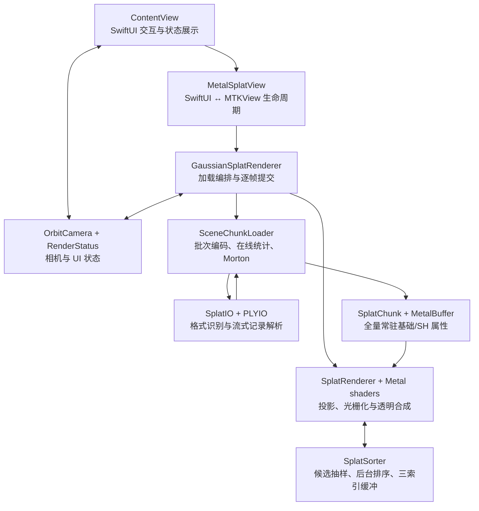
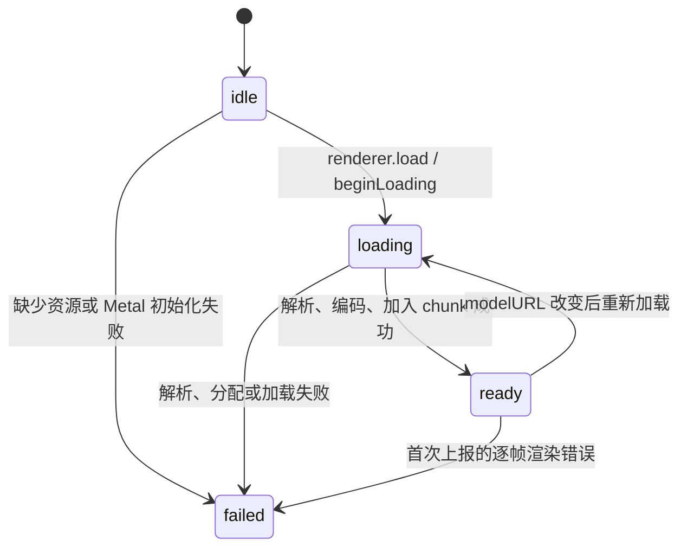

<!-- generated-by: gsd-doc-writer -->
# 系统架构

> **代码基线（2026-08-27）：** 本文已经合并当前实现：65,536 点有界批次编码、多 chunk 常驻、SH0～SH3、全场确定性候选抽样、自适应 60 FPS 预算，以及手势与屏幕按钮共用的轨道相机。压力验证数据和测量边界另见 [MILLION-SPLAT-IMPLEMENTATION.md](MILLION-SPLAT-IMPLEMENTATION.md)。

## 系统概览

GaussianSplatMobile 是一个面向 iPhone 的单场景、只读 3D Gaussian Splatting（3DGS）查看器。它从 App bundle 读取训练结果，按最多 65,536 个 `SplatPoint` 的工作集直接编码成多个 CPU/GPU 共享的 `SplatChunk`，不建立完整场景的 `[SplatPoint]`；所有属性常驻后，后台 sorter 从全场确定性抽取有界候选并按相机距离生成由远到近的索引，单阶段 Metal 管线再把每个候选高斯投影成屏幕空间椭圆并做预乘 Alpha 合成。应用层采用 SwiftUI，`UIViewRepresentable` 承接 `MTKView`；渲染和模型 I/O 来自仓库内的本地 Swift Package `Vendor/MetalSplatter`。当前产品路径固定为一个 viewport、无深度纹理、无 MSAA、无网络和无运行时模型选择；chunk 是加载工作集边界，不是可按相机淘汰的空间 tile。

这个架构优先追求三件事：在真机上走一条短而可读的原生渲染路径；让相机交互、加载状态与底层 Metal 生命周期彼此隔离；移除显式整场 `[SplatPoint]` 聚合，并把 `SceneChunkLoader.pendingPoints` 与稳态排序/绘制规模分别限制在 65,536 点和候选预算内。这里的批次上限不是端到端加载峰值上界：`PLYReader` 与 `SplatPLYSceneReader` 的 `AsyncThrowingStream` 使用默认无界 buffering 且没有背压，多个 `PLYElement`/`[SplatPoint]` 批次可能排队，最终 Metal buffer 也随场景累积。它仍没有解决磁盘到内存的视点相关 residency、空间 LOD、逐 tile 排序、遮挡剔除、编辑、训练或跨平台渲染；“300 万可加载”也不等于每帧绘制全部 300 万。

## 组件图



箭头表示调用、数据传递或状态反馈，而不是对象所有权。实际所有权从 `ContentView` 的两个 `@StateObject` 和 `MetalSplatView.Coordinator` 开始：Coordinator 强持有应用侧 renderer 与加载任务；renderer 强持有 camera 和 status；`MTKView.delegate` 在拆除 representable 时被显式清空。

## 运行时状态与端到端数据流

### 状态机

`RenderStatus.Phase` 是 UI 能观察到的最小状态机：



- `idle`：视图已经构造，但模型尚未开始加载。
- `loading`：`renderer` 被清空，PLY/.splat 正在解析或转换；`splatCount`、`candidateSplatCount` 与 FPS 归零，GPU/sort 指标清空并改写加载摘要，`shDegree`、`chunkCount` 暂留上次值。
- `ready`：chunk 已加入 `SplatRenderer`，相机已取景，但不代表第一次相机相关排序已经完成。首帧仍可能等待排序或被丢弃。
- `failed(String)`：保存面向用户的错误文本。加载任务因取消而退出时不会主动改写 phase；正常的 URL 切换会紧接着开始下一次加载。

Coordinator 会先把 `loadedURL` 设为新 URL，再启动任务。因此同一个 URL 加载失败后，不会在同一 Coordinator 内自动重试；需要重建视图或改变 URL。当前 App 的 URL 是固定 bundle 资源，所以这是故障恢复边界，而不是正常交互路径。

### 首次加载

1. [`ContentView`](../GaussianSplatMobile/UI/ContentView.swift) 从主 bundle 优先查找 `drjohnson_full_sh3.ply`，缺失时回退到 `sample_scene.ply`；同时创建 camera 与 status，并把三者交给 [`MetalSplatView`](../GaussianSplatMobile/Renderer/MetalSplatView.swift)。
2. `makeUIView` 创建 `MTKView` 和 [`GaussianSplatRenderer`](../GaussianSplatMobile/Renderer/GaussianSplatRenderer.swift)。应用侧 renderer 创建默认 `MTLDevice`、一条 command queue，并配置 BGRA sRGB、无深度、单采样和连续绘制。
3. `load(url:)` 在主 actor 上进入 `loading`，随后用 `Task.detached(priority: .userInitiated)` 调用 [`SceneChunkLoader.load`](../GaussianSplatMobile/Renderer/SceneChunkLoader.swift)。`AutodetectSceneReader` 依据扩展名选择 reader；PLYIO 的 `InputStream` 每次最多读 16 KiB，并且只有完整 PLY 记录才会进入语义映射。
4. loader 用 `for try await batch` 消费 reader，小批数据累计到 65,536 点后立即调用 `SplatChunk(device:from:)`。构造器把基础属性编码为 32 B/点的 shared Metal buffer，并为 SH1/2/3 建立单独的 Float16 buffer；随后在这个 chunk 内同步重排基础与 SH 数据的 Morton 顺序。批次局部 `[SplatPoint]` 随下一轮释放，返回结果只保留 `[SplatChunk]`。
5. 同一个后台 pass 用 Welford 在线算法累计场景中心和平方距离，无需保存全场语义数组或第二遍扫描；同时验证所有点的 SH degree 一致。最后不足 65,536 点的数据形成尾 chunk。
6. 返回主 actor 后，应用用 `min(总点数, 1,000,000)` 初始化候选预算，创建 `SplatRenderer(maximumRenderedSplatCount:)`，再调用 `addChunks(..., sortByLocality: false)` 一次性注册所有已重排 chunk。sorter 随后启动高优先级 detached 循环，从展平场景抽样候选并生成相机相关索引。
7. 应用相机用场景中心和半径重新取景，发布 renderer 并进入 `ready`。显示的加载耗时覆盖文件解析、分批编码、Morton 重排与 chunk 注册，但不等待第一次候选深度排序或第一次 GPU 呈现。

这里必须区分三种“流式”：当前已经是**移除显式整场 `readAll()` 聚合、边读边编码的流式解析与编码**，其中只有 `SceneChunkLoader.pendingPoints` 明确限制为 65,536 点；`PLYReader` 和 `SplatPLYSceneReader` 的 `AsyncThrowingStream` 默认无界且无背压，多个 `PLYElement`/`[SplatPoint]` 批次可能排队，所以端到端 CPU 语义工作集并未被严格限制。它也不是**渐进显示**，因为完整文件完成且全部 chunk 注册后才发布 renderer；更不是**视点相关 residency**，因为所有 chunk 属性仍长期常驻，不能按相机位置从磁盘加载或淘汰。

### 每帧提交

1. `MTKView` 调用 `draw(in:)`。如果尺寸无效、模型未发布、renderer 暂不可接收新帧、drawable 或 command buffer 不可用，本帧直接跳过。
2. 应用根据 drawable 宽高比、相机视图矩阵和动态 near/far 生成一个 `ViewportDescriptor`。
3. `SplatRenderer.render` 以 mutex 串行化 CPU 命令编码，并把最多三个已提交但 GPU 尚未完成的 frame 限制在 `maxSimultaneousRenders = 3`。
4. renderer 从视图矩阵的逆矩阵恢复世界空间相机位置和朝向，把新 pose 交给 sorter。当前启用欧氏距离键，所以只有相机世界位置改变超过阈值、chunk 集变化或候选预算变化时才触发排序；本 App 的 yaw/pitch 是绕 target 轨道旋转，会改变世界空间相机位置，因而通常触发。sorter 可以继续在后台写另一份索引缓冲，当前帧复用最近一份有效排序，所以结果允许落后一帧或多帧。
5. 如果从未产生有效排序，`render` 默认最多轮询 0.1 秒；仍不可用则返回 `false`。应用会提交这个空 command buffer，但不会 present drawable，从视觉上表现为丢帧而非错误顺序闪烁。
6. renderer 轮换 uniform 槽，构造本帧 chunk 指针表，绑定最近的有界候选索引和所有持久点缓冲，编码一次 indexed-instanced draw。索引条目数而不是全场点数决定该帧的 `splatCount`。
7. 应用调用 `present` 和 `commit`。Metal 完成回调再释放排序索引引用、归还临时 chunk 表缓冲并递减 in-flight 计数。

成功 render 的 command buffer 在 GPU completion handler 中计帧和读取 `gpuStartTime/gpuEndTime`，每至少 0.75 秒把完成 FPS 与平均 GPU 毫秒发布到状态卡并调用候选控制器；预算实际变化后至少 3 秒才可再次变化：完成 FPS 低于 55 时把预算乘 0.8；FPS 至少 59、平均 GPU 大于 0 且小于 12 ms 时乘 1.1；范围限制在 25 万～125 万和总点数以内。排序毫秒数是 CPU sorter 从读候选位置到发布索引的墙钟耗时。这些指标仍没有 p95、实际 present pacing、GPU stage breakdown 或温度数据。

## 线程、隔离与共享状态

| 执行域 | 主要工作 | 同步/所有权边界 |
| --- | --- | --- |
| 主 actor | SwiftUI 状态、手势与按钮、相机、`GaussianSplatRenderer.load` 编排、逐帧提交、完成帧统计和候选预算反馈 | `OrbitCamera`、`RenderStatus`、`MetalSplatView`、应用侧 renderer 均标记 `@MainActor` |
| detached 场景加载任务 | reader 创建、PLY/.splat 解析、65,536 点分批编码、Welford 统计、chunk 内 Morton 重排 | `LoadedScene` 以 `@unchecked Sendable` 携带最终 Metal buffer 返回主 actor；没有完整场景 `[SplatPoint]` |
| MetalSplatter chunk 注册路径 | 一次独占注册全部预构建 chunk，重建连续 chunk index 和 sorter 引用 | `withChunkAccess` 等待所有 GPU frame 结束；`addChunks` 内再取得 sorter 独占访问 |
| detached 排序循环 | 确定性跨全场抽样、读候选位置、计算距离、Swift `sort`、写排序索引 | `Synchronization.Mutex` 保护状态；三份索引各有引用计数和有效位；排序临时数组规模受候选预算限制 |
| GPU | 顶点投影、SH 求色、光栅化、片元高斯权重、硬件 blending | command buffer 完成前持有索引、chunk 表和点/SH 资源 |
| Metal completion 回调 | 释放排序索引引用、回收 chunk 表、递减 in-flight；应用再跳回主 actor 记录完成 FPS/GPU 时间 | renderer 用 mutex；buffer pool 用 `NSLock` |

大模型加载中的解析、协方差计算、Float16 编码、在线统计和 Morton 重排都位于显式 detached task，不再由主 actor 遍历全场点。主 actor 仍负责创建 renderer、批量注册 chunk、发布状态和逐帧 command submission。`SceneChunkLoader` 并未把每个 chunk 立即送给可见 renderer；它先构建完整 `[SplatChunk]`，所以加载任务取消、内存压力和首帧延迟仍需要按“完整资产加载”处理。

底层类型 `MetalBuffer`、`SplatChunk`、`SplatRenderer` 使用 `@unchecked Sendable`。安全性来自“初始化后不随意修改持久点缓冲”、独占 chunk 访问和索引引用计数，而不是编译器对每个裸指针写入的证明。任何新增的原地点编辑都必须走同一独占协议并使排序失效。

## 模型格式边界

### 当前入口与实际样例

应用层先查找 `Bundle.main` 中的 `drjohnson_full_sh3.ply`，找不到时才回退到 `sample_scene.ply`。Xcode Resources build phase 当前同时复制两者，因此仓库完整状态下默认运行的是 3,177,554 点、788,034,924 字节、binary little-endian、完整 SH3 的 Dr Johnson 压力验证场景；9,842,082 字节、175,745 点、SH0 的 Bonsai 精简文件保留作轻量 fallback。完整 PLY 放进 App bundle 是验证策略，不适合生产分发；生产应用应下载到 Application Support、校验后读取。

### PLY

[`SplatPLYSceneReader`](../Vendor/MetalSplatter/SplatIO/Sources/SplatPLYSceneReader.swift) 接受 ASCII、binary little-endian 或 binary big-endian PLY，但目标 element 必须名为 `vertex`，并要求以下 `float32` 属性：

- 位置：`x`、`y`、`z`；
- 尺度：`scale_0...2`，读取为指数域，之后通过 `exp` 变成线性尺度；
- 透明度：`opacity`，读取为 logit，之后通过 sigmoid 变成线性 Alpha；
- 旋转：`rot_0...3`，顺序为四元数实部 $w$，再到虚部 $x,y,z$；编码前会归一化；
- 颜色三选一：`f_dc_0...2` 的 SH0 float；`red/green/blue` 的 float32 legacy 0–256 格式；或 `red/green/blue` 的 UInt8。

`f_rest_*` 的 Float32 属性必须从 0 开始连续，数量只能是 0、9、24 或 45，分别表示 SH0、SH1、SH2、SH3。映射器按数值后缀排序，并把 Graphdeco PLY 的“先全部 R、再全部 G、再全部 B”重排成逐系数 RGB triplet；缺号、错误类型或其他数量都会在编码前失败。

### `.splat` 与 SPZ

`.splat` reader 每个点固定读取 32 字节：6 个 Float32 表示位置与线性尺度，4 个 UInt8 表示 sRGB 和线性透明度，另 4 个 UInt8 表示量化四元数。`AutodetectSceneReader` 已支持依据 `.splat` 扩展名选择它，但当前 app 资源名和扩展名仍固定为 PLY。

`SplatFileFormat` 枚举中保留 `.spz`，仓库也保留 SPZ 源文件，但 [`Package.swift`](../Vendor/MetalSplatter/Package.swift) 明确把两个 SPZ reader/writer 文件排除在 target 外，autodetect 对 `.spz` 抛出 `cannotDetermineFormat`。因此 SPZ 不是当前二进制的受支持输入。

### 输入不变量与失败方式

- reader 验证属性是否存在且类型匹配，但没有统一检查 NaN、无穷值、负线性尺度、零四元数或极端 logit/scale。它们可能在 `exp`、归一化、协方差或排序中传播为无穷/NaN。
- `SceneChunkLoader` 验证整个场景的 SH degree 一致；`SplatChunk(device:from:)` 还会逐点检查系数数量与首点推断的 degree 一致。直接使用公开的 `SplatChunk(splats:shCoefficients:shDegree:)` 仍由调用方保证 buffer 长度与 degree 相符。
- 空场景由应用侧转换为本地化错误；未知扩展名、缺属性、类型不匹配、截断文件、Metal buffer 超过 `device.maxBufferLength` 也会失败。
- `SceneChunkLoader` 不调用 `readAll()`，其显式 `pendingPoints` 受 65,536 点批次约束；但两级默认无界、无背压的 `AsyncThrowingStream` 可能同时保留多个 `PLYElement` 与 `[SplatPoint]` 批次，最终所有基础/SH Metal buffer 和 `[SplatChunk]` 容器也会随场景累积。它移除的是显式整场 CPU 语义聚合，不是严格有界的端到端 CPU 语义工作集，也不是全量属性 residency。

## CPU 与 GPU 数据布局

### 从训练参数到紧凑高斯

每个 `SplatPoint` 先保留训练语义：位置、颜色表示、透明度表示、尺度表示和四元数。编码时线性尺度向量 $\mathbf{s}$ 与归一化旋转 $R$ 组成变换：

$$
M = R\,\operatorname{diag}(\mathbf{s})
$$

读作“先用对角矩阵沿三个局部轴缩放，再用旋转矩阵把这些轴转到世界方向”。向量是按顺序排列的一组数；矩阵可以理解为把输入向量映射到新向量的规则表。`diag` 把三个尺度放到矩阵对角线，其余位置为零。

三维协方差为：

$$
\Sigma_{3D} = M M^T
$$

读作“三维协方差等于变换矩阵乘它的转置”。上标 $T$ 表示把矩阵行列交换。这样得到的 $\Sigma_{3D}$ 是对称矩阵：它记录高斯在三个空间方向的扩散大小，以及方向之间的倾斜关系。代码只需存它的六个独立分量。

[`EncodedSplatPoint`](../Vendor/MetalSplatter/MetalSplatter/Sources/EncodedSplatPoint.swift) 与 shader `Splat` 对齐：12 字节 packed Float32 位置、8 字节 half4（SH0 RGB + Alpha）、两个 6 字节 packed half3（对称协方差六分量），合计 32 字节基础数据。高阶 SH 不混入这个结构，而是单独按每点 9/24/45 个 Float16 存储，对应 SH1/SH2/SH3 的额外 RGB 系数。

### 缓冲区策略

| 缓冲 | 数量与生命周期 | 用途 |
| --- | --- | --- |
| 基础 splat | 每 chunk 一份，模型驻留期 | `.storageModeShared`；CPU sorter 读位置，GPU vertex shader 读完整高斯 |
| 高阶 SH | SH0 时没有，否则每 chunk 一份 | Float16 系数，和 Morton 重排后的 splat 一一对应 |
| 排序索引 | 固定三份，capacity 按历史最高候选扩张 | 每项 8 字节，含 UInt16 chunk index、padding、UInt32 local index；新 sort 的 count 受其捕获预算限制，降预算后旧有效 buffer 可暂供 frame 使用；sorter 写空闲份，frame 引用最近有效份 |
| CPU 排序临时项 | sorter 一份复用数组 | 每个候选保存 chunk index、local index 与深度；大小随当前候选数调整，不随全场常驻点数直接增长 |
| Uniform ring | 三槽，每槽按 256 字节对齐 | 与最多三个 GPU in-flight frame 对应；保存 view/projection、相机、屏幕和计数 |
| Chunk table | 每次 render 构造，GPU 完成后回池 | 保存各 chunk 的 GPU 地址、点数、SH degree 和 enabled 位 |
| Quad index | 按需增长后复用 | 最多为 1024 个模板 splat 保存每 quad 六个 UInt32 三角形索引 |

所有主要 Metal buffer 都是 `.storageModeShared`。收益是 CPU 不需 staging copy 就能填充、重排和排序，适合 Apple 统一内存；代价是缺少显式 upload boundary，裸指针写入时序必须由独占协议保证，也没有采用 `.private` buffer 可能带来的 GPU 侧访问优化。当前代码没有实测两种 storage mode 的差异。

绘制不是为 $N$ 个 splat 建立 $6N$ 个永久 index。令：

$$
K = \min(N, 1024), \qquad I = \left\lceil\frac{N}{K}\right\rceil
$$

读作“模板数量 $K$ 最多是 1024，实例数量 $I$ 是总点数除以模板数后向上取整”。分子 $N$ 是总 splat 数，分母 $K$ 是一个实例批次内由索引覆盖的 splat 数；向上取整保证最后不足一批的点也被覆盖。vertex shader 用 `instanceID * K + vertexID / 4` 恢复全局排序位置，超出 $N$ 的尾部顶点会被退化剔除。这样限制了 quad index buffer 大小，但仍保留实例化开销；1024 是库中的固定经验值，不是本项目 benchmark 得出的最优值。

## 相机与投影数学

### 场景取景

解码后先求所有点位置的算术平均中心：

$$
\mathbf{c} = \frac{1}{N}\sum_{i=1}^{N}\mathbf{p}_i
$$

读作“把 $N$ 个三维位置向量逐个相加，再除以点数”。分子是位置总和，分母是点数；结果 $\mathbf{c}$ 对应 `SceneChunkLoader.LoadedScene.center`。这里的向量就是 $(x,y,z)$ 三个数构成的有方向量。实际代码用 Welford 在线更新得到同一统计目标，而不是先保存全场再调用这个直接求和式。

再求均方根距离并乘 2.5：

$$
r = \max\!\left(2.5\sqrt{\frac{1}{N}\sum_{i=1}^{N}\lVert\mathbf{p}_i-\mathbf{c}\rVert^2},\ 0.1\right)
$$

读作“每个点先减中心，求距离平方，取平均后开平方，再乘 2.5，并保证至少为 0.1”。根号内分子是所有平方距离之和，分母仍是点数。$\lVert\cdot\rVert$ 表示向量长度；这里没有梯度或偏导数，只是几何统计。结果作为 `sceneRadius`，默认相机距离是 $\max(3.3r,\ 0.5)$，也就是取半径的 3.3 倍与 0.5 中较大者。

这个半径不是包围球：少数超过 2.5 倍均方根尺度的点可以落在预期取景外；反过来，极端离群点也会抬高 RMS，让主体显得过小。若用户模型的密度或离群分布差异很大，应改用分位数半径、AABB/OBB 或文件自带相机元数据。

### Orbit 视图矩阵

视图矩阵按右侧先作用：

$$
V = T_z(-d)\,R_x(\text{pitch})\,R_y(\text{yaw})\,R_z(\pi)\,T(-\mathbf{c})
$$

读作“先把场景中心移到原点，再绕 Z 轴翻转 180° 适配常见 PLY up 方向，然后应用 yaw、pitch，最后把场景沿相机负 Z 方向推远 $d$”。矩阵相乘的计算方向从公式最右端到最左端。初始 `yaw = 3.0`、`pitch = -0.1`；pitch 被限制在 $[-1.45,1.45]$ 弧度，避免翻越极点。拖动每个 point 改变 0.006 弧度。

捏合缩放用手势开始时的距离除以 magnification，并限制在 $[0.15r,20r]$。底部显式按钮调用同一个 `OrbitCamera`：左右/上下每次改变 15°，pitch 仍限制在 $[-1.45,1.45]$；放大/缩小每次把距离除以 $1.2^{steps}$，并复用同一距离上下界。按钮仅在 `RenderStatus.phase == .ready` 时启用，双击画面或右上角取景框会 reset。手势与按钮各自先清理对应的 gesture start，避免两套输入累计出不连续跳变。

这种中心轨道相机实现简单，但不提供平移、第一人称移动或围绕选中点旋转。当相机进入模型内部时，基于中心的距离排序和 near plane 都更容易产生伪影；离散按钮还会产生固定步长跳变，而不是连续动画。

动态裁剪面为：

$$
n = \max(0.01, d - 3r), \qquad
f = \max(n + 10, d + 5r)
$$

读作“近裁剪面取 0.01 与相机距离减三倍半径中的较大者；远裁剪面至少比 near 远 10，也至少到距离加五倍半径”。$n$ 和 $f$ 分别对应 `clipPlanes.near` 与 `.far`。固定最小跨度适合小样例，但对单位尺度非常大或非常小的自定义模型不是自适应精度的完整方案。

### 右手透视投影

令垂直视场角为 $\theta=60^\circ$、宽高比为 $a$：

$$
s_y = \frac{1}{\tan(\theta/2)}, \qquad
s_x = \frac{s_y}{\max(a,0.001)}, \qquad
s_z = \frac{f}{n-f}
$$

读作“垂直缩放由半视场角的正切倒数决定，水平缩放再除以宽高比，深度缩放由 near/far 决定”。分母越小，投影视野越窄或缩放越强；`max(a, 0.001)` 防止零宽高比除法。

代码生成的列向量矩阵是：

$$
P =
\begin{bmatrix}
s_x & 0 & 0 & 0 \\
0 & s_y & 0 & 0 \\
0 & 0 & s_z & s_z n \\
0 & 0 & -1 & 0
\end{bmatrix}
$$

读作“视图空间点左乘 $P$ 后得到裁剪空间坐标”。相机面向负 Z，$w_{clip}=-z_{view}$；near 映射到 Metal 深度 0，far 映射到 1。矩阵只负责中心投影；高斯椭圆的像素轴由协方差投影另行计算。

## 高斯投影、颜色与片元合成

### 三维协方差投影为二维椭圆

shader 先把中心变到 view space。$z\ge 0$ 的点位于相机平面后方，直接退化剔除。为了限制离屏高斯的数值膨胀，代码把 $x/z$、$y/z$ 分别裁到视场正切的 1.3 倍，再构造透视雅可比矩阵：

$$
J =
\begin{bmatrix}
f_x/z & 0 & -f_xx/z^2 \\
0 & f_y/z & -f_yy/z^2 \\
0 & 0 & 0
\end{bmatrix}
$$

读作“中心在相机空间发生一个很小的三维位移时，屏幕像素坐标大约怎样变化”。这种局部变化率矩阵叫雅可比矩阵；它不是新的模型参数。$f_x,f_y$ 由投影矩阵和屏幕像素尺寸预先算好，$(x,y,z)$ 是裁过的 view-space 中心。式中的分母 $z$ 或 $z^2$ 表示越靠近相机，同样的世界尺度通常覆盖越多像素。

取视图矩阵左上 $3\times3$ 旋转部分为 $W$，二维协方差计算为：

$$
T = JW
$$

$$
\Sigma_{2D} = T\Sigma_{3D}T^T
$$

读作“先把世界空间微小位移旋到相机空间并投影到屏幕，再用同样的线性变换搬运三维协方差”。第二个公式左右各乘一次变换及其转置，是协方差换坐标系的标准方向。shader 最终只保留左上 $2\times2$ 部分，并给两个对角项各加 0.3，作为低通下限，避免高斯缩成明显小于一个像素的尖点。

若：

$$
\Sigma_{2D}=
\begin{bmatrix}
a & b \\
b & d
\end{bmatrix}
$$

则代码用迹和行列式求两个特征值，再取平方根得到两条正交屏幕轴。特征向量表示椭圆方向，特征值表示沿该方向的方差；“方差开平方”就是标准差。quad 覆盖两条轴各正负 3 个标准差，中心还会做宽松的 1.2 倍 clip-space 边界检查。这里没有按 tile 或每点实际 Alpha 截断范围自适应缩小 quad。

### 颜色空间与球谐

基础缓冲存的是原始 SH0，而不是最终 sRGB：

$$
\mathbf{c}_{sRGB}=\max(C_0\mathbf{h}_0+0.5,0),
\qquad C_0\approx0.28209479
$$

读作“把零阶球谐 RGB 系数乘常数，加 0.5 偏置，再把负数截到 0”。$\mathbf{h}_0$ 是每点的三个 SH0 数；轻量 fallback 只有这一路，默认 Dr Johnson 验证资产是 SH3。高阶模型从世界空间相机指向点的单位方向计算 SH1–SH3 基函数，并叠加独立 Float16 系数。

shader 随后用 $\operatorname{pow}(c,2.2)$ 近似把 sRGB 转到线性颜色，再写入 `.bgra8Unorm_srgb` attachment；Metal 在存储时执行 sRGB 编码。收益是 blending 在线性空间发生；代价是 2.2 次幂只是近似 sRGB 传递函数，并且 `MTL_FAST_MATH = YES` 允许编译器采用更快但精度较宽松的数学实现。若做色彩校准或与训练参考实现逐像素对齐，应重审这两个选择。

### 片元权重与透明合成

椭圆内归一化坐标为 $\mathbf{q}$，范围被限制在半径 3：

$$
\alpha(\mathbf{q}) =
\begin{cases}
\alpha_0\exp\!\left(-\frac{1}{2}\lVert\mathbf{q}\rVert^2\right), & \lVert\mathbf{q}\rVert^2\le 9 \\
0, & \text{其他位置}
\end{cases}
$$

读作“中心 Alpha 是训练透明度 $\alpha_0$，离中心越远就按高斯指数衰减；超过三倍标准差的圆形边界直接变成 0”。分子 $-\lVert\mathbf{q}\rVert^2$ 是负的平方距离，分母 2 控制标准高斯衰减速度。

fragment shader 输出预乘颜色 $(\alpha\mathbf{c},\alpha)$。当前单阶段管线使用 source factor `one`、destination factor `oneMinusSourceAlpha`。在索引由远到近时，每加入一个更近高斯：

$$
\mathbf{C}_{new}=\alpha\mathbf{c}+(1-\alpha)\mathbf{C}_{old}
$$

读作“新颜色等于近处高斯已经乘 Alpha 的颜色，加上旧背景仍未被遮住的部分”。反复应用得到标准 back-to-front 合成。没有深度测试帮忙纠正顺序，因此排序近似是否合理直接影响边缘、薄层和近景质量。

## 深度排序

每个 frame 都把最新相机 pose 交给 sorter，但不会无条件设置 `needsSort`。当前常量 `sortByDistance = true`，因此只有相机位置变化平方超过 $10^{-6}$、chunk generation 改变或候选上限改变时才请求新排序。`OrbitCamera` 的 yaw/pitch 会让相机绕 target 移动，所以手势和四向旋转按钮通常都会超过位置阈值；若未来加入“原地转头”控制，则只有朝向变化不会触发距离模式排序。排序键为：

$$
d_i=\lVert\mathbf{p}_i-\mathbf{c}_{camera}\rVert^2
$$

读作“第 $i$ 个候选高斯位置减相机位置后求向量长度平方”。省略平方根不会改变正距离的大小顺序，因而少一次昂贵运算。Swift sort 按 $d_i$ 从大到小排列，即由远到近。备选代码已经存在：按相机 forward 的点积排序；若切换到该模式，旋转阈值也会参与 invalidation，但当前常量关闭。

排序前不是选取文件前 $C$ 个点，而是从展平后的全部 $N$ 个常驻点中确定性均匀抽取至多 $C$ 个候选。第 $k$ 个候选的全局下标为：

$$
i_k=\left\lfloor\frac{kN}{C}\right\rfloor,
\qquad 0\le k<C
$$

读作“用候选序号乘全场点数，再除以候选数并向下取整”。分子 $kN$ 把序号映射到全场范围，分母 $C$ 控制输出数量；chunk 边界通过单调游标解析，不建立全场索引数组。由于每个加载 chunk 已先做 Morton 重排，这个抽样通常能覆盖各 chunk 的不同局部位置；但 chunk 本身仍按文件记录范围切分，所以它不是基于重要性、可见性或屏幕误差的 LOD，可能漏掉小而关键的区域。

三索引缓冲允许一份被 GPU frame 引用、一份作为最近发布结果、另一份被后台排序。引用计数确保 sorter 不改写 GPU 尚在读的 buffer；相机再次移动时只设置 `needsSort`，不会取消当前 CPU sort。旧 sort 完成后，循环会继续处理较新的 pose；若没有待处理请求，任务清除 `sortLoopRunning` 后退出，由下一次 invalidation 再启动。因此静止相机没有 1 ms 永久轮询，交互也不会强制等待最新排序，但快速移动时画面可能使用滞后顺序。

距离排序是径向次序，不等同于沿观察方向的深度次序。两个点可能欧氏距离不同却在屏幕遮挡关系上相反；靠近或进入模型时尤其明显。库源码也明确记录距离法近景不稳定、forward-depth 法转向时有另一类伪影。精确 per-pixel 顺序代价很高；可选升级包括 view-space Z 排序、分 tile GPU 排序、order-independent transparency、分层/分块排序，或训练/预处理阶段的空间结构。

Morton 重排与深度排序是两件不同的事：Morton code 用每轴 10 bit 量化坐标，把空间邻近点尽量放到相邻内存；深度排序只输出索引，不再移动点本体。局部性边界取每轴均值 $\pm2.5\sigma$，边界外坐标被 clamp。这个选择的目标是改善 vertex shader 读取的 cache locality；代码和注释没有附带本项目 benchmark，所以文档只能确认“实施了该优化策略”，不能声称具体百分比或必然 FPS 提升。

## Metal 渲染管线

### 当前激活路径

应用配置是：

- `colorPixelFormat = .bgra8Unorm_srgb`；
- `depthStencilPixelFormat = .invalid`，且 render 时传 `depthTexture: nil`；
- `sampleCount = 1`，无 MSAA；
- `framebufferOnly = true`；
- `preferredFramesPerSecond = 60`；
- `maxViewCount = 1`、`maxSimultaneousRenders = 3`、`highQualityDepth = false`。

因为 `writeDepth == false`，`useMultiStagePipeline` 必定为 false，实际只构建 `singleStageSplatVertexShader` + `singleStageSplatFragmentShader`。顺序如下：读取排序索引和 chunk 指针；验证 chunk/local index 与 enabled；取点；相机后方和宽松视锥剔除；评估颜色；投影协方差；生成 quad 四顶点；光栅化；计算高斯 Alpha；硬件预乘 blending。render pass 每帧先清为固定深蓝黑色并以 `.store` 保存到 drawable。

禁用深度降低了 attachment 内存和多阶段 imageblock 工作，也符合透明 splat 主要依赖排序而非传统 Z-buffer 的特点。代价是无法向其他 3D 内容提供代表性深度，不能直接用于遮挡组合或 Vision Pro 重投影；本 App 也没有混合普通 mesh 的需求。

### 库中存在但本 App 未启用的路径

当调用者提供有效 depth format、depth texture 且 `highQualityDepth = true` 时，真机会改用三段 render pass：tile function 清空 imageblock；splat fragment 以 raster order group 自己累积颜色与 Alpha 加权深度；全屏三角形把颜色与归一化深度写回 attachment。模拟器被显式固定为单阶段。这个能力属于 vendored renderer，但不是 GaussianSplatMobile 当前运行路径，不能据此声称 App 正在输出高质量深度。

## 主要设计决策与权衡

### 1. SwiftUI 外壳 + `UIViewRepresentable` + 直接 Metal

- **目标：** 保留声明式 UI 和手势/状态绑定，同时获得 `MTKView` 生命周期与低层 GPU 控制。
- **选择：** `ContentView` 只管理交互和展示；`MetalSplatView` 负责 UIKit 桥接；应用侧 renderer 实现 `MTKViewDelegate`。
- **替代方案：** SceneKit/RealityKit 自定义材质、纯 UIKit，或 SwiftUI Canvas。
- **收益：** UI 与渲染代码边界清楚；没有通用 mesh scene graph；MetalSplatter API 可直接复用。
- **成本与失效方式：** representable 更新可能多次触发，必须靠 URL 幂等和 Coordinator 管任务；delegate/任务拆除不完整会产生悬挂工作；Metal 不可用时只能返回空 view 并报错。
- **何时重审：** 需要 ARKit 世界跟踪、普通 mesh 混合、visionOS 多视图，或多个可复用渲染 surface 时。

### 2. 本地 vendored Swift Package，而非运行时或远程依赖

- **目标：** 构建可离线复现，并能审计/修改 shader、排序与 I/O 边界。
- **选择：** Xcode 引用 `Vendor/MetalSplatter` 本地 package；package 只声明 iOS 18，排除 SPZ 可选源。
- **替代方案：** 远程 SwiftPM revision、预编译 framework、自研最小 renderer。
- **收益：** 源码与 App 同仓，构建不需下载；格式和渲染改动可同步核验。
- **成本与失效方式：** 上游修复不会自动进入；vendor 分叉可能漂移；保留但排除的 SPZ 文件容易让读者误判能力。
- **何时重审：** 需要频繁跟随上游、安全更新流程、SPZ 或多平台支持时。

### 3. 有界批次编码 + 全属性常驻多 chunk

- **目标：** 支持数百万点时避免完整场景 `[SplatPoint]` 与最终 Metal 属性同时驻留。
- **选择：** parser 批次累计到 65,536 点即编码为最终 `SplatChunk` 并做 Morton 重排；Welford 在线统计中心/半径；完整文件结束后一次注册所有 chunk，属性全量常驻。
- **替代方案：** 先 `readAll()` 再编码、边读边发布可见 chunk、磁盘映射、空间 LOD 与视点相关 residency。
- **收益：** 移除显式整场 `readAll()` / `[SplatPoint]` 聚合，并把 `SceneChunkLoader.pendingPoints` 限制为最多 65,536 点；这缩小了 loader 的显式语义暂存，但两级 stream 仍可能排队，不能据此推导端到端峰值不随总点数增长。协方差/SH 编码和 Morton 位于后台加载任务；chunk 批量注册只做一次独占同步。
- **成本与失效方式：** 首屏仍等待完整文件；chunk 按输入记录数量而不是空间划分，不能直接视锥剔除或淘汰；全部最终属性仍可能触发 Jetsam；reader 当前批次、Morton 临时数组与目标 buffer 会有局部重叠。
- **何时重审：** 需要远程资产、快速首帧、超出设备常驻预算，或需要真正的大场景空间选择时。

### 4. 共享 buffer + Float16 属性压缩

- **目标：** 利用 Apple 统一内存，减少 upload copy 与长期属性带宽。
- **选择：** 位置保留 Float32；颜色、Alpha、协方差和高阶 SH 用 Float16；所有 `MetalBuffer` 使用 `.storageModeShared`。
- **替代方案：** `.private` GPU buffer 加 staging、全 Float32、进一步量化/压缩。
- **收益：** CPU sorter 可直接读位置，编码/重排无需额外 blit；基础点固定紧凑布局。
- **成本与失效方式：** 半精度会损失极小/极大协方差与颜色精度；shared 不一定是每个 GPU 工作负载的最优访问模式；裸指针并发错误难由类型系统发现。
- **何时重审：** 出现半精度数值伪影、GPU memory bandwidth 成为瓶颈，或 profile 显示 private buffer 有明显收益时。

### 5. CPU 异步有界候选排序 + 最近有效结果

- **目标：** 保证透明合成有大致 back-to-front 次序，同时不让每帧阻塞到最新排序完成。
- **选择：** 从展平全场确定性等距抽样至候选预算，detached 高优先级 Swift sort；三索引缓冲；GPU frame 引用计数；允许 stale result；应用按完成 FPS/GPU 时间在 25 万～125 万之间反馈调整。
- **替代方案：** 同步排序、GPU radix sort、view-space Z、tile sort、OIT。
- **收益：** 排序临时项、三份索引和 draw 数量由候选 $C$ 而不是全场 $N$ 控制；实现直观且与 shared 位置 buffer 配合；交互时 renderer 通常可以继续提交。
- **成本与失效方式：** 比较排序仍近似 $O(C\log C)$；抽样不是视图/重要性感知 LOD，降低预算会丢细节；持续平移会持续占 CPU；排序滞后和欧氏距离近似产生透明伪影；首次无有效结果时最多等待 0.1 秒；降预算后旧有效索引可暂供 frame 使用到新 sort 发布，count 不保证立即降至当前预算，capacity 也不缩容。
- **何时重审：** 最低 25 万候选仍达不到 frame budget、功耗过高、抽样误差或近景伪影不可接受时；下一步应优先做相机相关 chunk/LOD 选择和 GPU project/cull，而不是继续扩大 CPU 抽样。

### 6. Morton 原地重排作为一次性局部性优化

- **目标：** 在不改变逻辑排序的情况下，让空间邻近点更可能邻近存储。
- **选择：** 以均值 $\pm2.5\sigma$ 建界、每轴 10 bit、30 bit Morton code，加载时对点和 SH 同步重排。
- **替代方案：** 保留文件顺序、Hilbert code、BVH/octree、按 tile 动态分桶。
- **收益：** 一次性预处理，运行时索引语义不变；无需额外持久空间结构。
- **成本与失效方式：** 加载多一次 $O(N\log N)$ sort；离群点被 clamp 后局部性变差；是否提升 FPS 取决于设备和访问模式，当前无基准证明幅度。
- **何时重审：** 加载时间比渲染收益更重要，或 GPU profile 显示点读取并非 cache/bandwidth 瓶颈时。

### 7. 无深度的单阶段预乘 Alpha 管线

- **目标：** 为纯 3DGS 查看器采用最短颜色路径并减少 attachment 成本。
- **选择：** 无 depth texture、single stage、硬件 premultiplied blending、由远到近。
- **替代方案：** 库内 imageblock 多阶段深度、传统 Z-buffer、weighted blended OIT。
- **收益：** 一次 render encoder 内完成，状态少，适合纯透明 splat。
- **成本与失效方式：** 排序错误直接可见；不能输出可用于组合/重投影的深度；过度绘制仍高；没有 early alpha termination。
- **何时重审：** 需要与 mesh/AR 遮挡组合、visionOS 重投影，或填充率成为主要瓶颈时。

### 8. 三个 in-flight frame + 1024 quad 模板

- **目标：** 让 CPU 编码与 GPU 执行流水重叠，同时限制静态 index 内存。
- **选择：** 最多三个已提交 frame；uniform 三槽；排序缓冲另有独立三份；quad index 只覆盖最多 1024 点，其余用 instance。
- **替代方案：** 单/双缓冲、每点完整 index、纯 instancing、indirect command buffers。
- **收益：** 避免 CPU 立即覆盖 GPU 正在读的 uniform；索引内存不随场景点数线性增长。
- **成本与失效方式：** 最坏交互延迟可增加；三帧资源驻留；固定 1024 未按设备调优；GPU 堵塞时 `isReadyToRender` 会丢帧。
- **何时重审：** Instruments/Metal System Trace 显示 GPU 队列深度、延迟或 index/instance 前端开销是瓶颈时。

## 关键抽象

| 抽象 | 位置 | 职责 |
| --- | --- | --- |
| `ContentView` | [`GaussianSplatMobile/UI/ContentView.swift`](../GaussianSplatMobile/UI/ContentView.swift) | 组合 Metal 视图、拖拽/捏合/双击、四向旋转和缩放按钮、加载/候选/FPS/GPU/排序状态与说明 sheet |
| `RenderStatus` | [`GaussianSplatMobile/App/RenderStatus.swift`](../GaussianSplatMobile/App/RenderStatus.swift) | 主 actor 状态机和可观察指标；发布总点数、SH、chunk、候选、完成 FPS、GPU 与 sort 时间 |
| `OrbitCamera` | [`GaussianSplatMobile/Renderer/OrbitCamera.swift`](../GaussianSplatMobile/Renderer/OrbitCamera.swift) | 取景、手势与离散按钮共用的轨道状态、动态裁剪面与 view matrix |
| `MetalSplatView` | [`GaussianSplatMobile/Renderer/MetalSplatView.swift`](../GaussianSplatMobile/Renderer/MetalSplatView.swift) | `UIViewRepresentable` 生命周期、Coordinator 与 URL 幂等加载 |
| `SceneChunkLoader` | [`SceneChunkLoader.swift`](../GaussianSplatMobile/Renderer/SceneChunkLoader.swift) | 后台有界批次编码、全场 SH 不变量、Welford 统计、chunk 内 Morton 和属性字节统计 |
| `GaussianSplatRenderer` | [`GaussianSplatMobile/Renderer/GaussianSplatRenderer.swift`](../GaussianSplatMobile/Renderer/GaussianSplatRenderer.swift) | App 专用 MTKView 配置、加载编排、批量 chunk 注册、逐帧提交、完成帧统计与候选预算反馈 |
| `SplatSceneReader` / `AutodetectSceneReader` | [`Vendor/MetalSplatter/SplatIO/Sources`](../Vendor/MetalSplatter/SplatIO/Sources) | 异步批次 reader 协议与按扩展名分派 |
| `SplatPoint` / `SHDegree` | [`SplatPoint.swift`](../Vendor/MetalSplatter/SplatIO/Sources/SplatPoint.swift) | 文件语义域中的位置、颜色、透明度、尺度与旋转表示 |
| `SplatChunk` / `EncodedSplatPoint` | [`Vendor/MetalSplatter/MetalSplatter/Sources`](../Vendor/MetalSplatter/MetalSplatter/Sources) | shader 对齐的持久 buffer、SH 分离与 chunk 身份 |
| `SplatSorter` | [`SplatSorter.swift`](../Vendor/MetalSplatter/MetalSplatter/Sources/SplatSorter.swift) | 跨全场候选抽样、跨 chunk 后台排序、三索引发布、引用计数和独占更新 |
| `SplatRenderer` | [`SplatRenderer.swift`](../Vendor/MetalSplatter/MetalSplatter/Sources/SplatRenderer.swift) | render access、uniform/chunk 表、pipeline state、资源绑定与 draw 编码 |
| Metal shaders | [`Vendor/MetalSplatter/MetalSplatter/Resources`](../Vendor/MetalSplatter/MetalSplatter/Resources) | SH、协方差投影、椭圆顶点、片元高斯与单/多阶段合成 |

## 目录结构与组织理由

```text
GaussianSplatMobile/
├── GaussianSplatMobile/          # App target 源码与打包资源
│   ├── App/                      # App 入口和跨界面状态
│   ├── UI/                       # SwiftUI 视图与手势
│   ├── Renderer/                 # UIKit/Metal 桥、相机和 App 渲染编排
│   ├── Math/                     # 独立矩阵构造函数
│   ├── Resources/                # 随 App 打包的训练结果
│   └── Assets.xcassets/          # 图标与颜色资源
├── Vendor/MetalSplatter/         # 可独立构建的本地 Swift Package
│   ├── PLYIO/                    # 通用 PLY 头/body 流式读写
│   ├── SplatIO/                  # 3DGS 语义和文件格式适配
│   └── MetalSplatter/            # Buffer、排序器、renderer 与 Metal shader
├── Scripts/                      # 样例下载/提取与预处理辅助脚本
├── ValidationAssets/             # 完整 Dr Johnson SH3 压力资产及校验 manifest
├── Design/                       # App 图标设计源资产
├── docs/                         # 项目文档
└── GaussianSplatMobile.xcodeproj # iOS target、资源、本地 package 与共享 scheme
```

组织上，App target 只保留“产品策略”：加载哪个资源、如何取景、显示哪些指标、使用什么 MTKView 配置。可复用的格式、点表示、排序和 shader 全部在 local package 中。这使应用层容易阅读，也允许 vendor package 自带单元测试；代价是调试一帧需要跨越 App 与 package 两层，且两边共享的像素格式、depth format、sample count 和 shader struct layout 必须保持一致。

## 性能边界与可观测性

代码可以直接证明的机制包括：16 KiB 字节输入、65,536 点后台编码工作集、32 字节基础点、高阶 SH Float16、chunk 内一次性 Morton 重排、25 万～125 万候选预算、后台三缓冲排序、三槽 uniform、最多三个 GPU in-flight frame、最多 1024 个 quad 索引模板、无深度/无 MSAA，以及固定请求 60 FPS。它们是机制，不等于在所有设备和相机姿态下稳定达到 60 FPS。

UI 当前显示总 splat、SH degree、chunk 数、文件/属性 MiB、加载时间、候选预算、完成 FPS、平均 command-buffer GPU 毫秒和最近一次 CPU sort 毫秒。统一日志的 `Lifecycle`、`State`、`SceneLoading`、`Rendering`、`Camera` 分类还记录 reader 选择、分块进度、Metal allocation、首个 sort/frame、预算变化、相机操作和错误。缺少的指标包括每 chunk 编码/Morton 分解、等待首个有效排序、GPU vertex/fragment 分段、overdraw、进程 resident 峰值、p95/p99 present pacing、温度与功耗。

最先值得 profile 的风险依次是：候选 Swift 比较排序与抽样质量；大椭圆造成的 fragment overdraw；全量 SH3 shared buffer residency；每 chunk Morton 的临时数组峰值；以及快速轨道旋转/缩放下 stale sort 的视觉误差。按钮与手势都改变同一个轨道状态，因此性能路径相同；按钮只是以离散步长更改参数。

## 大场景演进

当前架构已经移除显式整场 `readAll()` / `[SplatPoint]` 聚合，把 `SceneChunkLoader.pendingPoints` 限制为 65,536 点，并成功加载完整 317 万 SH3 验证资产；但上游两个默认无界、无背压的 `AsyncThrowingStream` 仍可能排队，因此端到端 CPU 语义工作集没有严格上界，最终 Metal buffer 也随场景累积。候选预算只限制新排序及其发布后的 draw 数量；chunk 没有 bounds/LOD，也没有 residency 调度、GPU 可见列表、逐 tile 排序或遮挡剔除。因此它解决的是“数百万点如何完成加载并控制每帧工作”，不是“任意超大场景如何按视点流式”。更大资产能否运行首先受设备常驻内存和 Jetsam 约束，不能仅由点数给出硬阈值。

完整方案见 [超大 3DGS 流式渲染设计](LARGE-SCENE-RENDERING.md)。该文档分别定义总资产、常驻、单帧候选、实际绘制和 splat-tile pair 数量，给出当前 buffer 布局的内存下界，并详细讨论空间 chunk、LOD、流式缓存、GPU tile pipeline、透明合成下的保守遮挡、性能测量、故障降级及实施阶段。推荐顺序是先控制 chunk / LOD / residency，再迁移 GPU tile pipeline，最后评估 conservative occlusion。

## 延伸阅读

- [README：运行方式、操作与样例来源](../README.md)
- [超大 3DGS：流式加载、逐 tile 排序与保守遮挡](LARGE-SCENE-RENDERING.md)
- [第三方代码与样例数据声明](../THIRD_PARTY_NOTICES.md)
