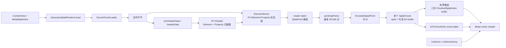
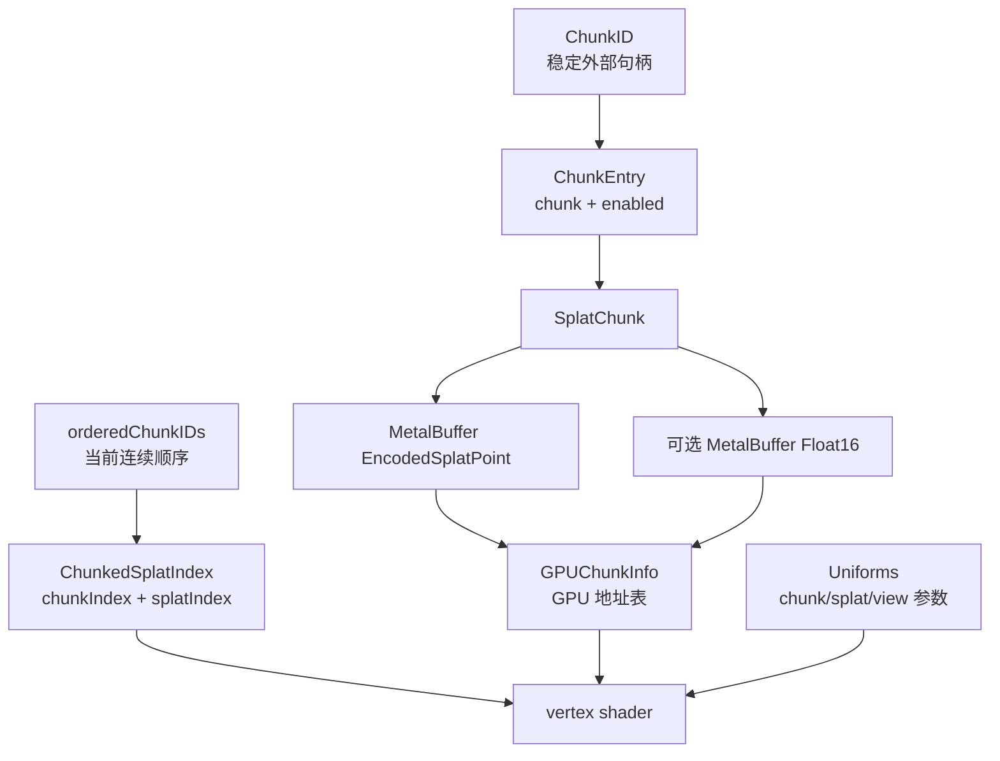

<!-- generated-by: gsd-doc-writer -->

# 数据结构与内存模型

> **当前实现基线（2026-08-27）：** 第 1～10 节以当前工作区源码为准：App 通过 `SceneChunkLoader` 按最多 65,536 点构建多个 chunk，PLY 接受 SH0～SH3，排序与绘制受候选预算约束。第 11 节只把已经淘汰的整场 `[SplatPoint]` 路径作为明确的历史对比，并列出尚未实现的进一步优化。

本文面向第一次沿源码学习 GaussianSplatMobile 的开发者，回答三个问题：文件中的字节怎样变成 shader 可读的数据；这些数据由谁持有、何时同时存在；哪些内存优化是当前事实，哪些仍只是建议。

全文严格区分三类内容：第 1～10 节描述**当前实现**；第 11.1 节标注**历史旧路径**；第 11.2 节以后才是**尚未实现的建议**。格式兼容性见 [3DGS-FORMATS.md](3DGS-FORMATS.md)，系统调用链见 [ARCHITECTURE.md](ARCHITECTURE.md)，空间分块与 LOD 目标见 [LARGE-SCENE-RENDERING.md](LARGE-SCENE-RENDERING.md)，与 CUDA 前向路径的逐阶段比较见 [FORWARD-RENDERING-COMPARISON.md](FORWARD-RENDERING-COMPARISON.md)。

## 1. 当前总数据链



这张图表示转换和引用关系，不表示每一步都会永久保留前一步。关键分界如下：

- [`ContentView`](../GaussianSplatMobile/UI/ContentView.swift) 创建 [`MetalSplatView`](../GaussianSplatMobile/Renderer/MetalSplatView.swift)，后者调度 [`GaussianSplatRenderer.load(url:)`](../GaussianSplatMobile/Renderer/GaussianSplatRenderer.swift)。
- [`SceneChunkLoader`](../GaussianSplatMobile/Renderer/SceneChunkLoader.swift) 消费 scene reader 的 `read()` 流，把跨 reader batch 累积的 `pendingPoints` 限制为 65,536 点；满批即编码并做 chunk 内 Morton 重排。
- [`PLYReader`](../Vendor/MetalSplatter/PLYIO/Sources/PLYReader.swift) 把字节分成结构化 header 和分批的 element 值；[`SplatPLYSceneReader`](../Vendor/MetalSplatter/SplatIO/Sources/SplatPLYSceneReader.swift) 只选择 `vertex` element，并把属性下标映射成 [`SplatPoint`](../Vendor/MetalSplatter/SplatIO/Sources/SplatPoint.swift) 的语义字段。
- [`SplatChunk`](../Vendor/MetalSplatter/MetalSplatter/Sources/SplatChunk.swift) 把一个有限批次的 `[SplatPoint]` 编码进 Metal buffer；chunk 不保存原数组。loader 返回所有已完成的 `[SplatChunk]`，App 再用 `addChunks` 一次注册到 renderer。
- [`SplatSorter`](../Vendor/MetalSplatter/MetalSplatter/Sources/SplatSorter.swift) 不复制点属性；它从跨 chunk 的确定性有界候选中生成 `(chunkIndex, splatIndex)` 排序索引。
- [`SplatRenderer`](../Vendor/MetalSplatter/MetalSplatter/Sources/SplatRenderer.swift) 常驻持有多个 chunk，每帧建立 chunk 地址表与 uniforms；shader 由排序索引间接访问具体 chunk 中的点。

## 2. PLYReader：原始字节、结构元数据与实际值

### 2.1 `preHeaderData` 与 `headerData` 是临时字节，不是模型对象

`PLYReader.read()` 创建一个默认每次读取 16 KiB 的 [`AsyncBufferingInputStream`](../Vendor/MetalSplatter/PLYIO/Sources/AsyncBufferingInputStream.swift)，然后执行两次 token 搜索：

1. `preHeaderData` 是 `ply\n` 之前的字节，token 本身被消费。调用传入 `maxLength: 0`，所以当前实现实际上要求文件从 `ply\n` 开始；合法文件中它应是空 `Data`。变量只用于确认 token 存在，随后不会保存。
2. `headerData` 是 `ply\n` 之后、`end_header\n` 之前的原始 UTF-8 字节；两个边界 token 都不包含在结果中。header 上限是 256 KiB，之后交给 `PLYHeader.decodeASCII`，也不会作为场景属性长期保存。

token 常量使用 LF 字节 `\n`。源码没有把任意前缀、UTF-8 BOM 或 CRLF 规范化为 LF 的步骤，因此不能把变量名 `preHeaderData` 理解为“支持任意前导内容”。

### 2.2 `PLYHeader` 保存 schema，`PLYElement` 保存值

这两层最容易混淆：

| 层 | 代表类型 | 保存内容 | 不保存什么 |
| --- | --- | --- | --- |
| 文件级结构 | `PLYHeader` | `format`、`version`、有序的 `[Element]` | 任意一个点的数值 |
| element 元数据 | `PLYHeader.Element` | `name`、声明的 `count`、有序的 `[Property]` | 第几条记录的值 |
| property 元数据 | `PLYHeader.Property` | property `name` 与 `PropertyType` | 标量或列表内容 |
| 一条实际记录 | `PLYElement` | 与 header property 同序的 `[PLYElement.Property]` | property 名和声明计数 |
| 一个分批 | `PLYReader.ElementSeries` | `[PLYElement]`、`typeIndex`、对应的 `elementHeader` | 全文件所有 element 的永久聚合 |

`PLYHeader.PropertyType` 可以是一个 primitive，也可以是带“计数类型 + 值类型”的 list。`PLYElement.Property` 才是实际的 `Int8`、`UInt32`、`Float`、`Double` 或对应列表数组。reader 依赖**相同下标**把元数据和数值配对；`SplatPLYSceneReader` 先从 header 求出属性下标，再用这些下标读每个 element。

### 2.3 ASCII 与 binary 的分批规则不同

| 路径 | 记录边界 | 何时产出 `ElementSeries` | 缓冲行为 |
| --- | --- | --- | --- |
| ASCII | 一行对应一个 element | 累积到 1024 条，或当前 element group 达到 header 声明计数 | 行缓冲可跨 16 KiB 输入块；1024 是 element 数，不是字节数 |
| Binary little/big endian | 按 header property 类型逐字节解码 | element group 结束，或当前可用 body buffer 恰好消费完；遇到半条记录时先产出已完成前缀 | 初始目标 16 KiB；若连一条完整 element 都放不下，目标容量翻倍 |

ASCII 解码按 header 顺序把一行拆成 scalar/list 值；列表首值是该 property 的元素数量。Binary 解码会保留未完成记录的尾部字节，下次补齐后继续。对至少含一个非零 element group、且已经正常推进完声明记录的常规文件，两条路径都会拒绝非空多余内容。

这里还有两个不能被“常规路径”掩盖的实现边界：

- header 的 `elements` 为空时，ASCII 和 binary 都会直接结束，不检查剩余 body。以 count 为 0 的 element 开头时，reader 也不会在第一次解码前主动跳过它；这种 schema 不能依赖当前实现得到严格验证。
- [`PLYElement.decodeASCII`](../Vendor/MetalSplatter/PLYIO/Sources/PLYElement+ascii.swift) 用动态的 `stringsIndex` 读取实际 token，但读取 list count 时当前使用属性下标 `i`。一个 list 前面只有 scalar 时二者相同；若前面已有可变长度 list，后续 list 的 count 可能取错 token。3DGS vertex 的常见属性全是 scalar，不触发这个问题，但不能把 reader 泛化为已经可靠支持任意多-list ASCII schema。

当前错误边界并不完全对称：binary EOF 时若尚未完成 header 声明的 element 数，会抛出 `unexpectedEndOfFile`；ASCII 循环到 EOF 后直接结束，没有做同等的最终计数核验。`SplatPLYSceneReader` 也留有“验证 expected point count”的 TODO。因此“header 声明了 count”不能被误写成“所有路径都已经严格验证实际 count”。

### 2.4 从 `ElementSeries` 到 App 的 65,536 点 chunk

`SplatPLYSceneReader.read()` 的行为是：

- 先用 header 建立一次 `ElementInputMapping`；
- 跳过非 `vertex` 的 element series；
- 把每批 `PLYElement` 转成一批 `[SplatPoint]`；
- 通过 `AsyncThrowingStream` 继续向调用者产出批次。

这里的 `AsyncThrowingStream` 没有显式设置有界 buffering policy，也没有把 producer 与 consumer 用背压绑定。因此下文的 65,536 上限只约束 `SceneChunkLoader.pendingPoints` 这个显式应用级数组；如果 reader 生产快于 chunk 编码与 Morton 重排，尚未消费的批次仍可能在 stream 内排队。它移除了整场 `readAll()` 聚合，但不能单凭该常量证明端到端解码峰值与场景总点数无关。

通用协议仍保留 [`SplatSceneReader.readAll()`](../Vendor/MetalSplatter/SplatIO/Sources/SplatSceneReader.swift)，它会执行 `points.append(contentsOf: batch)` 并返回完整 `[SplatPoint]`；但这只是库的便利 API，**当前 App 主路径没有调用它**，也不存在 `GaussianSplatRenderer.decodeScene(at:)`。

当前 App 的 [`SceneChunkLoader.load(url:device:)`](../GaussianSplatMobile/Renderer/SceneChunkLoader.swift) 直接执行 `for try await batch in try await reader.read()`。PLY reader 自身的 batch 可能小于 chunk：ASCII 路径通常最多产出 1024 个 element，binary 路径按已完成记录和输入 buffer 边界产出。loader 再把这些 batch 逐点追加到 `pendingPoints`，达到 `pointsPerChunk = 65_536` 时立即：

1. 把这一批交给 `SplatChunk(device:from:)`，编码基础属性和可选高阶 SH buffer；
2. 调用 `chunk.sortByLocality()`，只在该 chunk 内按 Morton code 同步重排基础属性与 SH；
3. 把完成的 chunk 追加到 loader 的 `[SplatChunk]`，然后继续读取下一批。

EOF 后，不足 65,536 点的尾批也会形成一个 chunk。loader 最终返回 `[SplatChunk]`、总点数、统一 SH degree、属性字节数，以及用 Welford 在线统计得到的 center/radius；它不返回也不保留完整场景 `[SplatPoint]`。`GaussianSplatRenderer.load` 收到结果后才调用 `SplatRenderer.addChunks(..., sortByLocality: false)` 一次注册所有 chunk；这里传 `false` 是因为每个 chunk 已经完成 Morton 重排，不代表 loader 边读边向 renderer 发布。

## 3. SplatPoint：保留来源语义和表示域

`SplatPoint` 是文件语义层，而不是固定 GPU ABI。它包含位置、颜色、透明度、尺度和旋转；其中 enum case 明确记录数值当前处于什么域。

| 字段 | `SplatPoint` 表示 | PLY 映射 | 编码前转换 |
| --- | --- | --- | --- |
| `position` | `SIMD3<Float>` 世界位置 | `x/y/z`，均要求 `float32` | 保持 Float32 |
| `color` | 原始 SH RGB triplet 数组，或 UInt8 sRGB | `f_dc_0...2`；可选 `f_rest_0...44`；或 `red/green/blue` | SH0 保持原始系数；UInt8 sRGB 先换算成 SH0 |
| `opacity` | `.logitFloat`、`.linearFloat` 或 `.linearUInt8` | PLY `opacity` 读成 logit | 统一为线性 Float，再压成 Float16 |
| `scale` | `.exponent` 或 `.linearFloat` | PLY `scale_0...2` 读成 exponent/log-scale | 对 exponent 执行 `exp`，得到线性尺度 |
| `rotation` | `simd_quatf` | `rot_0` 是实部 $w$，`rot_1...3` 是虚部 $x,y,z$ | 编码时归一化 |

### 3.1 尺度与透明度的域转换

对 PLY 中的 log-scale $\boldsymbol\ell$ 和 opacity logit $a$，编码使用：

$$
\mathbf{s}=\exp(\boldsymbol\ell),
\qquad
\alpha=\frac{1}{1+\exp(-a)}
$$

读作“对三维向量 $\boldsymbol\ell$ 的每个分量做指数得到线性尺度 $\mathbf{s}$；把 logit $a$ 送入 sigmoid 得到线性透明度 $\alpha$”。向量是按顺序排列的三个数；分式上方的 $1$ 是分子，下方的 $1+\exp(-a)$ 是分母。代码对应 `Scale.asLinearFloat` 和 `Opacity.asLinearFloat`。

域标签的设计价值是防止把已经线性的值再次 `exp` 或 sigmoid。代价是 Swift enum 带关联值，其 `MemoryLayout` 受编译器与 payload 影响；本文不会臆测 `SplatPoint`、`Color`、`Opacity` 或 `Scale` 的 stride。

### 3.2 SH0–SH3

degree 为 $d$ 时，每个颜色通道累计系数数为：

$$
n_d=(d+1)^2
$$

读作“球谐 degree 加一后平方”。$d$ 是 0～3 的整数；`SplatPoint.Color` 用一个 `SIMD3<Float>` 同时保存某个系数的 R、G、B，所以数组长度分别是 1、4、9、16。

| Degree | RGB triplet 总数 | SH0 之外 triplet 数 | 独立高阶 Float 标量数 |
| ---: | ---: | ---: | ---: |
| SH0 | 1 | 0 | 0 |
| SH1 | 4 | 3 | 9 |
| SH2 | 9 | 8 | 24 |
| SH3 | 16 | 15 | 45 |

当前 PLY 映射接受的 `f_rest_*` 数量精确为 0、9、24、45，分别对应 SH0、SH1、SH2、SH3。property 后缀必须从 0 开始连续，类型必须是 `float32`；不能用“出现 `f_rest_0` 就一定要求 45 个”描述当前实现。

Graphdeco PLY 把高阶标量按通道成段保存。令 $m=n_d-1$ 为每个颜色通道除 DC 之外的系数数，则文件顺序为：

$$
\underbrace{R_1,\ldots,R_m}_{m\text{ 个 R}},
\underbrace{G_1,\ldots,G_m}_{m\text{ 个 G}},
\underbrace{B_1,\ldots,B_m}_{m\text{ 个 B}}
$$

读作“先保存 R 通道的全部高阶系数，再保存 G，最后保存 B”。$m$ 在 SH0、SH1、SH2、SH3 下分别是 0、3、8、15；所以 `f_rest_*` 总数是 $3m$，即 0、9、24、45。reader 把通道分段布局重组为 `(R_i,G_i,B_i)` 的 RGB triplet，并把 `f_dc_0...2` 作为数组第 0 项放在最前面。于是 `SplatPoint.Color.sphericalHarmonicFloat` 的数组长度必须精确为 1、4、9 或 16。

`SplatChunk(device:from:)` 从首点取得 `shDegree`，再核验批内每个点的系数数组长度都等于该 degree 的 `coefficientCount`。`SceneChunkLoader` 还比较每一点的 degree，防止不同 chunk 混用 SH 阶数。若把“累计 RGB triplet 层数”记为 `sphericalHarmonicsLevelCount`，一致性关系是：

$$
\text{sphericalHarmonicsLevelCount}=(d+1)^2
$$

读作“degree 为 $d$ 时，累计层数是 $d+1$ 的平方”，也就是 SH0/SH1/SH2/SH3 分别要求 1/4/9/16 个 RGB triplet。需要注意：当前工作区的 [`SplatChunk`](../Vendor/MetalSplatter/MetalSplatter/Sources/SplatChunk.swift) **没有**名为 `sphericalHarmonicsLevelCount` 的存储成员；源码中的实际字段是 `shDegree`，层数由 `shDegree.coefficientCount` 给出。直接使用 `SplatChunk(splats:shCoefficients:shDegree:)` 时构造器不会验证 buffer 长度，因此调用方必须保证每点高阶 Float16 数量为 `shDegree.extraCoefficientCount * 3`，并且基础点与 SH group 同下标。

若输入是 UInt8 sRGB，转成原始 SH0 的关系是：

$$
\mathbf{h}_0=\frac{\mathbf{c}_{sRGB}-0.5}{C_0},
\qquad C_0=0.28209479177387814
$$

读作“把归一化到 0～1 的 sRGB 向量减去 0.5，再除以零阶球谐常数”。分子是带偏置的 RGB 向量，分母是标量 $C_0$；代码对应 `Color.sh0`。GPU 稍后用 $C_0\mathbf{h}_0+0.5$ 恢复基础颜色。

## 4. EncodedSplatPoint：目标 32-byte CPU/Metal ABI

[`EncodedSplatPoint.swift`](../Vendor/MetalSplatter/MetalSplatter/Sources/EncodedSplatPoint.swift) 与 [`ShaderCommon.h`](../Vendor/MetalSplatter/MetalSplatter/Resources/ShaderCommon.h) 必须同步。按当前字段顺序和 arm64 对齐规则，参考布局是 `size = 32`、`stride = 32`、`alignment = 4`。仓库目前没有把这些数值固化成目标设备上的 `MemoryLayout` 断言或测试，因此它是需要在每个受支持 target 上核验的 ABI 前置条件，不是跨架构的永久保证。

| Byte offset | CPU 字段 | Metal 字段 | 格式 | 含义 |
| ---: | --- | --- | --- | --- |
| 0–11 | `MTLPackedFloat3 position` | `packed_float3 position` | 3 × Float32 | 世界空间中心 |
| 12–19 | `PackedRGBHalf4 colorSH0` | `packed_half4 color` | 4 × Float16 | 原始 SH0 R/G/B + 线性 Alpha |
| 20–25 | `PackedHalf3 covA` | `packed_half3 covA` | 3 × Float16 | $\Sigma_{00},\Sigma_{01},\Sigma_{02}$ |
| 26–31 | `PackedHalf3 covB` | `packed_half3 covB` | 3 × Float16 | $\Sigma_{11},\Sigma_{12},\Sigma_{22}$ |

位置保留 Float32；颜色、Alpha 和协方差压为 Float16。两个 packed half3 恰好保存对称 $3\times3$ 协方差的六个独立分量，而不是保存 scale 和 quaternion 本身。

### 4.1 四元数归一化与协方差预计算

令线性尺度向量为 $\mathbf{s}$，归一化四元数生成的旋转矩阵为 $R$：

$$
M=R\,\operatorname{diag}(\mathbf{s})
$$

读作“先用对角矩阵沿三个局部轴缩放，再用旋转矩阵把这些轴转到世界方向”。矩阵是把输入向量映射成输出向量的数表；`diag` 只把三个尺度放在主对角线上。

三维协方差为：

$$
\Sigma_{3D}=MM^T
$$

读作“变换矩阵乘自己的转置”。上标 $T$ 表示交换矩阵的行和列；结果是对称矩阵，描述高斯椭球沿各方向的扩散与倾斜。`EncodedSplatPoint.init` 在 CPU 构建 chunk 时完成这一步，shader 每帧消费预计算结果，不再从 scale/quaternion 重建三维协方差。

### 4.2 高阶 SH 是独立 buffer

32-byte 结构只含 SH0。SH1/SH2/SH3 的额外系数放在 `MetalBuffer<Float16>` 中，每点分别占 9、24、45 个 Float16。shader 根据 `shDegree` 和局部 `splatIndex` 计算偏移，把连续 half 解释为 `packed_half3` RGB triplet。

把高阶 SH 分离的收益是 SH0 场景完全不分配该 buffer，基础点 stride 始终固定；代价是点顺序发生变化时，基础 buffer 与 SH buffer 必须使用同一排列同步重排。

## 5. Chunk、索引、chunk table 与 uniforms

### 5.1 引用关系



### 5.2 各类型职责与 arm64 参考布局

| 类型 | 当前职责 | 关键不变量 | arm64 参考布局 |
| --- | --- | --- | --- |
| `SplatChunk` | 强持有基础 splat buffer、可选高阶 SH buffer 和共同 `shDegree` | `device/from` 构造器核验批内系数数；直接 buffer 构造器仍要求调用方保证 degree、长度与同下标关系 | Swift struct 本身不作为 shader ABI |
| `ChunkID` | renderer 对外返回的稳定、opaque 句柄 | 单调分配且不复用；不等于 shader 的连续索引 | 不把 Swift stride 当文件/GPU ABI |
| `ChunkedSplatIndex` | 排序结果中的二级地址 | `chunkIndex` 指当前 `orderedChunkIDs` 的连续位置；`splatIndex < chunk.splatCount` | `size/stride/alignment = 8/8/4`，含 UInt16 padding |
| `GPUChunkInfo` | 每帧 chunk table 的一项 | 指针、点数、degree、enabled 必须来自同一个当前 chunk；规范的 SH0 chunk 应让 SH 地址为 0 | `size/stride/alignment = 24/24/8` |
| `Uniforms` | 单个 viewport 的矩阵、相机、屏幕与计数 | CPU/Metal 字段顺序同步；计数描述本帧绑定资源 | `size/stride = 180/192` |
| `UniformsArray` | 最多两个 viewport 的 inline uniforms | 当前 App 只填一个；renderer 常量最多两个 | `size/stride = 372/384`；256-byte 对齐槽 `alignedSize = 512` |

上述数值是依据当前 Swift/Metal 字段顺序和 arm64 对齐规则得到的参考布局，并与 [`SplatRenderer.swift`](../Vendor/MetalSplatter/MetalSplatter/Sources/SplatRenderer.swift) / [`ShaderCommon.h`](../Vendor/MetalSplatter/MetalSplatter/Resources/ShaderCommon.h) 逐项对应。仓库尚无自动 layout test；发布前应在实际 iOS target 对关键类型执行 `MemoryLayout` 断言，并与 Metal 侧 `sizeof` 或一份探针 shader 对照。

两条构造路径的保证不同。`SplatChunk(device:from:)` 用首点推断 degree，并逐点核验 `asSphericalHarmonicFloat.count == shDegree.coefficientCount`，然后按共同排列写基础 buffer 与 SH buffer；当前 App 使用这条路径。更底层的 `SplatChunk(splats:shCoefficients:shDegree:)` 不校验 degree、SH buffer 长度和点数是否匹配。renderer 对 SH0 也只是读取可选 SH buffer 的地址：若调用方直接传入“SH0 + 非空 SH buffer”，地址不会被强制改成 0。因此底层构造器的调用方仍必须验证第 3.2 节的长度和同下标不变量。

`ChunkID` 和 `chunkIndex` 的生命周期不同：添加 chunk 时，`ChunkID` 永久标识该对象；移除中间 chunk 后，renderer 会压紧 `orderedChunkIDs`，重建 `ChunkID → UInt16` 映射，并修补幸存排序索引。因此持久化 `chunkIndex` 会失效，持久化 `ChunkID` 才符合 API 语义。

### 5.3 shader 怎样完成二级寻址

当前 draw 先从实例号与模板顶点得到全局排序位置：

$$
splatID=instanceID\times indexedSplatCount+\left\lfloor\frac{vertexID}{4}\right\rfloor
$$

读作“实例号先跳过若干个索引模板，再用每四个顶点属于一个 quad 得到当前排序条目”。分式的分子是 `vertexID`，分母 4 表示一个 quad 有四个不同顶点；向下取整得到模板内第几个高斯。

shader 随后按以下顺序访问：

1. 用 `splatID` 读 `ChunkedSplatIndex`；
2. 先检查 `chunkIndex < uniforms.chunkCount`；
3. 用 `chunkIndex` 读 `ChunkInfo`；
4. 检查 `splatIndex < chunk.splatCount` 与 `enabled`；
5. 用 `chunk.splats[splatIndex]` 读 32-byte `Splat`；
6. 若 degree 大于 SH0，再用同一个局部 `splatIndex` 读高阶 SH；
7. 把 `Uniforms` 中的 view/projection、相机位置和焦距参数交给 [`SplatProcessing.metal`](../Vendor/MetalSplatter/MetalSplatter/Resources/SplatProcessing.metal)。

这解释了三个必须同时成立的不变量：连续 chunk 顺序必须一致；局部点下标必须与 SH 分组一致；排序 buffer 在 GPU 完成前不能被 sorter 改写。

## 6. 三份 sorter index buffer 不是三份场景属性

`SplatSorter` 固定创建三份 `MetalBuffer<ChunkedSplatIndex>`。每份都有 `referenceCount` 与 `isValid`，全局状态另记录 `sortingBufferIndex` 与 `mostRecentValidBufferIndex`。每份 buffer 的逻辑 count 是当前候选数 $K=\min(N_{all},K_{budget})$，不是默认等于全场总点数 $N_{all}$；App 的候选预算初始为 1,000,000，之后在 250,000～1,250,000 之间自适应，第 9 节详述抽样和调节规则。

三份 buffer 没有永久绑定为“前帧/当前帧/下一帧”三个固定角色。某一时刻常见角色是：

- 最近发布且可被多个 frame 同时引用的一份；
- 后台 sort 正在写的一份；
- 引用计数为 0、可供下一次写入或 patch 的一份。

渲染取得最近有效 buffer 时增加引用计数；command buffer 完成回调才释放。后台 sort 只选择引用计数为 0、且不是当前已发布结果的 buffer 写入。chunk 增删是例外：renderer 先取得独占访问并排空相关 GPU 引用，随后可以 patch 或重建有效结果；启用有界候选时，增加 chunk 会重新对扁平全场取样，不能只把新 chunk 的全部索引追加到旧样本。这三份 buffer 保存的都只是 8-byte 索引，不包含 position、color、opacity、covariance 或 SH，也不等于 `maxSimultaneousRenders` 的三槽 uniform ring。

## 7. 所有权与生命周期：`reader batches → 多个 SplatChunk`

当前应用加载顺序是：

```text
reader batches
  → pendingPoints（最多 65,536 点）
  → SplatChunk(device:from: points)
  → chunk 内 Morton 重排
  → LoadedScene.chunks
  → renderer 持有多个 SplatChunk / MetalBuffer
```

### 7.1 构建阶段发生什么

1. reader 可以产出自己的 `[SplatPoint]` batch；loader 把其中的点追加到 `pendingPoints`，并用 `reserveCapacity(65_536)` 为当前 chunk 预留容量。
2. 满 65,536 点时，loader 令 `pointsToEncode = pendingPoints`，马上换成新的空 `pendingPoints`。Swift Array 是 copy-on-write，这次赋值本身不会逐元素复制，但编码期间旧批 backing storage 与新数组的预留 storage 可能短时同时存在。
3. `SplatChunk(device:from:)` 按该批点数精确创建基础 `.storageModeShared` buffer，逐点写 `EncodedSplatPoint`；若 degree 大于 SH0，再创建独立高阶 SH buffer。此时**允许一批 `[SplatPoint]` 与正在形成的新 chunk buffers 重叠**。
4. 随后 `sortByLocality()` 为这个 chunk 建立 Morton key、排列和 `visited` 临时数据，并同步重排基础/SH buffer。完成后把 chunk 追加到 `[SplatChunk]`；已完成 chunk 的 packed buffers 常驻，语义批次在所有强引用消失后才具备释放条件。
5. EOF 尾批走同一路径。返回的 `LoadedScene` 只持有 `[SplatChunk]`、计数、SH degree、属性字节数和边界统计，不含完整场景 `[SplatPoint]`。

因此当前路径消除了“完整场景 CPU 语义数组”，但不能承诺“任意时刻永远只有一份数据”。reader batch、当前 `pendingPoints`、新数组的预留容量、新 chunk buffers、Morton 临时项与此前完成的所有 chunk buffers 都可能重叠。局部变量最后一次被使用也不等于某条源码行会立即释放内存；Swift ARC、优化器、异步状态机和 autorelease 行为会影响实际释放时点。精确峰值必须在目标 build/configuration 上用 Instruments 测量。

### 7.2 Welford 在线中心与半径

loader 不保存全场 position，也不做第二遍扫描。第 $n$ 个位置向量为 $\mathbf{x}_n$，已有均值为 $\boldsymbol\mu_{n-1}$ 时，更新为：

$$
\begin{aligned}
\boldsymbol\delta_n &= \mathbf{x}_n-\boldsymbol\mu_{n-1} \\
\boldsymbol\mu_n &= \boldsymbol\mu_{n-1}+\frac{\boldsymbol\delta_n}{n} \\
M_{2,n} &= M_{2,n-1}+\boldsymbol\delta_n\cdot(\mathbf{x}_n-\boldsymbol\mu_n)
\end{aligned}
$$

读作“先求新点相对旧均值的向量差，再用 $1/n$ 的权重修正均值，最后把修正前后的两个差向量做点积并累加到 $M_2$”。向量是三个坐标组成的有方向数列；点积把对应坐标相乘后相加，结果是一个标量。代码中的 `mean` 对应 $\boldsymbol\mu_n$，`squaredDistanceAccumulator` 对应 $M_{2,n}$。

最终相机 framing 半径为：

$$
r=\max\!\left(2.5\sqrt{\frac{M_{2,N}}{N}},\,0.1\right)
$$

读作“累计平方距离除以总点数，开平方得到三维均方根距离，再乘 2.5，并至少取 0.1”。分子 $M_{2,N}$ 是 Welford 累计量，分母 $N$ 是场景总点数。它是围绕均值的统计半径，不是所有点的精确包围球。

### 7.3 `.storageModeShared` 是一个共享 allocation

[`MetalBuffer`](../Vendor/MetalSplatter/MetalSplatter/Sources/MetalBuffer.swift) 创建一个 `.storageModeShared` 的 `MTLBuffer`，再把 `buffer.contents()` 绑定成 `UnsafeMutablePointer<T>`。`values` 是同一 allocation 的 CPU 地址视图，GPU 也读取该 `MTLBuffer`；它不是“一个 CPU 属性数组 + 一份永久 GPU 属性副本”。

这也不等于整个应用永远只有一个 allocation：每个 chunk 的基础点和高阶 SH 本来就是不同 buffer；三份排序索引、uniform ring、chunk table 和文件/Swift 临时内存也独立存在；扩容时新旧 buffer 会短暂重叠。Metal driver、页表、缓存和系统文件缓存的内部占用不由这些源码字段完整暴露，不能从 `.storageModeShared` 推导为零开销。

### 7.4 线程与同步边界

- [`MetalSplatView`](../GaussianSplatMobile/Renderer/MetalSplatView.swift) 和 `GaussianSplatRenderer` 都在 `@MainActor`；coordinator 用 `Task` 调用 `renderer.load(url:)`。
- `GaussianSplatRenderer.load` 明确创建 `.userInitiated` 的 `Task.detached`，在其中调用 `SceneChunkLoader.load`。reader 消费、`SplatChunk` 编码和 Morton 重排都在这条加载任务中完成；`LoadedScene` 以 `@unchecked Sendable` 跨边界返回。
- `SplatPLYSceneReader` 与 `PLYReader` 的 `AsyncThrowingStream` producer 使用 `Task`，但源码没有为这些 producer 声明命名 `DispatchQueue`、特定 actor 或固定 executor；文档不对其实际线程作额外承诺。
- `await detachedTask.value` 返回后，`GaussianSplatRenderer.load` 继续受 `@MainActor` 隔离，创建 `SplatRenderer`、调用 `addChunks`、设置相机与状态。`SplatRenderer` 自身不是 actor；chunk/render 互斥由 `Mutex`、continuation 和 in-flight 计数维护。
- [`SplatSorter`](../Vendor/MetalSplatter/MetalSplatter/Sources/SplatSorter.swift) 的 sort loop 明确由 `.high` 优先级 `Task.detached` 启动，内部状态由 `Mutex` 保护。App 的 `draw(in:)` 在主 actor 上向自己的 `MTLCommandQueue` 编码；Metal command-buffer completion handler 再通过 `Task { @MainActor in ... }` 交接 UI 统计。

## 8. `sortByLocality`：静态 Morton 局部性重排

[`SplatChunk+sortByLocality.swift`](../Vendor/MetalSplatter/MetalSplatter/Sources/SplatChunk+sortByLocality.swift) 只在点数大于 3 且三个轴的 bounds 跨度都大于 0 时运行。

### 8.1 `mean ± 2.5σ` bounds

对每个轴，代码计算：

$$
\mu=\frac{1}{N}\sum_{i=1}^{N}p_i,
\qquad
\sigma=\sqrt{\frac{1}{N}\sum_{i=1}^{N}p_i^2-\mu^2}
$$

读作“坐标总和除以点数得到均值；平方的均值减均值平方，再开根号得到标准差”。求和符号表示逐点累加；分子是总量，分母 $N$ 是点数。源码用 `SIMD3<Float>` 同时对 x、y、z 三轴计算。

量化盒为：

$$
L=\mu-2.5\sigma,
\qquad
U=\mu+2.5\sigma
$$

读作“每轴下界是均值减 2.5 个标准差，上界是均值加 2.5 个标准差”。它不是精确 min/max；离群点可以落在盒外，随后会被 clamp 到边界。

### 8.2 10-bit 量化与 30-bit Morton code

每轴坐标先映射到 $[0,1]$，再变成 10-bit 整数：

$$
q_a=\left\lfloor
\operatorname{clamp}\!\left(\frac{p_a-L_a}{U_a-L_a},0,1\right)\times1023
\right\rfloor
$$

读作“坐标离下界的距离除以轴跨度，限制到 0～1，乘 1023 后向下取整”。分式分子是当前位置相对下界的距离，分母是完整 bounds 跨度。$a$ 分别代表 x、y、z 轴。

Morton code 把三轴每一位交错：

$$
M=\sum_{i=0}^{9}
\left(x_i2^{3i}+y_i2^{3i+1}+z_i2^{3i+2}\right)
$$

读作“从最低位开始，把 x、y、z 的第 $i$ 位依次放入结果的三个相邻 bit，再累加所有十组”。每轴 10 bit，合计 30 bit，结果放进 `UInt32`。它是一种把三维网格线性化成一维键的方法；线性化尽量保留局部性，但不保证相邻 code 一定是最近邻。

### 8.3 同排列重排与临时内存

当前实现先创建 `(sourceIndex, mortonCode)` 的 $O(N)$ 数组，排序后再创建源索引排列。基础点通过 cycle permutation 原地重排，并分配一个 $O(N)$ 的 `visited`；高阶 SH 以相同排列、按每点固定 group size 重排，另用 `visited` 和一个点的 SH group 临时区。

这些数组的 Swift tuple、`Int`、`Bool` 容器 stride 未在源码中固定为跨目标 ABI，本文只记录可证明的字段和 $O(N)$ 规模，不用字段简单相加臆测字节数。

Morton 重排明确**不是**：

- 相机深度排序——它不读取相机；
- tile 划分或可见性筛选——它不读取屏幕 tile、frustum、opacity 或遮挡信息；
- 空间 chunk 划分——loader 已经按最多 65,536 点建立 chunk，Morton 只重排这个既有 chunk 内部的顺序，不创建或合并 chunk；
- Octree/BVH——没有生成节点、bounds 表或范围索引；
- 相机相关排序——它是加载时的静态局部性布局；每帧的候选深度排序由 `SplatSorter` 另行完成。

## 9. SplatSorter：CPU 位置读取与相机排序

当前 `SplatRenderer.Constants.sortByDistance = true`。sorter 直接从多个 chunk 的共享基础 buffer 读取候选点的 `EncodedSplatPoint.position`，为每个候选生成临时项：`UInt16 chunkIndex`、`UInt32 splatIndex` 和 `Float depth`。点属性仍按 chunk 全量常驻；候选预算只限制排序索引、CPU 排序工作和每帧提交数量，不卸载非候选点的属性 buffer。

### 9.1 跨 chunk 的确定性有界候选

先按 `orderedChunkIDs` 把全部 chunk 逻辑展平。设全场点数为 $N_{all}$，候选预算为 $K_{budget}$，实际候选数为：

$$
K=\min(N_{all},K_{budget})
$$

读作“实际候选数取全场点数与预算中较小者”。若 $K<N_{all}$，第 $j$ 个候选使用的扁平全局下标为：

$$
g_j=\left\lfloor\frac{jN_{all}}{K}\right\rfloor,
\qquad j=0,1,\ldots,K-1
$$

读作“把候选序号 $j$ 乘全场点数，再除以候选数并向下取整”。分子 $jN_{all}$ 表示在完整扁平序列中的比例位置，分母 $K$ 控制均匀步距。`forEachSampledReference` 再把 $g_j$ 映射回 `(chunkIndex, splatIndex)`，因此这个集合覆盖完整的跨 chunk 序列，而且在 chunk 顺序、点顺序、总数和预算不变时是确定的。

这种抽样是**按扁平下标均匀取样**，不是基于屏幕 tile、frustum、遮挡、opacity、贡献度或相机距离的可见性选择。chunk 内的 Morton 顺序会影响被抽到的局部点，但 Morton 自身也不是候选筛选。所有候选随后才按当前相机排序。

排序键为欧氏距离平方：

$$
d_i=(p_{i,x}-c_x)^2+(p_{i,y}-c_y)^2+(p_{i,z}-c_z)^2
$$

读作“点位置减相机位置，把三个坐标差分别平方后相加”。这就是三维向量长度的平方；省略平方根不会改变非负距离的大小关系。数组按 $d_i$ 从大到小排序，所以结果是全局、由远到近。

这不是沿相机 forward 的 view-depth；源码保留了点积备选分支，但常量当前选择欧氏距离。它也不是 Morton：Morton 移动属性以改善局部性，sorter 只写索引以适应当前相机。

App 初始化 renderer 时令预算为 $\min(N_{all},1{,}000{,}000)$。场景超过 250,000 点时，完成帧统计约每 0.75 秒形成一个窗口并调用控制器；预算实际改变后会进入至少 3 秒冷却，因此相邻两次预算改变不会短于 3 秒。低于 55 FPS 时预算乘 0.8、但不低于 250,000；达到 59 FPS、平均 GPU 时间大于 0 且低于 12 ms、并且尚未到上界时，预算乘 1.1。上界是 $\min(N_{all},1{,}250{,}000)$。这解释了“初始 1,000,000、在 250,000～1,250,000 间自适应”的准确含义；小场景不会为了满足下限而补出不存在的点。

`sortTempStorage` 被调整到精确候选数 $K$，后续排序复用或在预算改变时替换；它不是完整场景数组。完成 sort 后，候选字段被写入一份 `ChunkedSplatIndex` buffer，临时项中的 `depth` 不发送给 GPU。三份 index buffer 的逻辑 count 和扩容需求同样由候选数决定，而不是由 $N_{all}$ 决定；已扩大的 capacity 不保证在预算下降后立即缩小。

### 9.2 为什么不能把当前 buffer 直接改成 `.storageModePrivate`

把 `MetalBuffer` 构造参数从 `.shared` 改成 `.private` 会破坏当前代码路径，因为：

- `MetalBuffer` 初始化和扩容依赖 `buffer.contents()` 取得 CPU 指针；private buffer 不能这样直接映射。
- `SplatChunk` 由 CPU 逐点写基础属性和 SH。
- `sortByLocality` 原地读取并移动基础点与 SH。
- `SplatSorter` 每次相机变化都从基础 buffer 读取 Float32 position。
- 三份排序索引、uniform ring 与 chunk table 都由 CPU 直接写入。

未来可以只把适合 GPU-only 的资源迁到 private，但需要显式 staging + blit、独立 CPU position mirror，或把排序/重排搬到 GPU，并重新设计同步与加载峰值。那是架构变更，不是 storage option 的单行替换。

## 10. 当前内存账本

以下设第 $j$ 个 chunk 有 $N_j$ 个点，$N_{all}=\sum_{j=1}^{C}N_j$ 为所有 chunk 的总点数，$d$ 为 `SceneChunkLoader` 已核验统一的 SH degree，$C$ 为 chunk 数，$K$ 为当前候选数，$K_{cap}$ 为相关可复用 buffer 已达到的候选 capacity，$R$ 为 `maxSimultaneousRenders`。当前 App 有 $N_j\le65{,}536$、$K\le1{,}250{,}000$。只对源码定宽或前述 arm64 参考布局给出字节数；实际 iOS target 仍应由 layout test 核验。

### 10.1 可精确计算的驻留 buffer

每点基础属性固定 32 B。高阶 SH 每点字节为：

$$
b_{SH}(d)=2\times3\times\left((d+1)^2-1\right)
$$

读作“每个额外系数有 RGB 三个通道，每个通道是 2-byte Float16，再乘 SH0 之外的系数数”。从内向外计算：SH1、SH2、SH3 分别是 18、48、90 B/点，SH0 是 0。

| 类别 | 当前对象 | 可证明的规模 | 生命周期说明 |
| --- | --- | --- | --- |
| 常驻场景属性 | 所有 chunk 的基础 `MetalBuffer<EncodedSplatPoint>` | $32\sum_jN_j=32N_{all}$ B | renderer 持有期间全部常驻，不受候选预算影响 |
| 常驻场景属性 | 所有 chunk 的高阶 `MetalBuffer<Float16>` | $b_{SH}(d)N_{all}$ B；SH0 不创建 | 每 chunk 独立 allocation，与对应基础 buffer 同顺序 |
| 重复复用 | 三份 sorter index | 每份有效内容 $8K$ B；若 capacity 到 $K_{cap}$，三份合计约 $24K_{cap}$ B 的元素空间 | 按候选上限增长，角色动态轮换；不按 $N_{all}$ 预分配 |
| 重复复用 | `sortTempStorage` | $K$ 个“chunk 下标 + 局部下标 + depth”项 | 精确 Swift stride 未在 ABI 中固定；预算变化时数组可被替换 |
| 常驻 renderer | uniform ring | $512R$ B；当前 App 的 $R=3$，即 1536 B | 每槽按 256 B 对齐，轮换复用 |
| 按需增长后复用 | quad triangle index | $24\min(K,1024)$ B 的有效内容 | 每个模板点 6 个 UInt32；buffer capacity 不缩小 |
| 每帧/池化复用 | chunk table | 有效内容 $24C$ B | GPU 完成后回收到 [`MTLBufferPool`](../Vendor/MetalSplatter/MetalSplatter/Sources/MTLBufferPool.swift)；池可继续持有 allocation |

`MetalBuffer` 至少分配一个 element 的 capacity，即使逻辑 count 为 0；正常 App 会在建 chunk 前拒绝空场景。表格写的是非空实际路径和有效内容，不把 allocator 分配粒度或 driver 元数据伪装成字段字节。

### 10.2 加载峰值

加载期会重叠存在：

- PLY 的当前 reader batch、loader 的 `pendingPoints`，以及满批换数组后可能已经为下一批预留的 storage；`Color.sphericalHarmonicFloat` 还会让每点语义值引用动态数组。语义点的上界不能用一个臆测 enum stride 换算成精确字节。
- reader 的 `AsyncThrowingStream` 没有有界 buffering/backpressure；producer 领先 consumer 时，多个已产出的 `[SplatPoint]` batch 可能排队，所以“`pendingPoints` 最多 65,536”不是整个读取链路的内存上界。
- 之前已经完成的所有 chunk 的基础/SH buffers；它们随 `[SplatChunk]` 常驻，并随着读取进度累加。
- 正在编码的一批 `[SplatPoint]` 与新 chunk 的 32-byte 基础 buffer、可选高阶 SH buffer。这个短时重叠是允许且真实的，但没有完整场景 `[SplatPoint]`。
- PLY 的输入 `Data` 分块、header/line/binary buffer、`ElementSeries`、`PLYElement.Property` 值与 SplatPoint 批次。
- 当前 chunk 的 Morton 键/索引/排列/visited；高阶 SH 重排时还有一个点的 group 临时区。这些临时项按单 chunk 的 $N_j$，不是按全场 $N_{all}$。
- 所有 chunk 注册后，初次相机排序还会按候选数 $K$ 建立 `sortTempStorage` 和 sorter index buffer；这时全场 packed 属性已经常驻。

当前实现的关键收益是移除了完整场景 CPU 语义数组，不能把它夸大为“加载时永远只有一份”。chunk initializer 会为**当前批次**精确预分配目标属性 buffer，所以单个 chunk 的基础/SH buffer 不逐点扩容；sorter index 首次或后续预算上调时的扩容仍可能让新旧 allocation 短时重叠。

### 10.3 每帧或反复复用

- `sortTempStorage` 在相机/chunk/候选预算改变后被覆盖并重新排序，大小是 $K$ 而不是 $N_{all}$。
- 三份 index buffer 被 patch、排序、发布和 GPU 引用，不复制点属性；有效 count 是 $K$，capacity 可能保留此前更大的候选预算。
- uniform 从 512-byte ring 槽直接更新。
- chunk table 每帧从 pool 取得合适 buffer或重新分配，command buffer 完成后归还；多个 in-flight frame 可让多份 table 同时在用。
- quad triangle index 只在需要更大模板时增长，之后复用。

### 10.4 短期临时与无法由源码封顶的边界

- `AsyncBufferingInputStream` 每次底层读最多 16 KiB，但返回的 `Data`、pushback 后缀和 ASCII 单行可以同时存在；单行长度没有 16 KiB 硬上限。
- Binary body 工作 buffer 初始 16 KiB，遇到超大的 list element 会翻倍，因此 reader batch 不是严格的峰值内存上限。
- `MetalBuffer.setCapacity` 会新建目标大小 buffer、复制旧 count，再替换属性；方法执行期间新旧 allocation 重叠。它按请求的 minimum capacity 扩，不是指数增长策略。
- 文件系统页缓存、`InputStream`/Foundation 内部对象、Metal driver 内部 staging/cache、页表和 allocator rounding 不在这些结构字段中，不能从仓库源码给出精确上界。

## 11. 历史旧路径与尚未实现的进一步优化

### 11.1 历史对比：整场聚合与单 chunk（已淘汰）

较早的设计曾采用 `readAll() → 完整 [SplatPoint] → DecodedScene → 单个 SplatChunk`。它需要让完整 CPU 语义数组与整场目标 Metal buffers 在构建期重叠，而且中心/半径依赖完整数组扫描。**这不是 2026-08-27 当前 App 的实现**；当前主路径是第 2.4、7 节描述的 `SceneChunkLoader`、65,536 点上限、多个 chunk 和 Welford 在线统计。库中保留 `readAll()` 不表示 App 仍在使用旧路径。

| 维度 | 历史旧设计 | 2026-08-27 当前实现 |
| --- | --- | --- |
| CPU 语义点 | 完整场景 `[SplatPoint]` | 当前 reader batch + 最多 65,536 点的 chunk 批次 |
| packed 属性 | 单个整场 chunk | 多个最多 65,536 点的 chunk，全部常驻 |
| 场景统计 | 完整数组扫描 | Welford 单遍在线统计 |
| Morton | 整场单 chunk 内重排 | 每个 chunk 完成编码后分别重排 |
| renderer 注册 | 单 chunk | loader 返回全部 chunk 后一次 `addChunks` |
| 每帧排序索引 | 可随全场点数增长 | 跨 chunk 确定性候选，受自适应预算约束 |

### 11.2 建议：从 element 直接编码当前 chunk（尚未实现）

当前实现已经消除**完整场景** `[SplatPoint]`，但仍会让一个最多 65,536 点的语义数组与新 chunk buffers 重叠。若测量表明这仍是峰值瓶颈，可新增专用 PLY-to-chunk encoder：读取并验证 header/schema 后，把每个 `PLYElement` 直接转换为 `EncodedSplatPoint` 和对应高阶 SH Float16，并写入当前固定容量 chunk；同时继续使用现有 Welford 更新。

这项建议需要处理以下事实：PLY header 可在 body 前给出 vertex count 和 0/9/24/45 个 `f_rest_*` schema，但当前 reader 对所有格式路径的最终实际 count 校验并不完全对称。实现必须自行核验 `writtenCount`，并在 chunk 完整、SH 长度正确且 Morton 同步重排之前禁止发布。它能进一步缩短语义对象生命周期，却不会消除已经完成的 packed chunks、reader buffer、Morton 临时项或候选排序资源。

### 11.3 Morton 与资源存储的独立取舍（尚未实现）

- 离线把基础属性和高阶 SH 同步排成 Morton 顺序，可省去运行时每 chunk 的 key/permutation/visited；资产格式必须声明并验证该排列，普通 PLY header 没有这个保证。
- 两遍或外部排序可以先算 permutation、再按最终 offset 编码，但会增加 I/O 或外部存储。
- 把属性迁到 `.storageModePrivate` 需要 staging + blit、独立 CPU position mirror，或把 Morton/相机排序搬到 GPU；它与“分批直接编码”不是同一个改动。
- 若要首批可见，必须设计渐进 `addChunk`、排序发布与错误回滚协议。当前 loader 虽然分 chunk 构建，却要等全部 chunk 返回后才一次注册，不能称为渐进显示。

### 11.4 当前与未来都必须保持的正确性不变量

1. header property 元数据与 element 实际值始终按同一有序下标解释。
2. 每个输入点恰好写一个 32-byte `EncodedSplatPoint`；最终实际 count 必须被核验。
3. opacity/scale 只激活一次，四元数在 covariance 计算前归一化。
4. 场景与 chunk 内 SH degree 一致；SH0/1/2/3 每点分别有 1/4/9/16 个 RGB triplet，高阶 buffer 分别有 0/9/24/45 个 Float16 标量。
5. 基础点和 SH 使用同一个逻辑点序；Morton、过滤、LOD 或 chunk 拆分必须同步应用所有属性。
6. `ChunkedSplatIndex.chunkIndex` 对应发布时的连续 chunk table，局部下标不越界。
7. 发布后任何原地属性重排都必须使旧排序索引失效；GPU 完成使用前不得复用或释放 index、chunk table 与属性 buffer。

无论采取哪项后续优化，都只能对被实际移除的重叠作出承诺，不能把 `.storageModeShared` 描述成“整个应用只有一个 allocation”。

## 12. 源码索引与继续阅读

### 当前实现源码

- [App 根视图与模型选择](../GaussianSplatMobile/UI/ContentView.swift)
- [Metal view 生命周期与加载任务](../GaussianSplatMobile/Renderer/MetalSplatView.swift)
- [65,536 点分块、Welford 统计与 Morton 调用](../GaussianSplatMobile/Renderer/SceneChunkLoader.swift)
- [MainActor 交接、renderer 注册与自适应候选预算](../GaussianSplatMobile/Renderer/GaussianSplatRenderer.swift)
- [PLY 分批 reader](../Vendor/MetalSplatter/PLYIO/Sources/PLYReader.swift)
- [PLYHeader 数据结构](../Vendor/MetalSplatter/PLYIO/Sources/PLYHeader.swift)
- [PLY header ASCII 解码](../Vendor/MetalSplatter/PLYIO/Sources/PLYHeader+ascii.swift)
- [PLYElement 实际值](../Vendor/MetalSplatter/PLYIO/Sources/PLYElement.swift)
- [PLY ASCII element 解码](../Vendor/MetalSplatter/PLYIO/Sources/PLYElement+ascii.swift)
- [PLY binary element 解码](../Vendor/MetalSplatter/PLYIO/Sources/PLYElement+binary.swift)
- [SplatSceneReader 的 read 流与兼容便利方法 readAll](../Vendor/MetalSplatter/SplatIO/Sources/SplatSceneReader.swift)
- [PLY 到 SplatPoint 映射](../Vendor/MetalSplatter/SplatIO/Sources/SplatPLYSceneReader.swift)
- [SplatPoint、表示域与 SH](../Vendor/MetalSplatter/SplatIO/Sources/SplatPoint.swift)
- [32-byte 编码与 covariance](../Vendor/MetalSplatter/MetalSplatter/Sources/EncodedSplatPoint.swift)
- [共享 MetalBuffer 与扩容](../Vendor/MetalSplatter/MetalSplatter/Sources/MetalBuffer.swift)
- [SplatChunk、ChunkID 与 ChunkedSplatIndex](../Vendor/MetalSplatter/MetalSplatter/Sources/SplatChunk.swift)
- [Morton 局部性重排](../Vendor/MetalSplatter/MetalSplatter/Sources/SplatChunk+sortByLocality.swift)
- [CPU 相机排序与三索引缓冲](../Vendor/MetalSplatter/MetalSplatter/Sources/SplatSorter.swift)
- [Uniforms、GPUChunkInfo 与资源绑定](../Vendor/MetalSplatter/MetalSplatter/Sources/SplatRenderer.swift)
- [CPU/Metal 共用 shader 结构](../Vendor/MetalSplatter/MetalSplatter/Resources/ShaderCommon.h)
- [shader 二级寻址](../Vendor/MetalSplatter/MetalSplatter/Resources/SingleStageRenderPath.metal)
- [SH 与 covariance 投影](../Vendor/MetalSplatter/MetalSplatter/Resources/SplatProcessing.metal)

### 关联文档

- [系统架构与运行时数据流](ARCHITECTURE.md)
- [3DGS 格式、schema 与数值域](3DGS-FORMATS.md)
- [大场景 chunk、LOD、residency 与 Morton 设计](LARGE-SCENE-RENDERING.md)
- [Mobile 与 CUDA 前向渲染数据结构对照](FORWARD-RENDERING-COMPARISON.md)
