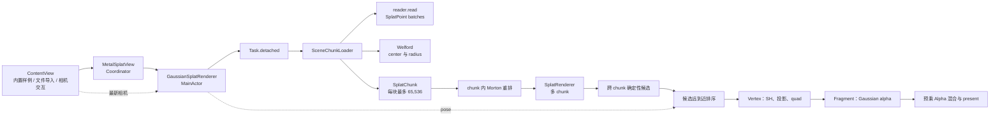
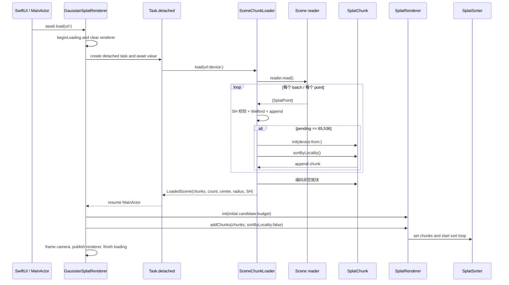
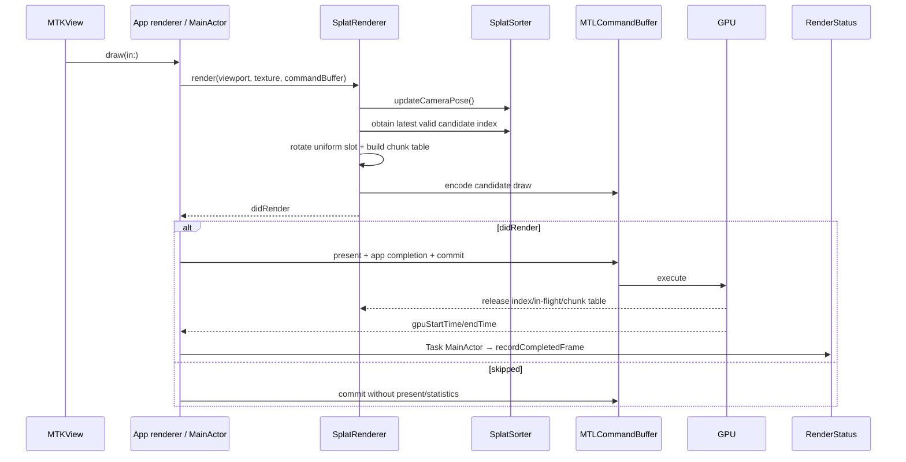
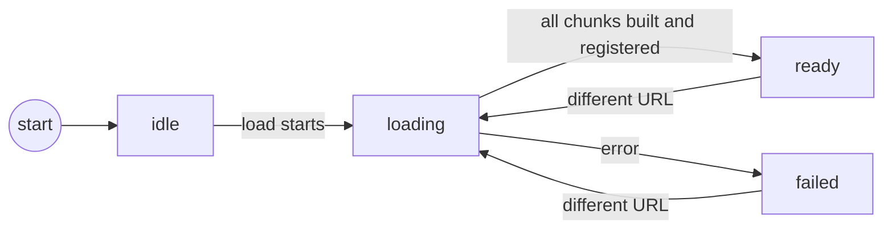
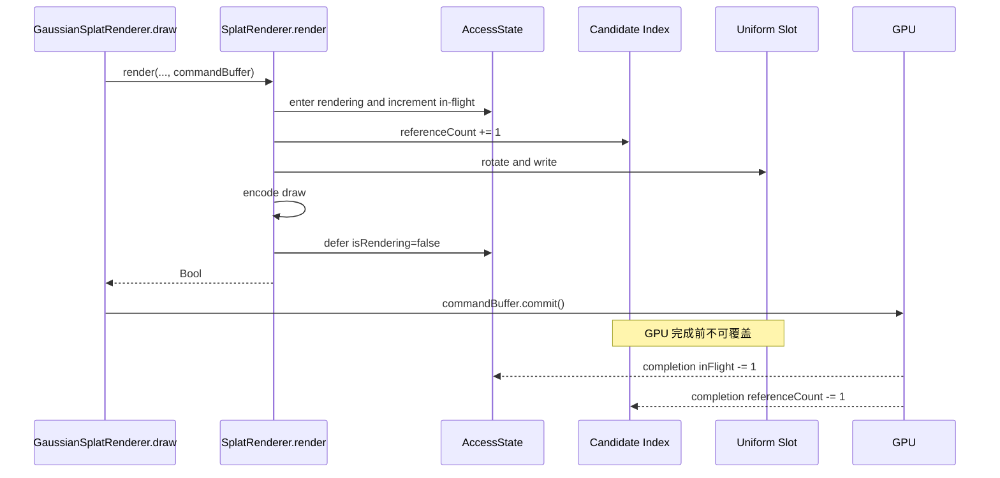

<!-- generated-by: gsd-doc-writer -->
# 端到端数据流与线程模型

> **代码基线（2026-09-03）：** 本文描述当前工作区源码。主路径是：ContentView 启动时选择 bundle 内的 sample_scene.ply，或由用户从“文件”导入外部 PLY/.splat → SceneChunkLoader → reader.read() 分批读取 → 每 65,536 点立即编码并做 chunk 内 Morton 重排 → 一次注册多个 chunk → 跨 chunk 建立有界候选 → 仅对候选做逐相机远到近排序和绘制。

本文沿一条主线解释：**一个训练好的 3DGS 场景怎样从 App bundle 或用户选择的外部文件，经过分批读取、CPU 语义对象、Metal chunk、候选选择、深度排序和 shader，最终成为屏幕上的一帧**。目标读者是正在学习 Swift、Swift Concurrency 与 Metal，并希望把项目各目录连成完整心智模型的开发者。

当前已经支持多 chunk 和有界候选，但 chunk 是按点数切出的加载块，不是带 bounds、LOD 或独立文件 range 的空间 tile；当前也没有 GPU 排序、按需磁盘 residency 或遮挡剔除。

## 1. 三条不同频率的路径

| 路径 | 正常频率 | 起点 | 终点 | 主要成本 |
| --- | --- | --- | --- | --- |
| 一次性加载 | 首次显示一次；导入文件或重新发起请求时重跑 | bundle 或 security-scoped file URL | 多个 SplatChunk 的常驻 Metal buffer | I/O、解析、批内编码、Morton 重排、Welford 在线统计 |
| 候选/排序更新 | chunk、预算或相机位置改变时 | 所有 chunk 的位置与相机 pose | 最多为当前预算大小的 ChunkedSplatIndex | 跨 chunk 抽样、候选深度、CPU 排序 |
| 逐帧渲染 | MTKView 请求的每帧，目标 60 FPS | 相机、chunk 表、最近有效候选索引 | drawable 上的预乘 Alpha 颜色 | command encoding、顶点/片元、混合 |

### 1.1 总览图

必须区分三种“顺序”：

- **chunk 内 Morton 重排**只在加载时发生，用空间局部性改善内存访问。
- **跨 chunk 候选选择**按展平后的全场索引做确定性均匀抽样，把工作量限制在预算内。
- **逐相机深度排序**只对候选发生，生成远到近的间接索引。

SplatPoint 不会被 shader 直接读取；shader 读取 SplatChunk 的紧凑属性，并通过候选索引找到 chunk 和局部 splat。

### 1.2 相关文档

- [ARCHITECTURE.md](ARCHITECTURE.md) 从系统组件与设计决策看全局。
- [DATA-STRUCTURES.md](DATA-STRUCTURES.md) 深挖数据结构和内存布局。
- [SPLAT-RENDERER.md](SPLAT-RENDERER.md) 深挖候选 sorter、uniform ring 与 AccessState。
- [3DGS-FORMATS.md](3DGS-FORMATS.md) 比较格式与字段顺序。
- [MILLION-SPLAT-IMPLEMENTATION.md](MILLION-SPLAT-IMPLEMENTATION.md) 记录百万级 SH3 实现与验证资产。
- [LARGE-SCENE-RENDERING.md](LARGE-SCENE-RENDERING.md) 设计未来的空间 tile、LOD 与流式 residency。
- [STEREO-RENDERING.md](STEREO-RENDERING.md) 讨论双眼与 vertex amplification；当前 App 只传一个 viewport。
- [FORWARD-RENDERING-COMPARISON.md](FORWARD-RENDERING-COMPARISON.md) 对比本项目与 diff-gaussian-rasterization。

## 2. App、资源与相机交互

[GaussianSplatMobileApp.swift](../GaussianSplatMobile/App/GaussianSplatMobileApp.swift) 创建根视图 [ContentView.swift](../GaussianSplatMobile/UI/ContentView.swift)。ContentView 用两个 StateObject 持有：

- [OrbitCamera.swift](../GaussianSplatMobile/Renderer/OrbitCamera.swift)：target、sceneRadius、yaw、pitch、distance、view matrix 与 clip planes。
- [RenderStatus.swift](../GaussianSplatMobile/App/RenderStatus.swift)：phase、点数、完成帧 FPS、平均 GPU ms、最近 sort ms、候选数、SH、chunk 数与加载摘要。

ContentView 当前同时提供：

- 拖动环绕和捏合缩放手势；
- 左、上、下、右四个旋转按钮；
- 缩小、放大两个按钮；
- 顶部文件导入、重置、说明按钮和双击画面重置。

因此“六个按钮”专指四向旋转加缩小/放大；重置是额外入口。

### 2.1 内置样例与外部验收资产

ContentView.activeModelURL 当前执行：

~~~swift
importedModelURL
    ?? Bundle.main.url(forResource: "sample_scene", withExtension: "ply")
~~~

Xcode Resources build phase 只登记轻量 [sample_scene.ply](../GaussianSplatMobile/Resources/sample_scene.ply)。完整 [drjohnson_full_sh3.ply](../ValidationAssets/drjohnson_full_sh3.ply) 保留在 ValidationAssets，不复制进 App bundle：

- 默认启动使用 175,745 点 SH0 样例，验证安装、加载和基本渲染；
- 300 万点验收时，用户通过右上角文件按钮选择完整 SH3 文件；
- SwiftUI `fileImporter` 返回 security-scoped URL，ContentView 在使用期间保持访问权限；
- `loadRequestID` 让同一路径也能作为新请求重新调度，而不是只按 URL 去重。

App 不在运行时下载模型。开发期脚本 [download_validation_scene.sh](../Scripts/download_validation_scene.sh) 负责下载并按固定摘要验证完整资产，[download_sample.sh](../Scripts/download_sample.sh) 负责准备内置样例。300 万点验收条件见 [ValidationAssets/ACCEPTANCE.md](../ValidationAssets/ACCEPTANCE.md)。

### 2.2 SwiftUI 到 MetalKit

[MetalSplatView.swift](../GaussianSplatMobile/Renderer/MetalSplatView.swift) 是 UIViewRepresentable。Coordinator 保存应用 renderer、loadingTask 和 loadedRequestID；同一加载请求不重复调度，ContentView 导入文件后更新 loadRequestID，前一任务或 view 拆除时取消外层任务。

应用层 [GaussianSplatRenderer.swift](../GaussianSplatMobile/Renderer/GaussianSplatRenderer.swift) 是 MainActor 隔离的 MTKViewDelegate；vendored [SplatRenderer.swift](../Vendor/MetalSplatter/MetalSplatter/Sources/SplatRenderer.swift) 管理 chunks、sorter、uniform 和 draw encoding。MTKView 当前为 bgra8Unorm_srgb、无 depth、单采样、continuous draw、目标 60 FPS。

## 3. 分批加载的真实调用链

GaussianSplatRenderer.load 第 102～104 行确实把 SceneChunkLoader.load 包在 Task.detached(priority: .userInitiated) 内。因此 reader 消费、逐点循环、SplatChunk 编码、Morton 重排和 Welford 统计都明确脱离 MainActor。

这不等于绑定专用后台线程。异步读取会暂停和恢复，Swift runtime 可以在不同工作线程调度 continuation。

### 3.1 65,536 点边界

[SceneChunkLoader.swift](../GaussianSplatMobile/Renderer/SceneChunkLoader.swift) 的 pointsPerChunk 为 65,536。pendingPoints 满时：

1. pointsToEncode 持有当前批数组。
2. pendingPoints 换成新的空数组并再次预留容量。
3. 从 pointsToEncode 创建 SplatChunk。
4. 立即做 chunk.sortByLocality()。
5. 追加完成的 chunk。

EOF 后，剩余点形成尾块。LoadedScene 返回 [SplatChunk]，不返回完整场景 [SplatPoint]。

不能因此声称“任意时刻绝对只有一份数据”：reader batch、pointsToEncode、新预留的 pending 数组、正在分配的 Metal buffer 和 Morton 临时数组可能短时重叠；此前完成的 chunks 也一直常驻。

### 3.2 取消边界

Coordinator 取消外层 loadingTask，但 load 内的 Task.detached 是 unstructured task，源码没有保存并显式取消其 handle。外层任务取消不会自动传播给它。detached 工作返回后，外层 Task.checkCancellation() 会阻止旧结果注册和发布；但大文件解析可能在取消后继续运行一段时间。

## 4. reader.read()、字节块与 SH0～SH3

[AutodetectSceneReader.swift](../Vendor/MetalSplatter/SplatIO/Sources/AutodetectSceneReader.swift) 让 .ply 进入 SplatPLYSceneReader，.splat 进入 DotSplatSceneReader；当前 Package target 排除了 SPZ reader/writer。

[PLYReader.swift](../Vendor/MetalSplatter/PLYIO/Sources/PLYReader.swift) 的 bodyBufferLen 是 16 KiB，它影响两层：一是作为 AsyncBufferingInputStream 的 bufferSize，限制每次底层 InputStream.read 请求；二是初始化 binary body 的 targetBufferSize 与 bufferCapacity。16 KiB 不是 record 边界：binary 解码后会把未消费尾部 memmove 到工作 buffer 起点，再追加下一次读取的数据；如果当前数据连一条完整 record 都解不出，targetBufferSize 会翻倍并按需扩容。因此 binary record 可以跨多个底层读取而不被截断；Header 和 ASCII 行也各自由累积逻辑跨读取拼接。ASCII 最多每 1,024 个 element 产出一批，binary batch 则取决于工作 buffer 能解出的完整记录数。

因此有三种不同尺度：

1. 16 KiB 底层读取请求与 binary 初始工作 buffer；
2. reader 的 element/SplatPoint batch；
3. SceneChunkLoader 最多 65,536 点的 scene chunk。

当前 App 主路径直接消费：

~~~swift
for try await batch in try await reader.read() {
    for point in batch {
        // 在线统计，满 65,536 就编码
    }
}
~~~

vendored SplatSceneReader.readAll() API 仍存在，但当前 App 不调用它。当前也不是“边读边显示”：必须等完整文件解析、所有 chunks 构建并一次注册后才进入 ready。

### 4.1 属性域转换

Graphdeco PLY 的 scale 是对数域，opacity 是 logit 域：

$$
\mathbf{s}=\exp(\boldsymbol{\ell})
$$

读作“对 log-scale 向量 $\boldsymbol{\ell}$ 的三个分量分别取指数，得到线性尺度向量 $\mathbf{s}$”。向量是一组三个有顺序的数。

$$
\alpha=\frac{1}{1+\exp(-a)}
$$

读作“把 logit 值 $a$ 送入 sigmoid，得到 0～1 的透明度 $\alpha$”。分子是 1，分母是 $1+\exp(-a)$。对应实现位于 [SplatPoint.swift](../Vendor/MetalSplatter/SplatIO/Sources/SplatPoint.swift)。

### 4.2 SH 支持

PLY reader 接受连续的 f_rest 标量数：

| SH | f_rest 数 | 每通道高阶系数 | 含 DC 的每通道总系数 |
| --- | ---: | ---: | ---: |
| SH0 | 0 | 0 | 1 |
| SH1 | 9 | 3 | 4 |
| SH2 | 24 | 8 | 9 |
| SH3 | 45 | 15 | 16 |

关系为：

$$
C(d)=(d+1)^2,\qquad R(d)=3\left(C(d)-1\right)
$$

读作“SH 阶数为 $d$ 时，每通道有 $C(d)$ 个系数；去掉 f_dc 中的一个 DC 系数后，三个颜色通道共有 $R(d)$ 个 f_rest 标量”。SceneChunkLoader 检查全场 SHDegree 一致，SplatChunk 再检查块内一致；shader 分级执行 SH0～SH3。

## 5. Welford 在线中心与半径

SceneChunkLoader 不保存完整数组再做两遍扫描，而是在线更新。对第 $n$ 个位置 $\mathbf{p}_n$：

$$
\boldsymbol{\delta}_n=\mathbf{p}_n-\boldsymbol{\mu}_{n-1}
$$

读作“当前三维位置减旧均值，得到偏差向量 $\boldsymbol{\delta}_n$”。

$$
\boldsymbol{\mu}_n=\boldsymbol{\mu}_{n-1}+\frac{\boldsymbol{\delta}_n}{n}
$$

读作“偏差向量除以当前点数 $n$，再加到旧均值上”。分子是偏差，分母是已处理点数。

$$
M_{2,n}=M_{2,n-1}+\boldsymbol{\delta}_n\cdot
\left(\mathbf{p}_n-\boldsymbol{\mu}_n\right)
$$

读作“旧平方距离累积量加上旧均值偏差与新均值偏差的点积”。点积把两个三维向量的对应分量相乘并求和。

文件结束后：

$$
r_{\mathrm{RMS}}=\sqrt{\frac{M_{2,N}}{N}},
\qquad
r=\max\left(2.5r_{\mathrm{RMS}},0.1\right)
$$

读作“累积量除以总点数 $N$ 并开平方得到均方根半径，再乘 2.5，且至少取 0.1”。分子是 $M_{2,N}$，分母是总点数。这个半径用于相机取景，不是严格包围所有离群点的 bounding sphere。

## 6. SplatChunk 与 chunk 内 Morton 重排

[SplatChunk.swift](../Vendor/MetalSplatter/MetalSplatter/Sources/SplatChunk.swift) 把每批 SplatPoint 转换成：

- 基础 MetalBuffer<EncodedSplatPoint>；
- SH0 时为 nil、SH1～SH3 时存在的高阶 SH Float16 buffer；
- 统一的 chunk.shDegree。

[EncodedSplatPoint.swift](../Vendor/MetalSplatter/MetalSplatter/Sources/EncodedSplatPoint.swift) 当前按 32 B 目标布局保存 position、raw SH0 + Alpha 和对称三维协方差的六个独立分量。高阶 SH 每点另存 9/24/45 个 Float16。

令归一化四元数对应旋转矩阵 $R$，线性尺度为 $\mathbf{s}$：

$$
M=R\operatorname{diag}(\mathbf{s}),\qquad
\Sigma_{3D}=MM^T
$$

读作“先按三个局部轴缩放，再由 $R$ 旋转得到 $M$；让 $M$ 乘自己的转置，得到三维协方差 $\Sigma_{3D}$”。矩阵是把输入向量映射成输出向量的二维数表，上标 $T$ 表示交换行列。

MetalBuffer 使用 storageModeShared；CPU values 与 GPU MTLBuffer 是同一 allocation 的访问视图。但构建期仍有语义数组、目标 buffer 和临时数据重叠，所以不是全流程单副本。`SceneChunkLoader.pendingPoints` 虽限制为 65,536，reader 的 `AsyncThrowingStream` 却没有有界 buffering/backpressure；producer 领先时还可能有多个待消费 batch 排队，因此“单批”不是端到端 CPU 峰值上界。

### 6.1 Morton 的准确边界

[SplatChunk+sortByLocality.swift](../Vendor/MetalSplatter/MetalSplatter/Sources/SplatChunk+sortByLocality.swift) 对每个 chunk：

1. 用每轴均值 $\pm2.5\sigma$ 建立量化范围；
2. x/y/z 各量化为 10 bit；
3. 交错 bit 得到 30-bit Morton code；
4. 按 code 排序；
5. 同步原地重排基础属性和 SH 分组。

$\sigma$ 读作“标准差”，表示该轴位置围绕均值的典型波动。Morton 只改善**chunk 内**空间局部性，不跨 chunk，也不依赖相机。它的 code/index/visited 临时数组按单块上限受控。

### 6.2 一次注册多 chunk

MainActor 恢复后调用：

~~~swift
await splatRenderer.addChunks(loadedScene.chunks, sortByLocality: false)
~~~

addChunks 在一次 withChunkAccess 中登记多个 ChunkID，重建连续 UInt16 chunkIndex，并在 sorter exclusive access 内 setChunks。sortByLocality 为 false，因为 SceneChunkLoader 已经完成 Morton。setChunks 启动后台 sort；addChunks 返回不保证首轮候选深度排序已经完成。

## 7. 跨 chunk 有界候选与逐相机排序

应用预算为：

| 参数 | 值 |
| --- | ---: |
| 目标 | 60 FPS |
| 初始候选 | 1,000,000 |
| 最小候选 | 250,000 |
| 最大候选 | 1,250,000 |
| 调整最短间隔 | 3 秒 |

初始预算是场景点数与 1,000,000 的较小者。所有 chunk 属性仍全量常驻；预算只限制 candidate index、CPU sort 和 GPU draw。

### 7.1 确定性跨 chunk 抽样

SplatSorter 把所有 chunk 展平成长度 $S$ 的逻辑序列，候选数为：

$$
K=\min(S,B)
$$

读作“候选数 $K$ 是全场点数 $S$ 与预算 $B$ 中较小者”。

第 $j$ 个候选对应：

$$
g_j=
\left\lfloor
\frac{jS}{K}
\right\rfloor,
\qquad j=0,1,\ldots,K-1
$$

读作“候选编号 $j$ 乘全场点数 $S$，除以候选数 $K$，再向下取整”。分子是 $jS$，分母是 $K$。同一 chunks 和预算得到相同样本，且样本跨越所有 chunk；实现不构建第二份完整场景索引。

这只是候选选择，不是视锥、LOD、opacity 或屏幕贡献选择。

### 7.2 只排序候选

当前 sortByDistance = true。候选 $i$ 的键是：

$$
d_i=\left\lVert\mathbf{p}_i-\mathbf{c}_{camera}\right\rVert^2
$$

读作“候选世界位置减相机世界位置，再求三维长度平方”。展开是三个坐标差的平方和。sorter 按 $d_i$ 从大到小排列，即远到近。

updateCameraPose 当前有位置阈值：位置变化平方大于 $10^{-6}$ 才触发；sortByDistance 为 true 时，单独 forward 变化不触发，因为 key 不使用 forward。chunk generation 或预算变化也会触发。

sort loop 由 Task.detached(priority: .high) 启动，只对 $K$ 个候选计算距离并做 Swift sort，复杂度约为 $O(K\log K)$，不是全场 $O(S\log S)$。

### 7.3 三份 index buffer

sorter 固定维护三份候选 index buffer，每份有 isValid 与 referenceCount。frame 取得最近有效 buffer 时引用数加一，Metal command buffer completion 时释放；后台只写没有 frame 引用且不是当前发布结果的 buffer。chunkGeneration 防止旧快照覆盖新配置。

快速移动相机时，renderer 可使用稍旧但仍有效的候选排序；没有任何有效索引时最多等待默认 0.1 秒，仍拿不到就丢帧。

### 7.4 GPU 时间驱动预算

至少间隔 3 秒后：

- 完成帧 FPS 小于 55：预算乘 0.8，但不低于 250,000；
- FPS 至少 59、平均 GPU 时间大于 0 且小于 12 ms：预算乘 1.1，但不高于场景点数与 1,250,000 的较小者；
- 其他情况不变。

setMaximumRenderedSplatCount 会更新 sorter 预算、递增 generation 并触发新候选 sort。

## 8. 逐帧渲染、uniform ring 与 completion

当前 App 使用 depthFormat invalid、depthTexture nil、highQualityDepth false、maxViewCount 1、maxSimultaneousRenders 3，因此走 [SingleStageRenderPath.metal](../Vendor/MetalSplatter/MetalSplatter/Resources/SingleStageRenderPath.metal)。

AccessState 用 Mutex 保证 CPU render 串行、最多三个 GPU frame 在途，并让 exclusive chunk access 等待在途工作排空。isRendering 由 defer 在 CPU encoding 结束时清除；inFlightRenderCount 到 GPU completion 才递减。

uniform buffer 大小为：

$$
B_{\mathrm{uniform}}
=
\operatorname{alignedSize}(\mathrm{UniformsArray})\times3
$$

读作“一个 UniformsArray 对齐到 256 B 后乘三个在途 frame 槽”。三槽不是三个 view；当前每槽只使用一个 viewport。GPU completion 前，对应槽不能被复用。

每帧还建立 GPUChunkInfo 表，记录各 chunk 的基础/SH buffer GPU 地址、点数、SH degree 和 enabled。表由带 NSLock 的 MTLBufferPool 复用，并在 GPU completion 后归还。

### 8.1 只绘制候选

候选索引数就是本帧 $K$。renderer 复用最多 1,024 个 quad 的 index topology：

$$
Q=\min(K,1024),\qquad
I=\left\lceil\frac{K}{Q}\right\rceil
$$

读作“每组模板槽数 $Q$ 最多 1,024；instance 数 $I$ 是候选数除以模板容量后向上取整”。分子是 $K$，分母是 $Q$。

shader 恢复候选位置：

$$
\mathrm{splatID}
=
\mathrm{instanceID}\times Q
+
\left\lfloor\frac{\mathrm{vertexID}}{4}\right\rfloor
$$

读作“instance 编号乘模板容量，再加当前 quad 槽号”。分母 4 表示四个顶点属于一个高斯。

~~~text
candidateIndex[splatID]
  → (chunkIndex, splatIndex)
  → chunks[chunkIndex]
  → splats[splatIndex] + optional SH
~~~

## 9. GPU 前向处理

[SplatProcessing.metal](../Vendor/MetalSplatter/MetalSplatter/Resources/SplatProcessing.metal) 对 SH0 走快速路径，对 SH1～SH3 按相机到高斯方向评估 basis。三维协方差投影为：

$$
\Sigma_{2D}=J\,W\,\Sigma_{3D}\,W^T J^T
$$

读作“世界空间协方差由 view rotation $W$ 转到相机空间，再由透视投影雅可比 $J$ 映射到屏幕，得到二维协方差”。矩阵从右向左作用于列向量；雅可比是输出对输入的局部变化率表。这里只做前向渲染，没有训练、损失函数或反向传播。

二维协方差的特征向量给出椭圆主轴，特征值平方根给出轴长。quad 覆盖 $\pm3\sigma$，真实高斯形状由 fragment shader 计算。

对归一化二维坐标 $\mathbf{r}$：

$$
\alpha(\mathbf{r})=
\begin{cases}
\exp\!\left(-\frac{1}{2}\lVert\mathbf{r}\rVert^2\right)\alpha_0,
& \lVert\mathbf{r}\rVert^2\le 9 \\
0,& \text{otherwise}
\end{cases}
$$

读作“三倍标准差圆域内，用距离平方的负指数衰减乘基础透明度；域外为零”。指数分子是负距离平方，分母是 2。

预乘 Alpha 混合为：

$$
\mathbf{C}_{new}
=
\alpha_s\mathbf{c}_s
+
\left(1-\alpha_s\right)\mathbf{C}_{old}
$$

读作“新颜色等于 source 颜色乘 Alpha，加上旧颜色未被 source 覆盖的部分”。所以候选必须远处先画、近处后画。

vertex shader 还剔除边界越界、disabled、相机后方、clip depth 外与宽松屏幕 bounds 外的候选。当前没有 CPU chunk frustum culling、tile list、Hi-Z 或 GPU sort。

## 10. 指标的真实统计边界

didRender 为 true 后，应用注册 command buffer completion；完成时读取 gpuStartTime/endTime，再用 Task { @MainActor in ... } 调用当前方法 recordCompletedFrame(gpuDuration:)。

至少 0.75 秒窗口内：

$$
\mathrm{FPS}
=
\operatorname{round}
\left(
\frac{F_{\mathrm{completed}}}{\Delta t}
\right)
$$

读作“已完成帧数 $F_{\mathrm{completed}}$ 除以窗口时间 $\Delta t$，再取整”。分子不是 display callback 或仅 CPU commit 的帧数。

| 指标 | 来源 | 去向 |
| --- | --- | --- |
| 完成帧 FPS | recordCompletedFrame 的 completion 计数 | RenderStatus / 状态卡 |
| 平均 GPU ms | gpuEndTime - gpuStartTime 的窗口平均 | RenderStatus / 状态卡 |
| 最近 sort ms | SplatSorter.onSortComplete | hop MainActor 后写 RenderStatus |
| candidate | currentCandidateBudget | 状态卡“绘制”；预算改变时更新 |
| 加载状态 | beginLoading / finishLoading / fail | phase 与 loadSummary |
| chunk 进度 | 第 1 块及每 8 块记录 chunks/splats/Metal bytes | AppLog；最终 chunk 数写入 loadSummary |

loadSummary 还包含 SH、chunk 数、文件 MiB、属性 MiB 和加载秒数。逐块进度当前没有逐次发布到 UI。

## 11. 多线程与 actor/锁边界

| 上下文 | 当前工作 | 源码保证 | 不能声称 |
| --- | --- | --- | --- |
| MainActor | SwiftUI、camera、status、App renderer 的 load/draw 编排 | UI 状态串行 | 所有 async 都自动后台运行 |
| Coordinator 普通 Task | 调用 MainActor 的 load | handle 可取消 | 它本身就是 CPU 加载线程 |
| load 内 Task.detached(.userInitiated) | SceneChunkLoader、reader 消费、chunk 编码、Morton、Welford | 脱离 MainActor | 固定线程；外层取消自动传播 |
| StreamReader actor | InputStream 与 pushback | read/open/close 串行 | 专用 I/O 线程 |
| MainActor 调用点；nonisolated async addChunks | GaussianSplatRenderer.load 调用 addChunks 注册预构建 chunks | 调用发生在 MainActor 上下文；SplatRenderer.addChunks 自身没有 @MainActor，依靠 withChunkAccess/Mutex/sorter exclusive 协调资源 | addChunks 方法体受 MainActor 隔离；再次 Morton 或再次编码完整场景 |
| SplatSorter Task.detached(.high) | 抽样候选、读位置、距离、Swift sort、写 index | state 由 Mutex 保护 | 实时线程或固定 CPU 核 |
| MTLCommandQueue/GPU | 执行 commit commands | 与 CPU 提交异步 | Swift Task queue |
| Metal completion | 释放资源、采集 GPU 时间 | 库侧调用锁保护逻辑；UI 显式 hop MainActor | 回调固定在主线程 |

三份候选 index 用 referenceCount 保护，三槽 uniform 用 in-flight 上限保护，每帧 chunk table 用 NSLock pool 和 completion 保护。MetalBuffer、SplatChunk、SplatRenderer 等的 unchecked Sendable 是开发者对这些同步协议的承诺，不是编译器证明裸指针绝无竞态。

## 12. 所有权与内存阶段

| 阶段/对象 | 主要同时存在的数据 | 生命周期 |
| --- | --- | --- |
| 底层读 | 最多请求 16 KiB、Data、pushback | 短期 |
| PLY body | 工作 buffer、PLYElement series | 短期/复用 |
| reader batch | 当前 [SplatPoint] batch | 短期 |
| chunk 聚合 | pending 最多 65,536；边界时 pointsToEncode 与新预留数组 | 短期 |
| chunk 编码/Morton | 当前 pending 语义点、可能排队的 reader batch、目标基础/SH buffer、code/index/visited、此前 chunks | 显式 chunk 临时受单块限制；stream 队列无硬上界；旧块持续常驻 |
| Welford | count、mean、M2 | 加载全程，大小固定 |
| 候选 sort | 所有属性 chunks、最多预算大小的 sortTempStorage 和 index | temp 复用 |
| 稳态 | 所有 chunk 属性、三份候选 index、sort temp、uniform ring、pipeline | 长期 |
| 每个在途 frame | uniform 槽、借用 index、chunk table、drawable | GPU completion 前 |

当前主链不主动聚合完整场景 `[SplatPoint]`，但 pending 数组、可能排队的 stream batches、当前 chunk 的目标 buffer 与 Morton 临时会短时共存，因此不能称为绝对单副本，也不能仅凭 65,536 常量证明端到端语义内存恒定。

设文件字节数为 $F$、全场点数为 $S$、chunk 上限为 $C=65{,}536$、候选为 $K$：

| 工作 | 规模 | 当前执行位置 |
| --- | --- | --- |
| 文件/属性解析 | $O(F)$ / $O(S\times properties)$ | detached load + stream actor |
| Welford | $O(S)$ 时间、$O(1)$ 额外空间 | detached load |
| chunk 编码 | 总计 $O(S)$，单次最多 $C$ | detached load |
| Morton | 每块 $O(C\log C)$，尾块更小 | detached load |
| 候选选择 | $O(K+\mathrm{chunkCount})$ | sorter detached loop |
| 候选排序 | $O(K\log K)$ | sorter detached loop |
| GPU | 只提交 $K$ 个候选，再做 shader 剔除 | GPU |

$O(\cdot)$ 表示输入增长时工作量的数量级，不是精确毫秒。

## 13. 状态与 GPU 资源时序

ready 不保证首份候选深度排序已经完成；render 无有效 index 时最多等 0.1 秒，否则丢帧。

SplatRenderer.render 只把绘制命令编码进传入的 command buffer 并返回 Bool，不调用 commit。GaussianSplatRenderer.draw 在 render 返回后提交：true 路径先 present 并登记指标 completion，再 commit；false 路径也由 draw commit，但不 present。isRendering 只覆盖 CPU encoding；in-flight、index reference 与 uniform 槽的安全边界延伸到 GPU completion。

## 14. 常见误解与当前权衡

| 误解 | 当前源码事实 |
| --- | --- |
| 16 KiB 是 scene chunk | 它是底层 read 上限，也是 binary targetBufferSize 与 bufferCapacity 的初值；scene chunk 最多 65,536 点 |
| App 当前调用 readAll() | 主链直接消费 reader.read() |
| 分批后绝对单副本 | 无完整场景数组，但 batch、pending、目标 buffer 与 Morton 临时会重叠 |
| 多 chunk 是空间 tile 流式加载 | chunk 按点数切分，没有 bounds、LOD、文件 range 或 residency |
| SH 阶数只有两档 | f_rest 0/9/24/45 分别支持 SH0/SH1/SH2/SH3 |
| Morton 就是相机深度排序 | Morton 是 chunk 内静态重排；候选选择和相机排序是另两步 |
| 每帧所有点都参与排序与绘制 | 最多选择当前预算个候选，只排序和绘制候选 |
| 候选是视锥 LOD | 当前只是对展平全场做确定性均匀抽样 |
| 相机静止仍无条件重排 | 位置有阈值；预算/chunk 变化也可触发 |
| FPS 是 CPU 提交 FPS | 当前按真正绘制 command buffer 的 GPU completion 计数 |
| 三槽 uniform 是三个 view | 它是三个在途 frame；当前只有一个 viewport |
| SplatRenderer.render 会提交 command buffer | render 只编码并返回 Bool；GaussianSplatRenderer.draw 在其返回后调用 commandBuffer.commit() |
| commit 返回就是 GPU 完成 | commit 只提交，资源和指标以 completion 为边界 |

当前方案是“完整文件预载 + 批内编码成多 chunk + 所有属性常驻 + 有界候选 + CPU 候选深度排序 + single-stage quad”。

优点是没有完整场景 SplatPoint、SH0～SH3 共用主链、sort/draw 有预算上界、指标可驱动预算、资源复用边界清楚。代价是 ready 前仍读完整文件；所有属性仍常驻；chunk 不是空间 tile；均匀候选可能漏掉重要可见 splat；欧氏距离和有限候选都是透明合成近似；当前无 depth、GPU sort、tile binning、Hi-Z 或 early termination。

未来的空间 tile、LOD、渐进发布和 GPU candidate/sort 需要重构数据契约，详见 [LARGE-SCENE-RENDERING.md](LARGE-SCENE-RENDERING.md)。

## 15. 源码跟读顺序

1. [GaussianSplatMobileApp.swift](../GaussianSplatMobile/App/GaussianSplatMobileApp.swift) → [ContentView.swift](../GaussianSplatMobile/UI/ContentView.swift)：资源优先级、两个 StateObject、手势和六个相机按钮。
2. [MetalSplatView.swift](../GaussianSplatMobile/Renderer/MetalSplatView.swift)：Coordinator、普通 Task、loadedURL 与取消。
3. [GaussianSplatRenderer.swift](../GaussianSplatMobile/Renderer/GaussianSplatRenderer.swift)：load、Task.detached、draw、recordCompletedFrame 和预算调整。
4. [SceneChunkLoader.swift](../GaussianSplatMobile/Renderer/SceneChunkLoader.swift)：reader.read()、65,536 点边界、Welford、SH 校验和 Morton。
5. [SplatPLYSceneReader.swift](../Vendor/MetalSplatter/SplatIO/Sources/SplatPLYSceneReader.swift) 与 [PLYReader.swift](../Vendor/MetalSplatter/PLYIO/Sources/PLYReader.swift)：SH0～SH3 与 16 KiB/batch 边界。
6. [SplatPoint.swift](../Vendor/MetalSplatter/SplatIO/Sources/SplatPoint.swift)、[SplatChunk.swift](../Vendor/MetalSplatter/MetalSplatter/Sources/SplatChunk.swift) 与 [SplatChunk+sortByLocality.swift](../Vendor/MetalSplatter/MetalSplatter/Sources/SplatChunk+sortByLocality.swift)：紧凑属性、SH buffer、chunk 内 Morton。
7. [SplatSorter.swift](../Vendor/MetalSplatter/MetalSplatter/Sources/SplatSorter.swift)：forEachSampledReference、performSort、updateCameraPose 和三份 index。
8. [SplatRenderer.swift](../Vendor/MetalSplatter/MetalSplatter/Sources/SplatRenderer.swift)：addChunks、AccessState、uniform ring、chunk table 和 drawIndexedPrimitives。
9. [SingleStageRenderPath.metal](../Vendor/MetalSplatter/MetalSplatter/Resources/SingleStageRenderPath.metal) → [SplatProcessing.metal](../Vendor/MetalSplatter/MetalSplatter/Resources/SplatProcessing.metal)：SH、投影、quad、Alpha 与混合。

完成后应能回答：为什么 16 KiB 与 65,536 点不是同一种 chunk；为什么没有完整场景数组仍不能声称绝对单副本；为什么 Morton、候选选择和深度排序是三件事；为什么只对候选排序和绘制；为什么 FPS、uniform、index 与 chunk table 都以 GPU completion 为边界。
