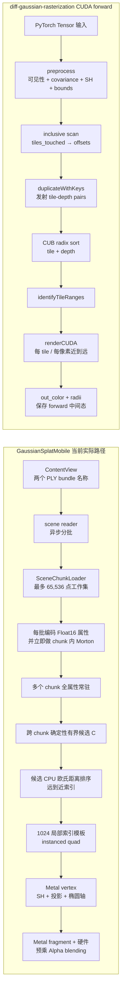

<!-- generated-by: gsd-doc-writer -->
# GaussianSplatMobile 与 diff-gaussian-rasterization 前向渲染对照

## 一句话结论

**当前 GaussianSplatMobile 是“reader 分批 + 65,536 点工作集编码与 chunk 内 Morton 重排 + 跨 chunk 确定性有界候选 + CPU 候选远到近排序 + Metal quad 光栅化/硬件 Alpha 混合”的移动端只读显示器；`diff-gaussian-rasterization` 则是“CUDA 逐点预处理 + Gaussian-tile 复制/基数排序 + 每 tile、每像素近到远合成”的可微训练光栅器前向路径，后者的 tile 数据流很适合借鉴，但 CUDA/CUB、反向传播中间态和训练期每帧重算策略不应原样搬到 iPhone。**

## 比较范围与版本边界

本文只以两个本地工作区的源码为事实依据，不用论文、README 之外的外部描述补全实现，也不引用未经本仓库实测的性能数字。

### GaussianSplatMobile 范围

- 比较对象是 2026-08-27 工作区快照；该目录没有可用于标识版本的 Git 元数据，因此不能给出 commit ID。
- “当前 App”特指 [`GaussianSplatRenderer`](../GaussianSplatMobile/Renderer/GaussianSplatRenderer.swift) 构造并调用 vendored [`SplatRenderer`](../Vendor/MetalSplatter/MetalSplatter/Sources/SplatRenderer.swift) 的真实路径。
- 当前参数是 `depthFormat: .invalid`、`depthTexture: nil`、`highQualityDepth: false`、单 viewport、单采样。因此 `useMultiStagePipeline` 为 `false`，实际启用的是 [`SingleStageRenderPath.metal`](../Vendor/MetalSplatter/MetalSplatter/Resources/SingleStageRenderPath.metal)。
- [`MultiStageRenderPath.metal`](../Vendor/MetalSplatter/MetalSplatter/Resources/MultiStageRenderPath.metal) 是库中未启用的可选能力，只用于说明边界，不能当成 App 当前行为。
- App 只做推理/查看；本文不把未来的大场景设计写成现有功能。大场景目标另见 [LARGE-SCENE-RENDERING.md](LARGE-SCENE-RENDERING.md)。

### diff-gaussian-rasterization 范围

- 本地仓库基于 commit `59f5f77e3ddbac3ed9db93ec2cfe99ed6c5d121d`（2023-08-27，`Added submodule license`）。
- 本地 `rasterize_points.cu`、`cuda_rasterizer/rasterizer_impl.h` 与 Python 包装文件存在未提交的中文注释增补；核对到的差异没有改变前向算法。本文描述的是当前工作区实际源码，而不是假定的最新上游版本。
- 前向入口是 [`RasterizeGaussiansCUDA`](../../diff-gaussian-rasterization/rasterize_points.cu)，核心调度是 [`Rasterizer::forward`](../../diff-gaussian-rasterization/cuda_rasterizer/rasterizer_impl.cu)，逐点预处理和逐 tile 合成位于 [`forward.cu`](../../diff-gaussian-rasterization/cuda_rasterizer/forward.cu)。
- 本文不比较 backward 的数学实现。只说明一个与 forward 设计直接相关的事实：Python autograd 包装会保留 `geomBuffer`、`binningBuffer`、`imgBuffer`、`radii` 等 forward 中间态，供之后的 backward 使用；这解释了部分内存布局为何不是纯推理最小集。

## 先统一术语

为避免和 CUDA 源码把 Gaussian 数写成 `P` 混淆，本文统一使用：

| 符号 | 含义 |
| --- | --- |
| $N$ | 已加载并常驻的输入 Gaussian 总数 |
| $B$ | Mobile 的当前候选预算上限 |
| $C$ | Mobile 从跨 chunk 展平序列中确定性抽取的实际候选数，$C=\min(N,B)$ |
| $P$ | 所有可见 Gaussian 与其覆盖 tile 形成的 pair 总数；在 CUDA 返回值中叫 `num_rendered` |
| $H,W$ | 图像高度与宽度 |
| $A$ | 所有 rasterized quad 产生的片元/像素覆盖工作量的概念性总量，不是源码中的一个计数器 |
| $n_t$ | tile $t$ 的 Gaussian 列表长度 |

若第 $i$ 个可见 Gaussian 覆盖 tile 集合 $T_i$，则：

$$
P=\sum_{i=1}^{N_{visible}} |T_i|
$$

读作“把每个可见 Gaussian 覆盖的 tile 个数相加”。求和符号表示逐项累加，$|T_i|$ 表示集合中 tile 的数量。一个大椭圆会贡献多个 pair，所以 $P$ 可能显著大于 $N$。这对应 CUDA 的 `tiles_touched`、`point_offsets` 和 `num_rendered`；当前 Mobile 路径不生成 $P$。

Mobile 的 $C$ 只是按全场展平下标均匀抽取的有界候选，不是通过视锥、遮挡或 tile 测试得到的“可见数”。候选进入 vertex shader 后仍会因无效索引、disabled chunk、相机后方或 clip 边界而退化，因此 $C$ 也不等于最终产生有效片元的 Gaussian 数。

向量可理解为有顺序的一组数，例如三维位置向量 $\mathbf{p}=(x,y,z)$。矩阵是把一个向量线性变换成另一个向量的数表；矩阵乘法的先后顺序很重要。协方差矩阵描述 Gaussian 沿各方向的扩散和倾斜。本文只讲 forward：偏导数表示输出对某个输入的局部变化率，梯度是把多个偏导数组成的向量；这些属于 backward 的主题，不在本文展开。

## 设计目标：两条路径为什么长得不同

| 维度 | GaussianSplatMobile 当前实现 | diff-gaussian-rasterization CUDA forward |
| --- | --- | --- |
| 产品目标 | iPhone 上显示一个已训练、只读、整场常驻的模型 | PyTorch 训练/研究中的可微光栅化前向计算 |
| 数据变化 | 位置、尺度、旋转、Alpha、SH 在加载后固定；相机逐帧变化 | Gaussian 参数、相机和可选预计算输入都可能每次调用变化 |
| 并行重点 | Apple GPU 硬件 vertex/fragment/raster/blend；CPU 后台候选选择与排序 | CUDA 逐点预处理、CUB scan/radix sort、每 tile CUDA block 合成 |
| 排序粒度 | 跨所有常驻 chunk 抽出的至多 $C$ 个候选共用一条索引序列 | Gaussian 先复制到覆盖的每个 tile，再在 tile 内排序 |
| 合成方向 | 远到近提交，硬件 source-over blending | 近到远遍历，显式维护透射率并 early terminate |
| forward 输出 | 直接写 drawable 颜色；当前无 depth attachment | `out_color`、`radii`、pair 数及三块中间 buffer |
| 训练状态 | 无 backward，不保存梯度所需状态 | forward 中间态由 autograd 保存给 backward；本文不讨论 backward 公式 |

Mobile 把不会随相机改变的三维协方差提前到加载期形成并压成 Float16，符合只读推理目标。CUDA 支持每次调用传入 `scales + rotations` 或 `cov3D_precomp`，也支持 `SH` 或 `colors_precomp` 二选一，符合训练时参数可能更新的目标。两者的差异首先是生命周期选择，不只是“Metal 与 CUDA 谁更快”。

## 输入数据与相机参数

### GaussianSplatMobile

App 从场景 reader 得到每点的：

- 世界空间中心 `position`；
- 原始 SH0，以及可选的 SH1–SH3 高阶系数；
- 带有明确表示域的 opacity（例如 PLY reader 读入 logit）与三轴尺度（例如 PLY reader 读入 exponent）；
- 场景文件提供的旋转四元数，reader 不保证它已经归一化。

当前 [`ContentView`](../GaussianSplatMobile/UI/ContentView.swift) 的实际入口只会在 bundle 中依次查找 `drjohnson_full_sh3.ply` 与 `sample_scene.ply`。[`AutodetectSceneReader`](../Vendor/MetalSplatter/SplatIO/Sources/AutodetectSceneReader.swift) 也具备按扩展名选择 `.splat` reader 的能力，但当前 UI 没有选择或导入 `.splat` 文件的入口，不能把 reader 能力写成当前 App 实际加载资产。

[`SplatChunk`](../Vendor/MetalSplatter/MetalSplatter/Sources/SplatChunk.swift) 把它们编码为长期驻留的基础点缓冲和可选高阶 SH 缓冲。编码 [`EncodedSplatPoint`](../Vendor/MetalSplatter/MetalSplatter/Sources/EncodedSplatPoint.swift) 时，`asLinearFloat` 才把 opacity 与 scale 统一转到线性域，`rotation.normalized` 才归一化四元数；最终每点包含 Float32 位置、Float16 SH0/Alpha 与 Float16 三维协方差六个独立分量。

每帧相机输入由 [`GaussianSplatRenderer`](../GaussianSplatMobile/Renderer/GaussianSplatRenderer.swift) 生成：右手视图矩阵、右手透视投影矩阵、drawable 像素尺寸和 Metal viewport。[`MatrixMath.swift`](../GaussianSplatMobile/Math/MatrixMath.swift) 的投影使用相机朝向负 $z$，并把 near/far 映射到 Metal 深度范围。底层 renderer 由视图矩阵的逆矩阵恢复世界空间相机位置与 forward，前者供 SH 和 CPU 距离排序使用。

### diff-gaussian-rasterization

[`RasterizeGaussiansCUDA`](../../diff-gaussian-rasterization/rasterize_points.cu) 接收 CUDA Tensor 或标量：

- `means3D`、`opacities`；
- `scales + rotations` 与 `cov3D_precomp` 二选一；
- `sh + degree` 与 `colors_precomp` 二选一；
- `scale_modifier`；
- `viewmatrix`、`projmatrix`、世界空间 `campos`；
- `tan_fovx`、`tan_fovy`、$W$、$H$、背景色；
- `prefiltered` 和 `debug`。

这里的 `projmatrix` 被源码直接用于把世界空间中心变到齐次投影空间；`viewmatrix` 另用于相机空间深度和协方差。调用者必须让两者的布局、坐标符号和组合方式满足 CUDA 的 `transformPoint4x4` / `transformPoint4x3` 约定。CUDA 的可见点要求相机空间 $z>0.2$；Mobile 则以负 $z$ 为相机前方，不能把同一个矩阵数组不经转换地跨实现复用。

## 端到端数据流

图中 Mobile 的 Morton 重排只改变**当前 chunk** 属性在内存中的静态顺序；它不生成空间 tile、LOD 或视点相关 residency。候选选择覆盖全部已注册 chunk 的展平序列，但只为至多 $C$ 个候选生成排序索引；属性本身仍按 $N$ 全量、分多个 chunk 常驻。CUDA 的 duplicate 不是复制全部属性，而是为每个覆盖 tile 复制一个 Gaussian ID，并为它配一个排序键。

## 逐阶段并排映射

| 阶段 | GaussianSplatMobile 当前实现 | CUDA forward | 关键差异 |
| --- | --- | --- | --- |
| 参数准备 | 加载期把尺度/旋转转成并压缩三维协方差 | `preprocessCUDA` 每次使用预计算 covariance，或由尺度/旋转计算 | Mobile 静态化；CUDA 保留训练期动态性 |
| 静态布局 | 每个至多 65,536 点的 chunk 编码后立即按 30-bit Morton code 原地重排点和 SH | 无对应步骤；输入 Tensor 顺序不改 | Morton 是 chunk 内 cache 局部性，不是透明顺序、空间 tile 或 LOD |
| 粗可见性 | 先按全场展平下标确定性抽取 $C$ 个候选；vertex shader 再检查 chunk/index/enabled、相机后方、clip 深度与宽松中心边界 | `preprocessCUDA` 先做 $z>0.2$ near test，再以投影半径和 tile rect 判断是否覆盖屏幕 | CUDA 在生成 pair 前压掉无 tile 项；Mobile 候选不是 GPU visibility compaction，进入 draw 后仍会退化剔除 |
| 3D→2D | Metal vertex 从已编码 $\Sigma_{3D}$ 投影并分解两条轴 | `preprocessCUDA` 计算 $\Sigma_{2D}$、逆矩阵 conic、标量半径 | Mobile 输出 oriented quad 轴；CUDA 输出 per-pixel 二次型与 tile 包围半径 |
| SH 求色 | vertex shader 中按当前相机方向求色；SH0 有 fast path | `preprocessCUDA` 每个 Gaussian 求一次；若有 `colors_precomp` 则跳过 SH | Mobile 每个 quad 的 vertex 路径执行；CUDA 一次/点并缓存 RGB |
| 屏幕包围 | 两条特征轴各取 $\pm3\sigma$ 形成 oriented quad；fragment 再裁半径为 3 的圆形支持域 | 最大特征值生成标量像素半径，得到 axis-aligned tile rect；pixel 用 conic 精确测试 | Mobile 借硬件 raster；CUDA 为 tile 列表保守过覆盖 |
| 数量展开 | $C$ 个候选索引各对应一个 quad；最多 1024 个 quad 的索引模板，其余用实例 | 一个 Gaussian 按覆盖 tile 数复制成多个 `(key, ID)` pair | Mobile 的排序/提交索引随 $C$，常驻属性仍随 $N$；CUDA binning 核心随 $P$ |
| 排序 | CPU 对 $C$ 个候选按相机欧氏距离平方降序，跨 chunk 远到近 | GPU 按 `tileID` 主键、正相机深度升序次键，每 tile 近到远 | 排序键和空间粒度都不同 |
| 区间建立 | 无；候选共用一条索引序列 | `identifyTileRanges` 生成每 tile 的 `[start,end)` | CUDA 可让 tile 独立并行 |
| 光栅化 | 图形管线生成三角形、硬件光栅化 quad | 每个 `16×16` CUDA block 对应一个 tile，每线程对应一个像素 | 一个用固定功能硬件，一个用 CUDA 自己遍历 |
| 合成 | fragment 输出预乘颜色，硬件远到近 source-over | `renderCUDA` 近到远累积颜色与透射率，有阈值与 early termination | 理想实数下可等价，当前数值策略并不相同 |
| 输出/状态 | sRGB drawable；无深度 texture；无 per-pixel 贡献状态 | FP32 planar RGB、radii、最终 $T$、最后贡献者、几何/binning 状态 | CUDA 状态兼顾训练；Mobile 追求短的显示路径 |

## 3D 协方差怎样形成

### 共同几何含义

设三轴尺度向量为 $\mathbf{s}=(s_x,s_y,s_z)$，旋转矩阵为 $R$。`diag` 会把三个尺度放在对角线上：

$$
S=\operatorname{diag}(s_x,s_y,s_z)
$$

读作“$S$ 是只沿三个局部轴缩放的对角矩阵”。矩阵对角线是从左上到右下的元素；其他位置为零，所以它不会混合不同坐标轴。

在常见列向量记法下，先局部缩放再旋转可写成：

$$
M=RS,
\qquad
\Sigma_{3D}=MM^T=RS^2R^T
$$

读作“变换矩阵 $M$ 先缩放、再旋转；协方差等于 $M$ 乘它的转置”。上标 $T$ 表示交换矩阵的行和列。$S^2$ 的三个对角元素是尺度平方，也就是三个主轴方向的方差；左右的 $R$ 和 $R^T$ 把这些主轴转到世界空间。

### Mobile 的具体实现

[`EncodedSplatPoint.swift`](../Vendor/MetalSplatter/MetalSplatter/Sources/EncodedSplatPoint.swift) 明确执行：

$$
M_M=R(q_{normalized})\,\operatorname{diag}(\mathbf{s}),
\qquad
\Sigma^M_{3D}=M_M M_M^T
$$

读作“先归一化四元数 $q$，再建立旋转矩阵与尺度矩阵，最后形成世界空间协方差”。下标 $M$ 表示 Mobile。该计算在 `SplatChunk` 构造期发生，之后只把对称矩阵的六个独立分量转为 Float16 保存；每帧不会从 scale/rotation 重算。

### CUDA 的具体实现

[`computeCov3D`](../../diff-gaussian-rasterization/cuda_rasterizer/forward.cu) 的源码表达式是：

$$
S_D=\operatorname{diag}(m s_x,m s_y,m s_z),
\qquad
M_D=S_D R_{GLM},
\qquad
\Sigma^D_{3D}=M_D^T M_D
$$

读作“先把三轴尺度乘全局 `scale_modifier` $m$，再按源码的 GLM 矩阵布局组合旋转，最后得到协方差”。不能只根据乘法文字顺序断定它和 Mobile 相反：GLM 标量构造器按列填充，CUDA 源码也明确用额外转置处理行/列主序约定。真正需要比较的是给定同一几何旋转后生成的六个协方差分量，而不是直接比较 `R*S` 和 `S*R` 的字符串。

有一个明确的正确性边界：CUDA 注释写着归一化四元数，但实际代码是 `q = rot`，归一化表达式被注释掉；它依赖调用者提供合适的 rotation。Mobile 则在编码前使用 `splat.rotation.normalized`。因此对非单位四元数，两边不保证得到同一椭球。

CUDA 若收到 `cov3D_precomp` 会直接使用它，但 `GeometryState` 仍为每点预留 `cov3D` 区域。Mobile 没有每帧二选一 API：进入 GPU 的永远是加载期已编码的协方差。

## 3D 协方差怎样投影到 2D

透视投影不是线性变换，因为屏幕坐标要除以深度。两条实现都在 Gaussian 中心附近用雅可比矩阵做一阶线性近似。雅可比矩阵就是“输出各分量对输入各分量的偏导数”排成的矩阵；偏导数表示只轻微改变一个输入坐标时，屏幕坐标变化多快。

若相机空间中心为 $(x,y,z)$，像素焦距为 $f_x,f_y$，局部投影雅可比可写成：

$$
J=
\begin{bmatrix}
f_x/z & 0 & -f_x x/z^2 \\
0 & f_y/z & -f_y y/z^2 \\
0 & 0 & 0
\end{bmatrix}
$$

读作“第一行描述三维小位移对水平像素的影响，第二行描述对垂直像素的影响”。分母 $z$ 或 $z^2$ 是深度：越靠近相机，同样的世界空间位移通常投影得越大。矩阵第三行是零，因为后续只关心二维屏幕协方差。Mobile 使用负 $z$ 前方，CUDA 使用正 $z$ 前方；符号由各自矩阵约定吸收。

设 $W$ 是世界到相机的线性部分，抽象的协方差搬运关系是：

$$
T=JW,
\qquad
\Sigma_{2D}=T\Sigma_{3D}T^T
$$

读作“先用 $W$ 把世界空间微小位移转到相机空间，再用 $J$ 投影到像素空间；协方差左右分别乘变换和其转置”。矩阵乘法从右向左作用于列向量。Mobile 的 [`calcCovariance2D`](../Vendor/MetalSplatter/MetalSplatter/Resources/SplatProcessing.metal) 直接写成这组形式。CUDA 的 [`computeCov2D`](../../diff-gaussian-rasterization/cuda_rasterizer/forward.cu) 因 GLM 和输入数组布局写成 `T = W * J` 与 `transpose(T) * transpose(Vrk) * T`；源码注释明确说这些转置用于行/列主序约定。

两边都先把 $x/z$、$y/z$ clamp 到半视场正切的 $1.3$ 倍，再给二维协方差两个对角项各加 `0.3`：

$$
\widetilde{\Sigma}_{2D}
=
\Sigma_{2D}
+
\begin{bmatrix}
0.3 & 0 \\
0 & 0.3
\end{bmatrix}
$$

读作“在水平和垂直方差上都加一个低通下限”。矩阵对角线控制两个坐标方向的基础扩散；加 `0.3` 避免投影 Gaussian 退化成极尖的亚像素点。这个数是源码常量，不是本文建议的新参数。

对称二维协方差写作：

$$
\widetilde{\Sigma}_{2D}
=
\begin{bmatrix}
a & b \\
b & d
\end{bmatrix}
$$

读作“$a,d$ 是两个轴方向的方差，$b$ 是两轴相关造成的倾斜”。Mobile 求两个特征值和正交特征向量，把“特征值开平方”作为椭圆标准差轴；CUDA 先求逆矩阵作为 conic，另用最大特征值形成保守圆半径。

Mobile 没有保护第二个特征值开平方前一定非负。它使用 `dist = max(0.1, sqrt(mean²-det))`，也就是**先开平方、再与 0.1 取最大值**，随后计算 `lambda2 = mean-dist` 和 `sqrt(lambda2)`。CUDA 则使用 `sqrt(max(0.1, mid²-det))`，也就是**先与 0.1 取最大值、再开平方**。这两种保护的位置不同，不能称为相同数值公式。极端退化或非有限输入可能令 Mobile 的第二轴开平方产生 NaN；CUDA 的屏幕半径只对两个特征值的最大者开平方，但 conic 仍依赖 `det`，且只在 `det == 0` 时退出。两者都假设输入有限、协方差合理；都不是任意坏数据的数值修复器。

## SH 求色时机与颜色空间

两边的 SH 基函数形状基本对应：先用世界空间的“相机到 Gaussian”单位方向，计算 SH0–SH3，最后加 `0.5` 并把负 RGB 截到零。零阶项为：

$$
\mathbf{c}_{SH0}=\max(C_0\mathbf{h}_0+0.5,0),
\qquad
C_0\approx0.28209479
$$

读作“SH0 RGB 系数向量 $\mathbf{h}_0$ 先乘常数 $C_0$，每个通道加 $0.5$，再把负值变为零”。向量表示 RGB 三个通道一起计算。Mobile 对 SH0 走单独 fast path；CUDA 在没有 `colors_precomp` 时由 `computeColorFromSH` 处理。

时机不同：

- **Mobile 当前实现：** 高阶 SH 在 Metal vertex shader 内求值。一个 quad 的六个 triangle index 只引用四个不同顶点；索引后的 vertex cache 可以避免两个三角形对共享顶点的重复执行，但仍可把源码工作模型理解为约四次 `splatVertex`/Gaussian，SH 与 covariance 投影都位于这个函数内。源码没有单独的“一点一次 SH/投影预处理 buffer”。SH0 样例走更短的常量颜色分支。
- **CUDA：** `preprocessCUDA` 是一线程对应一个 Gaussian，每点只预处理一次 SH 与 covariance，把最终 FP32 RGB 写入 `geomState.rgb`，tile 内所有像素复用。若调用者给 `colors_precomp`，preprocess 完全跳过 SH。

颜色空间还有实质差异。Mobile 把 SH 结果视作 sRGB，用 `pow(color, 2.2)` 近似转线性，再输出到 `.bgra8Unorm_srgb` attachment，让 blending 在线性值上发生、存储时再做 sRGB 编码。CUDA forward 直接把 SH/预计算 RGB 的 FP32 值参与合成并写 planar FP32 `out_color`，源码没有同样的 gamma 2.2 转换。即使几何和排序完全相同，两边也不应被期待逐像素同色，除非调用者先统一颜色语义。

## 可见性与屏幕包围

### Mobile 当前实现

1. CPU sorter 先从所有已加入 chunk 的逻辑展平序列中确定性抽取至多 $C$ 个候选，再只对这些候选排序；disabled chunk 的点仍可能进入候选并付出排序成本。
2. vertex shader 对候选索引检查 chunk index、local index 和 `enabled`。失败时输出退化位置。
3. 相机空间 $z\ge0$ 的中心被退化，因为 Mobile 相机看向负 $z$。
4. 中心投影深度必须在 $0\le z_{clip}\le w_{clip}$；$x,y$ 中心只做 $1.2w$ 的宽松边界检查。
5. 二维协方差分解成两条正交像素轴，沿每轴取 $\pm3$ 个标准差，构成 oriented quad。
6. fragment 用归一化椭圆坐标半径 3 再裁圆，并计算高斯权重。

这里的 $C$ 是与视点无关的均匀下标候选，不是 GPU visibility compaction。后续视锥判断主要看**中心**，不是先算完整椭圆与屏幕的保守相交；特别大的离屏 Gaussian 可能跨回屏幕，但中心越过宽松边界后仍会被剔除。反过来，候选中的屏外点已经消耗了 CPU 排序和部分 vertex 工作。当前没有紧凑的最终可见索引，也没有记录通过这些 vertex 测试的点数。

### CUDA forward

1. `in_frustum` 实际只检查相机空间 $z>0.2$；源码中的投影 $x/y$ 范围条件被注释掉。
2. preprocess 投影中心并计算二维协方差。
3. 最大特征值形成三倍标准差像素半径：

$$
r=\left\lceil 3\sqrt{\max(\lambda_1,\lambda_2)}\right\rceil
$$

读作“选择二维协方差更大的特征值，开平方变成标准差，乘 3 并向上取整成像素半径”。$\lambda_1,\lambda_2$ 是两个主轴方差；向上取整让 tile 包围偏保守。代码对应 `my_radius`。

4. 以中心 $\pm r$ 构造 axis-aligned 矩形，再按 [`config.h`](../../diff-gaussian-rasterization/cuda_rasterizer/config.h) 固定的 `16×16` tile 切范围并 clamp 到屏幕 tile grid。
5. 若矩形覆盖 tile 数为 0，Gaussian 不再生成 pair；否则 `tiles_touched` 保存覆盖数。
6. `renderCUDA` 仍会对 tile 矩形中的像素计算 conic 二次型，所以 tile rect 的过覆盖不会直接变成错误颜色，只会增加候选测试。

CUDA 因而在 scan/sort 之前已经把不可见项的 `tiles_touched` 设为 0。它的屏幕包围是用于分桶的保守标量半径，不代表 Gaussian 真的变圆；最终每像素形状仍由逆二维协方差决定。

## Mobile 的两种排序：Morton 与相机距离

### 加载期 Morton 重排

[`SplatChunk+sortByLocality.swift`](../Vendor/MetalSplatter/MetalSplatter/Sources/SplatChunk+sortByLocality.swift) 先按每轴均值 $\pm2.5$ 个标准差建立 bounds，再逐轴 clamp、量化为 10-bit 整数 $(q_x,q_y,q_z)$。Morton code 是：

$$
M(q_x,q_y,q_z)
=
\sum_{i=0}^{9}
\left(
x_i2^{3i}+y_i2^{3i+1}+z_i2^{3i+2}
\right)
$$

读作“把量化后 $x,y,z$ 的第 $i$ 个二进制位交错写入一个 30-bit 整数”。$x_i,y_i,z_i$ 各是 0 或 1；乘 $2^k$ 相当于把该 bit 放到第 $k$ 位。代码按 Morton code 升序重排基础点，并用同一排列成组重排高阶 SH。

这只服务内存局部性：它不考虑相机，不保证透明合成顺序，也不生成空间树、空间 tile 或 LOD。当前 [`SceneChunkLoader`](../GaussianSplatMobile/Renderer/SceneChunkLoader.swift) 每累计满 65,536 点就立即编码一个 `SplatChunk`，随后马上对**该 chunk**做 Morton 重排，再继续消费 reader；尾批也走同一路径。因此显式 Morton 临时态只随单个 chunk 增长，并避免了主动执行 `readAll()` 后再统一编码/排序；但上游 `AsyncThrowingStream` 没有有界 buffering/backpressure，仍可能排队多个已解码 batch，且最终全部基础属性与高阶 SH 仍按 $N$ 常驻。

### 运行时候选选择与相机距离排序

[`SplatSorter`](../Vendor/MetalSplatter/MetalSplatter/Sources/SplatSorter.swift) 先按 chunk 注册顺序把全部 $N$ 个点逻辑展平。候选预算为 $B$ 时，实际候选数为 $C=\min(N,B)$；第 $j$ 个候选的展平下标是：

$$
g_j=\left\lfloor\frac{jN}{C}\right\rfloor,
\qquad j=0,1,\ldots,C-1
$$

读作“把候选序号 $j$ 乘全场点数 $N$，再除以候选数 $C$ 并向下取整”。分子 $jN$ 表示候选在完整展平序列中的比例位置，分母 $C$ 决定均匀步距。只要 chunk 顺序、chunk 内顺序、$N$ 与预算不变，这组跨 chunk 候选就是确定的；它不依据相机、frustum、tile、opacity 或遮挡打分。

当前常量 `sortByDistance = true`。对上述候选，排序键精确定义为：

$$
k_i^M=\lVert\mathbf{p}_i-\mathbf{c}_{camera}\rVert^2
$$

读作“第 $i$ 个候选 Gaussian 的世界位置减世界空间相机位置，得到三维向量，再把三个分量平方相加”。这就是欧氏距离平方；省略平方根不会改变非负距离的大小顺序。代码按 $k_i^M$ **降序**排列，所以候选索引跨 chunk 远到近。

它不是 view-space $z$。两个点即使屏幕上相互覆盖，径向距离顺序也可能与沿观察方向的深度顺序不同；相机靠近或进入模型时尤其明显。相等键没有显式的 chunk/splat tie-break，Swift `sort` 调用也没有把稳定性写成排序契约。

排序在线程优先级 `.high` 的 detached task 中运行。三份 `ChunkedSplatIndex` 缓冲通过有效位和引用计数轮换；渲染可以使用最近一次有效结果，因此快速移动时顺序可能滞后。每次 `render` 都把 pose 交给 sorter，但在 `sortByDistance = true` 时，只有相机世界位置变化的平方长度大于 `1e-6` 才会因 pose 触发新排序；纯朝向变化不会触发。当前 [`OrbitCamera`](../GaussianSplatMobile/Renderer/OrbitCamera.swift) 的 yaw/pitch 是绕 target 轨道运动，通常会同时改变相机世界位置，所以轨道旋转通常仍会触发。chunk 或候选预算变化也会使排序失效；渲染不要求“最新 sort 完成后才画”。

## CUDA 的精确 tile + depth 键

`preprocessCUDA` 把可见 Gaussian 的相机空间深度写到 `depths[idx]`。由于 `in_frustum` 要求 $z>0.2$，正常有限输入下它是正 Float32。`duplicateWithKeys` 对每个覆盖 tile 发射：

$$
tileID=tileY\times gridWidth+tileX
$$

读作“把二维 tile 坐标按行优先展成一个整数”。乘数 `gridWidth` 是每行 tile 数；加 `tileX` 得到唯一 tile 编号。

64-bit 排序键精确定义为：

$$
k_{i,t}^{D}
=
\bigl(\operatorname{uint64}(tileID_t)\ll32\bigr)
\;\vert\;
\operatorname{bits}_{uint32}(z_i)
$$

读作“高 32 位放 tile ID，低 32 位原样放相机空间 Float32 深度的 bit pattern”。`<<32` 是左移 32 位，$\vert$ 表示按位或；`bits` 不是数值取整，而是把同一组 32 个二进制位解释成无符号整数。代码的 value 是原 Gaussian ID。

CUB `SortPairs` 按键**升序**，实际排序 bit 范围是从 bit 0 到 `32 + getHigherMsb(tileCount)`，所以结果先按 tile ID 分组，再在 tile 内按深度升序，即近到远。正、有限 IEEE-754 Float32 的 bit pattern 作为无符号数时保持数值升序；这一性质不覆盖负深度、NaN 或任意坏输入。键中没有 Gaussian ID tie-break，所以完全相同的 tile 和深度键没有在本仓库声明额外几何顺序。

这和 Mobile 有三重区别：CUDA 用 view-space 正深度而非世界欧氏距离，用升序近到远而非降序远到近，而且同一 Gaussian 会在每个覆盖 tile 中分别出现。

## CUDA scan、复制、排序与 range

`preprocessCUDA` 为每个 Gaussian 写 `tiles_touched[i]`。CUB inclusive scan 计算：

$$
offset_i=\sum_{j=0}^{i} tilesTouched_j
$$

读作“第 $i$ 项 offset 是从第 0 个到第 $i$ 个 Gaussian 覆盖 tile 数的累加和”。求和的分子/分母概念在这里不适用，因为它不是平均；它只是累计数量。`offset_{N-1}` 就是总 pair 数 $P$。`duplicateWithKeys` 用前一项 offset 作为每个 Gaussian 的写入起点，避免不同线程写到同一位置。

流程随后是：

1. 从 device 把最后一个 offset 拷到 host，得到 $P$，据此调整 binning buffer。
2. `duplicateWithKeys` 写 $P$ 个未排序 key 和 Gaussian ID。
3. CUB radix sort 输出排序后的 key/ID。
4. `identifyTileRanges` 比较相邻 key 的高 32 位，在 tile 边界写 `[start,end)`。
5. 一个 CUDA block 处理一个 tile，线程布局固定为 `16×16`，一个线程对应一个像素。

这条路径的优势是 tile 间天然独立、每个 tile 有局部有序列表；代价是显式 pair 内存、scan/sort scratch、一次 device-to-host 数量同步，以及大屏幕椭圆使 $P$ 膨胀。

## Mobile 的 1024 局部索引与实例化 quad

Mobile 不为 $C$ 个候选永久保存 $6C$ 个三角形 index。设：

$$
K=\min(C,1024),
\qquad
I=\left\lceil\frac{C}{K}\right\rceil
$$

读作“索引模板最多覆盖 $K=1024$ 个 quad，其余通过 $I$ 个实例复用”。分子 $C$ 是当前候选排序索引数，分母 $K$ 是单个索引模板覆盖的 Gaussian 数；向上取整保证末尾不足一组时仍有实例承接。源码对应 `maxIndexedSplatCount`、`indexedSplatCount` 和 `instanceCount`。

模板内每个 quad 有四个顶点、六个 UInt32 triangle index。vertex shader 用：

$$
splatID=instanceID\times K+\left\lfloor\frac{vertexID}{4}\right\rfloor
$$

读作“实例号先跳过若干个完整模板，再用当前顶点属于第几个四顶点 quad 得到排序列表位置”。分子 `vertexID` 除以 4 后向下取整；同一 quad 的四个顶点得到相同 `splatID`。最后一个实例超出 $C$ 的顶点被退化。

1024 是 vendored 源码常量和注释中的经验选择，不是本项目 benchmark 结论。它只限制 triangle index buffer，不减少每个候选的 vertex、fragment 或 CPU 排序工作。

## Metal vertex、fragment 与当前硬件混合

### Vertex

[`singleStageSplatVertexShader`](../Vendor/MetalSplatter/MetalSplatter/Resources/SingleStageRenderPath.metal) 读取排序索引与 chunk 表，完成边界检查，然后调用 [`splatVertex`](../Vendor/MetalSplatter/MetalSplatter/Resources/SplatProcessing.metal)：

- 位置转 view space；
- SH 求色并近似转线性颜色；
- 三维协方差投影为二维协方差；
- 特征分解得到两条椭圆轴；
- 中心投影和宽松中心裁剪；
- 输出覆盖 $\pm3\sigma$ 的 oriented quad 四顶点。

### Fragment

若 fragment 的归一化椭圆坐标为 $\mathbf{q}$，Mobile 的 Alpha 是：

$$
\alpha_M(\mathbf{q})=
\begin{cases}
\alpha_0\exp\!\left(-\frac{1}{2}\lVert\mathbf{q}\rVert^2\right),
& \lVert\mathbf{q}\rVert^2\le9 \\
0,&\text{其他位置}
\end{cases}
$$

读作“中心 Alpha $\alpha_0$ 乘标准二维 Gaussian 衰减，超过三倍标准差半径就变成零”。分子是负的平方距离，分母 2 控制标准 Gaussian 的衰减尺度；$\lVert\mathbf{q}\rVert^2$ 是向量两个分量平方和。fragment 使用 half 精度计算并输出预乘颜色 $(\alpha\mathbf{c},\alpha)$。

### 当前 single-stage blending

pipeline 的 RGB/Alpha 都使用 source factor `one`、destination factor `oneMinusSourceAlpha`。因为 CPU 索引是远到近，每画一个更近层：

$$
\mathbf{C}_{new}=\alpha_i\mathbf{c}_i+(1-\alpha_i)\mathbf{C}_{old}
$$

读作“新近层的预乘颜色放在前面，旧的远处颜色只保留未被新层遮住的比例”。$\mathbf{C}$ 是 RGB 颜色向量，$\alpha_i$ 是当前 fragment 的 Alpha。该操作由固定功能 blending 完成，不在 fragment shader 中显式读取旧颜色。

当前 render pass 每帧清背景色，没有 depth attachment；depth compare state 虽设为 `always`，但 `writeDepth` 为 false。不存在传统 Z-buffer 来纠正错误透明顺序，也没有逐像素 early termination。

### 未启用的 multi-stage 边界

vendored multi-stage 路径会用 `32×32` imageblock tile、raster order group 和后处理 pass，自行累积颜色与 Alpha 加权深度。但它只在真机、存在有效 depth format 且 `highQualityDepth=true` 时启用。当前 App 的 `depthFormat` 为 `.invalid` 且 `highQualityDepth=false`，因此即使在真机也不会启用 multi-stage。这条 imageblock tile 也不是 CUDA 那种“显式生成 Gaussian-tile pair 并做 tile 内 radix sort”的分桶架构。

## CUDA renderCUDA：前到后合成与 early termination

每个 tile block 先从全局排序列表成批把 Gaussian ID、二维中心和 conic/opacity 搬到 shared memory。每个有效像素线程按近到远遍历同一 tile 列表。

令像素与 Gaussian 中心差为 $\mathbf{d}=(d_x,d_y)$，逆二维协方差的独立分量为 $(A,B,C)$。CUDA 的指数为：

$$
power=-\frac{1}{2}\left(Ad_x^2+2Bd_xd_y+Cd_y^2\right)
$$

读作“用逆协方差定义椭圆距离，再乘负二分之一”。分子中的二次型衡量像素离椭圆中心有多远；交叉项 $2Bd_xd_y$ 表示椭圆倾斜。源码把交叉项拆成外部的 `-B d_x d_y`，与公式等价。

当前 Alpha 数值策略是：

$$
\alpha_D=\min\!\left(0.99,\alpha_0 e^{power}\right)
$$

读作“Gaussian 衰减乘基础 opacity，再把上限限制为 0.99”。下标 $D$ 表示 CUDA 路径。代码还会跳过 $\alpha_D<1/255$ 的贡献；这些阈值在 Mobile fragment 中不存在。

前到后累积维护颜色 $\mathbf{C}$ 与剩余透射率 $T$，初值分别为零和一：

$$
\mathbf{C}_{new}=\mathbf{C}_{old}+T_{old}\alpha_i\mathbf{c}_i,
\qquad
T_{new}=T_{old}(1-\alpha_i)
$$

读作“当前层先乘自身 Alpha，再乘所有更近层留下的透射率，最后加到颜色；剩余透射率继续乘一减 Alpha”。$T$ 是一个标量，$T=1$ 表示完全透过，越接近 0 表示前景越不透明。

源码先计算 `test_T`。若 `test_T < 0.0001`，该像素标记 `done`，并且不会把这个触发终止的当前项加进 $\mathbf{C}$；否则才更新颜色和 $T$。block 中若所有线程都 done，会停止加载后续批次。最后输出：

$$
\mathbf{C}_{out}=\mathbf{C}+T\mathbf{C}_{bg}
$$

读作“已累积的前景颜色，加上仍能透过所有前景的背景颜色”。这里没有分式；$T$ 直接缩放背景。CUDA 还保存最终 $T$ 和最后有效贡献者序号，主要是 forward/backward 接口设计的一部分。

## 远到近与近到远何时等价

把层按真实的近到远顺序编号为 $1,2,\ldots,m$，理想的预乘 Alpha 结果是：

$$
\mathbf{C}
=
\sum_{i=1}^{m}
\left(
\alpha_i\mathbf{c}_i
\prod_{j=1}^{i-1}(1-\alpha_j)
\right)
+
\mathbf{C}_{bg}\prod_{j=1}^{m}(1-\alpha_j)
$$

读作“第 $i$ 层颜色乘自身 Alpha，还要乘所有更近层留下的透射率；背景乘全部层的一减 Alpha”。乘积符号表示把若干项连续相乘。这个公式既可以用 CUDA 的近到远 $T$ 递推算出，也可以把层反过来，用 Mobile 的远到近 source-over 逐层覆盖算出。

两种方向等价需要同时满足：

- 每个像素参与的是同一组 Gaussian；
- 一个方向的顺序恰好是另一个方向的逆序，深度 ties 也一致；
- 每层使用相同颜色与 Alpha；
- 不做 Alpha clamp、低 Alpha 跳过、三倍标准差之外差异化裁剪或 early termination；
- 采用理想实数运算，或至少忽略 FP32、Float16、attachment 格式和运算结合顺序造成的舍入差；
- 背景处理语义一致。

当前两条源码并不满足全部条件：Mobile 先取有界候选，再用跨 chunk 的欧氏距离平方统一排序；CUDA 用每 tile 的中心 view-depth。Mobile half fragment 不限 0.99、不跳过 $1/255$、不 early terminate，CUDA 则全部采用；颜色空间也不同。因此“合成方向在数学上可等价”不表示两份程序应生成逐像素相同图像。

更根本的近似是：两者都用 Gaussian **中心**决定整个 footprint 的顺序。两个三维椭球相交或沿不同像素的真实前后关系改变时，一个中心排序无法表达 per-pixel 精确顺序。

## 内存中间态

### GaussianSplatMobile 当前实现

| 中间态 | 规模/布局 | 生命周期与用途 |
| --- | --- | --- |
| 语义点工作集 | `SceneChunkLoader.pendingPoints` 最多 65,536 个 `SplatPoint`；reader stream 还可能排队多个小批次 | 当前 pending 编码完即清空；主链不主动形成 `readAll()` 全场数组，但无背压 stream 使端到端解码峰值没有硬上界 |
| 基础 splat buffers | 所有 chunk 合计 $32N$ B | 模型驻留期；位置 Float32，其余基础属性和 covariance 为 Float16；候选预算不卸载属性 |
| 高阶 SH buffers | 所有 chunk 合计按 $N$；SH0 无，SH1/2/3 分别为每点 9/24/45 个 Float16 | 随多个 chunk 的基础属性一起全量常驻 |
| 当批编码与 Morton 临时态 | 新 chunk 属性 buffer，加 `(sourceIndex, UInt32 code)`、排序结果、visited 和 SH group 临时区；规模至多一个 65,536 点 chunk | 加载期逐 chunk 短时存在，可能与当批语义点重叠；不随全场 $N$ 同时展开 |
| CPU sort temp | $C$ 个 `UInt16 chunk + padding + UInt32 splat + Float depth`；当前 Swift stride 为 12 B | 后台重复复用；预算改变时按当前候选数替换 |
| 排序索引 | 最多三份，每项 `ChunkedSplatIndex` 为 8 B；已扩容的历史 capacity 记为 $C_{cap}$ | 最新有效、正在写、GPU in-flight 引用之间轮换；有效 count 为 $C$，capacity 可能按 $C_{cap}$ 保留 |
| Uniform ring | 最多三个 frame 槽，256 B 对齐 | 相机、投影、屏幕、chunk/splat 数量 |
| Chunk table | 每帧构建的 GPU 地址/计数/SH degree/enabled 表 | command buffer 完成后回池 |
| Quad triangle index | 最多 1024 个 quad × 6 个 UInt32 | 按需增长后复用 |
| 颜色目标 | drawable texture | 硬件 raster/blend 的最终目标；当前没有 depth texture |

[`MetalBuffer`](../Vendor/MetalSplatter/MetalSplatter/Sources/MetalBuffer.swift) 使用 `.storageModeShared`，所以 CPU sorter 可以直接读点位置并写索引，GPU 也读同一底层缓冲。好处是统一内存下少一条显式 staging/blit 路径；代价是 CPU/GPU 时序必须靠独占访问和引用计数保证，且源码没有证明 shared 对每种 iPhone 工作负载都最优。

当前加载峰值会短时重叠 loader 中至多 65,536 点的 pending 数组、无背压 reader stream 里可能排队的多个 batch、当批新属性 buffer 与 Morton 临时态，同时此前完成的所有 chunk 属性继续累加常驻。它消除的是显式 `readAll()` 全场 `[SplatPoint]` 聚合，不是端到端解码队列上界，也不是最终按 $N$ 的属性 residency。Mobile 没有 `means2D`、conic、tile pair、tile range 或 per-pixel $T$ 的显式全屏中间缓冲；这些工作被 vertex 输出、固定功能 rasterizer、片元插值和 color attachment 隐式承接。

### diff-gaussian-rasterization CUDA forward

`GeometryState` 按 $N$ 分配：

- `depths`、三通道 `clamped`、`internal_radii`、`means2D`；
- 每点六个 Float32 的 `cov3D`；
- `conic_opacity`、三通道 `rgb`；
- `tiles_touched`、`point_offsets`；
- inclusive scan scratch。

`BinningState` 按 pair 数 $P$ 分配：

- 未排序与已排序 Gaussian ID，各一个 UInt32，合计 8 B/pair；
- 未排序与已排序 64-bit key，合计 16 B/pair；
- radix sort scratch。

所以仅显式 key/value 输入输出就是 24 B/pair，尚未计对齐、allocator 和 CUB scratch。这里的 24 B 是字段大小相加，不是承诺的总显存成本。

`ImageState::fromChunk(width*height)` 按 $HW$ 分配最终透射率、最后贡献者和 `uint2 ranges`。虽然真正使用的 range 只覆盖 tile 数，当前实现仍按像素数取得 range 区域。另有 FP32 `out_color`、每点 `radii` 和 PyTorch Tensor/byte buffer 元数据。

这些状态中有些直接服务 forward（投影结果、pair、range、合成），有些还被 autograd 保存以支持 backward（例如 `clamped`、最终 $T$、最后贡献者）。纯 iPhone 推理移植不应默认复制全部训练状态。

## 算法复杂度与扩展性

复杂度的 $O(\cdot)$ 只描述输入规模增长时工作量的量级，不等于某台设备上的毫秒数。

### GaussianSplatMobile

- 加载期编码：$O(N)$。
- Morton 对每个 chunk 独立执行；若第 $j$ 个 chunk 有 $N_j\le65{,}536$ 个点，总比较排序为 $\sum_j O(N_j\log N_j)$，另有合计 $O(N)$ 的置换。
- 候选变化或相机位置越过阈值后的排序：跨 chunk 确定性选择与生成距离为 $O(C)$，Swift 比较排序为 $O(C\log C)$，写索引为 $O(C)$。
- nominal vertex 工作随 $C$ 增长；候选中的 disabled、相机后方或屏外点仍先出现在排序索引中，再在 vertex 内退化。
- fragment/raster 成本主要随 quad 覆盖 $A$ 与重叠增长。少数大 Gaussian 就可能产生大量 overdraw；没有 per-pixel early termination。
- 场景属性常驻主要随 $N$ 增长，排序临时与三索引按 $C$ 或历史 $C_{cap}$ 增长；不存在显式 $P$，代价转化为硬件 raster 的片元工作和 attachment 带宽。

### CUDA forward

- preprocess：$O(N)$。
- inclusive scan：逻辑工作 $O(N)$。
- 发射 pairs：$O(P)$。
- 固定 bit 范围的 radix sort 可写成 $O(kP)$，$k$ 是由 bit passes 决定的常数轮数；实际 scratch 和带宽仍随 $P$。
- `identifyTileRanges`：$O(P)$。
- 每像素遍历成本概念上与 $\sum_t pixels_t\,n_t$ 相关；`16×16` tile 中所有像素先共享加载同一批候选，再由 conic/Alpha 判断是否真正贡献。early termination 可减少长列表尾部工作，但结果带有阈值近似。
- 中间显存同时受 $N$、$P$、$HW$ 约束。即使 $N$ 固定，Gaussian 变大、分辨率升高或 tile 变小都可能推高 $P$。

两者没有一个能只用 $N$ 预测性能。Mobile 还要看候选数 $C$、候选质量与 quad 像素覆盖 $A$；CUDA 还要看 pair 数 $P$、每 tile 列表长尾和每像素提前终止位置。

## 画质与数值细节

| 细节 | Mobile 当前实现 | CUDA forward | 影响 |
| --- | --- | --- | --- |
| 3D 属性精度 | 位置 Float32；SH/Alpha/covariance 多为 Float16 | 主要中间量与输入按 Float32 | Mobile 更省带宽/内存，但极端小或大 covariance 更易量化损失 |
| quaternion | 编码前归一化 | 源码实际不归一化 `rot` | 非单位输入会分歧 |
| 2D low-pass | 对角各加 0.3 | 对角各加 0.3 | 共同避免过尖 footprint |
| footprint | oriented quad，半径 3 的 fragment 圆裁剪 | tile rect 用最大轴半径；pixel conic 测试不设 3-sigma 几何硬边界 | 支持域和尾部贡献不完全相同 |
| Alpha 上限 | 没有显式 0.99 clamp | `min(0.99, ...)` | 高 opacity 层透射率不同 |
| 小 Alpha | 不按 $1/255$ 跳过 | 小于 $1/255$ 跳过 | CUDA 更快但有受控近似 |
| early termination | 无 | `test_T < 0.0001` 停止 | CUDA 可省长尾；触发项本身不累积 |
| 颜色空间 | SH 结果经 gamma 2.2 近似转线性，写 sRGB attachment | FP32 RGB 直接合成 | 不统一输入语义时不可逐像素比较 |
| 排序 | 跨 chunk 有界候选的径向距离、可能 stale | 每 tile 正 view-depth | Mobile 候选不等于可见集；两者都不是 per-pixel 几何真顺序 |
| 深度 | 当前无 attachment | 不输出传统 depth；保存每点 depth 与 per-pixel 贡献状态 | 都不能直接当 opaque Z-buffer |
| 背景 | render pass 先清背景，随后硬件 source-over | 最后显式加 $T\mathbf{C}_{bg}$ | 理想公式可等价 |
| 非有限输入 | 没有统一 NaN/Inf 修复 | 正深度 bit key也假设有限 | 坏数据可能导致排序、特征分解或颜色异常 |

CUDA 的 `power > 0` 会跳过理论上不该出现的“Gaussian 指数为正”情况；Mobile 通过由特征轴构造的归一化坐标计算负平方距离。两者对数值坏掉的 covariance 采取的失败方式不同。

## 正确性边界与核心 trade-off

### Mobile 当前实现的边界

- **有界候选距离排序简单，但候选与顺序都有近似。** 优点是 CPU sort 与 draw 上限受 $C$ 控制，且只需一条索引列表交给硬件 blending；缺点是均匀下标抽样不是可见性/贡献度选择，欧氏距离也不是真正的透明 view-depth，近景、相交椭球和排序滞后仍会产生伪影。
- **硬件 raster/blend 路径短。** 不需要 pair/scan/sort scratch；但看不到 per-pixel $T$，也无法在像素足够不透明时停止后续 Gaussian。
- **加载期静态化适合只读模型。** covariance 不必每帧重算，显式 pending 与 Morton 临时态按单个 chunk 处理；代价是 reader stream 尚无背压、最终全量属性仍常驻，且不支持训练参数原地变化。
- **Float16 与 sRGB attachment 符合移动端资源取舍。** 它节约常驻数据，但不以复现 CUDA FP32 参考为首要目标。
- **当前无深度。** 路径更短，但不能与普通 mesh 做可靠深度遮挡，也不能把未启用 multi-stage 的 Alpha 加权深度当作现有输出。

### CUDA forward 的边界

- **tile 内排序更贴近局部可见关系。** 同一个 Gaussian 可在每个覆盖 tile 的局部列表中参与排序；但仍只用中心深度，同一 tile 内不同像素也不能改变顺序。
- **前到后合成能 early terminate。** 代价是自写 raster/composite、显式 $P$ 级中间态和阈值近似。
- **训练接口灵活。** scale/rotation、covariance、SH/颜色都可二选一；代价是 forward 状态更重，且有些 buffer 为 backward 保留。
- **pair 扩展性取决于屏幕覆盖。** 大 Gaussian 会跨很多 tile，$P$ 和 sort scratch 可能比 $N$ 更快膨胀。
- **CUDA 实现绑定 CUB 与 NVIDIA 执行模型。** 算法思想可迁移，kernel/block/warp/scratch API 不能直接用于 Apple GPU。

## 哪些思路可以迁移到 iPhone

以下全部是**建议**，不是当前 App 能力。

1. **把 project/cull 提前成 GPU compute pass。** 在当前 CPU 有界候选之后输出紧凑可见列表、二维中心、conic/轴、深度与 tile 覆盖数，使 GPU 后续工作从“候选全部进入 vertex 再退化”转向紧凑可见集合。
2. **建立 count → scan → emit 的有界 pair 管线。** CUDA 的 `tiles_touched` 和 inclusive scan 是清晰的数据流；Metal 上应给 `pairCapacity`、overflow counter 和确定性降级，不能假定 $P$ 总能分配。
3. **设计 tile 主键 + 深度次键。** 可沿用“高位 tile ID、低位单调深度键”的思想，用 Metal compute 实现 radix sort 或分桶排序；键应明确处理负深度、NaN 和 ties。
4. **生成 tile ranges。** 排序后一次边界检测即可让每个 tile 独立合成，便于 threadgroup memory 批量加载。
5. **前到后维护透射率。** 在 compute composite 中使用 $T$，为逐像素 early termination 提供正确位置；阈值必须通过参考图和时间稳定性测试选择。
6. **复用每 Gaussian 的相机相关预处理。** SH 和二维 covariance 可在 project pass 每点算一次，避免 Mobile 当前公共 vertex 函数在 quad 顶点路径中重复相同工作。
7. **保留 Mobile 的加载期 3D covariance。** 只读模型没有必要照搬 CUDA 每帧由 scale/rotation 重算；GPU project pass直接消费压缩或适当精度的 $\Sigma_{3D}$ 更符合 iPhone 推理。
8. **补齐分阶段与尾延迟指标。** 当前 App 已显示 completed FPS、command buffer 的平均 GPU 毫秒、最近 CPU 候选 sort 毫秒、候选数和加载摘要；仍缺 GPU stage breakdown、vertex 退化后的实际可见数、$P$、overdraw 代理、present p95、温度和内存峰值。

这些迁移应保留当前 single-stage 作为参考/fallback，直到新路径在固定相机轨迹上同时通过图像、容量、帧时与热稳定性验证。

## 哪些不应照搬

以下同样是**建议边界**：

- 不要照搬 CUDA/CUB API、warp 假设和 `16×16` block 常量；Apple GPU 的 threadgroup、tile memory、SIMD-group 和内存层次需要单独测量。
- 不要为纯推理保留 `clamped`、`n_contrib` 以及全部 backward 所需状态，除非新的 forward 功能本身需要它们。
- 不要照搬“最后一个 scan offset 拷回 CPU 后再分配”的同步点。iPhone 路径更适合硬容量 buffer、GPU-side indirect dispatch 或分级重试，避免每帧 CPU/GPU 往返。
- 不要默认每帧从 scale/rotation 重建 3D covariance。当前资产静态，加载期预计算更合适。
- 不要直接采用 `z>0.2`、`alpha<1/255`、`T<0.0001`、Alpha 上限 0.99 等阈值；它们是当前 CUDA 源码行为，不是跨颜色空间、分辨率和设备的通用真理。
- 不要照搬按 $HW$ 分配 tile range 的布局；Metal 设计应按实际 tile count 和对齐要求核算。
- 不要把 CUDA 的中心 view-depth 排序误称为 per-pixel 精确排序，也不要用它掩盖相交 Gaussian 的根本顺序歧义。
- 不要为了“像 CUDA”而放弃硬件 raster 路径。对中小场景，当前图形管线可能仍是更低复杂度的选择；是否改 compute composite 必须由目标 iPhone 的 GPU counter 和画质回归决定。

## 当前实现与建议的严格分界

| 能力 | 当前 App | 建议演进 |
| --- | --- | --- |
| 渲染 pass | single-stage Metal graphics | 可实验 compute project/bin/sort/composite；保留 graphics fallback |
| 深度 attachment | 无 | 只有产品确需 mesh/AR 遮挡或重投影时再设计；不能靠当前未启用 multi-stage 代替需求分析 |
| 排序 | CPU 对跨 chunk 确定性有界候选做欧氏距离平方排序，远到近 | 先评估候选质量与 view-depth，再评估 GPU tile-depth；以参考图验证 |
| 可见性 | 有界候选不是可见 compaction；shader 内仍会退化，无紧凑列表 | compute project/cull + compact visible list |
| 屏幕分桶 | 无 | count/scan/emit pairs，硬容量与 overflow fallback |
| 合成 | 硬件 back-to-front，无 early termination | 可选前到后 compute + $T$ early termination |
| 资产驻留 | 全量属性分多个加载 chunk 常驻；chunk 不是空间 tile/LOD | 增加空间 chunk、LOD 与视点相关 residency，再扩大 tile pipeline 范围 |
| 训练状态 | 无 | 仍不建议引入 backward 状态；目标是推理专用最小中间态 |

## 结论与演进建议

当前实现的价值在于短：loader 用最多 65,536 点的显式 pending 数组逐批编码并做 chunk 内 Morton（reader stream 尚无背压），全部 chunk 属性常驻后，CPU 从跨 chunk 展平序列确定性抽取至多 $C$ 个候选并给出大致远到近的索引，Metal 用实例化 quad、fragment Gaussian 和硬件 blending 直接完成显示。它没有 CUDA 的 $P$ 级 pair 内存和显式 rasterizer，也因此没有 tile 局部排序、GPU 可见 compaction、逐像素透射率和 early termination。对一个整场属性常驻、只读、无深度需求的 iPhone viewer，这是自洽的设计，而不是“不完整的 CUDA 移植”。

CUDA forward 最值得学习的是数据依赖：`preprocess → count → scan → duplicate → tile/depth sort → ranges → front-to-back composite`。相对 Mobile 当前“有界候选共用一条顺序”的路径，这条链只让覆盖该 tile 的 Gaussian 参与局部顺序，并把 $N$ 与 $P$ 的扩展性显式化。其代价也必须一起迁移思考：pair 容量、sort scratch、同步、阈值误差和大 Gaussian 长尾。

建议按以下顺序演进，且每一步都标为未来工作：

1. 先固定参考相机轨迹并保留已有 completed FPS、平均 command-buffer GPU ms、候选数、CPU sort ms 与加载摘要；再补实际可见数、GPU stage、overdraw、present p95、温度和内存峰值。
2. 评估当前均匀下标候选的画质与稳定性，并单独测候选 CPU sort；比较更好的视点相关粗选和欧氏距离/view-depth 顺序，而不是把问题继续表述为“全量 CPU sort”。
3. 在候选之后实现 GPU project/cull/compaction，让二维投影与细剔除每候选只做一次，并把紧凑可见数变成一等指标。
4. 若目标场景超过全属性常驻预算，再把现有加载 chunk 演进为空间 chunk、LOD 与 residency，使 $N_{resident}$ 和 $C$ 都受预算控制。
5. 再实现有硬容量的 tile count/scan/emit、Metal 排序和 tile ranges；把 $P$ 与 overflow 作为一等指标。
6. 最后实验前到后 compute composite 与 early termination，逐项对齐颜色空间、Alpha 支持域、阈值和背景公式，并长期保留当前 single-stage 作为无阈值参考路径。

最终选择不应是“复制 CUDA”或“永远保留 CPU sort”的二选一，而应是：保留 Mobile 已经合适的分批静态资产编码和 Metal 平台优势，先改善有界候选的质量与排序成本，再迁移能把 $C$ 收缩到真正可见集合、并让透明局部顺序更可控的算法结构。

## 源码索引

### GaussianSplatMobile

- [当前两个 PLY bundle 入口与指标面板](../GaussianSplatMobile/UI/ContentView.swift)
- [65,536 点工作集、分 chunk 编码与在线场景统计](../GaussianSplatMobile/Renderer/SceneChunkLoader.swift)
- [App 渲染配置、加载与逐帧提交](../GaussianSplatMobile/Renderer/GaussianSplatRenderer.swift)
- [completed FPS、GPU/sort 毫秒、候选数与加载摘要状态](../GaussianSplatMobile/App/RenderStatus.swift)
- [投影矩阵](../GaussianSplatMobile/Math/MatrixMath.swift)
- [Splat chunk 与索引结构](../Vendor/MetalSplatter/MetalSplatter/Sources/SplatChunk.swift)
- [3D covariance 编码](../Vendor/MetalSplatter/MetalSplatter/Sources/EncodedSplatPoint.swift)
- [Morton 重排](../Vendor/MetalSplatter/MetalSplatter/Sources/SplatChunk+sortByLocality.swift)
- [跨 chunk 有界候选与 CPU 相机排序](../Vendor/MetalSplatter/MetalSplatter/Sources/SplatSorter.swift)
- [Metal renderer、1024 索引模板与 pipeline 状态](../Vendor/MetalSplatter/MetalSplatter/Sources/SplatRenderer.swift)
- [SH、2D covariance、椭圆与 fragment Alpha](../Vendor/MetalSplatter/MetalSplatter/Resources/SplatProcessing.metal)
- [当前 single-stage shaders](../Vendor/MetalSplatter/MetalSplatter/Resources/SingleStageRenderPath.metal)
- [未启用的 multi-stage shaders](../Vendor/MetalSplatter/MetalSplatter/Resources/MultiStageRenderPath.metal)

### diff-gaussian-rasterization

- [PyTorch/CUDA forward 入口](../../diff-gaussian-rasterization/rasterize_points.cu)
- [scan、duplicate、radix sort、tile ranges 与调度](../../diff-gaussian-rasterization/cuda_rasterizer/rasterizer_impl.cu)
- [preprocess、covariance、SH 与 renderCUDA](../../diff-gaussian-rasterization/cuda_rasterizer/forward.cu)
- [公开 Rasterizer 接口](../../diff-gaussian-rasterization/cuda_rasterizer/rasterizer.h)
- [Geometry/Binning/Image 中间态布局](../../diff-gaussian-rasterization/cuda_rasterizer/rasterizer_impl.h)
- [tile 常量](../../diff-gaussian-rasterization/cuda_rasterizer/config.h)
- [投影、tile rect 与 near test 辅助函数](../../diff-gaussian-rasterization/cuda_rasterizer/auxiliary.h)
- [仓库用途说明](../../diff-gaussian-rasterization/README.md)
