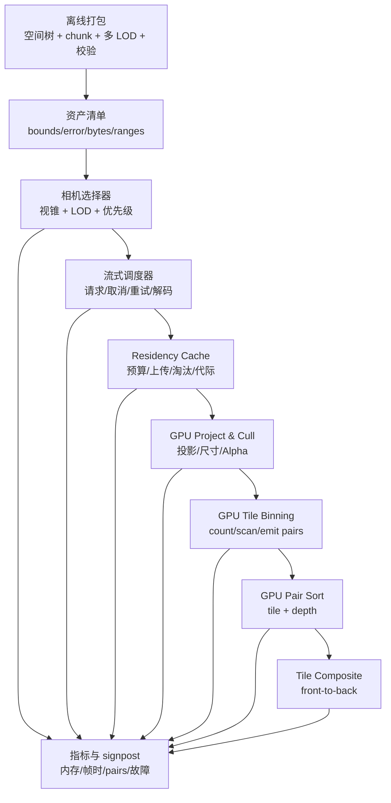

<!-- generated-by: gsd-doc-writer -->
# iPhone / Metal 超大 3D Gaussian Splatting 流式渲染设计

> **落地进度（2026-08-27）：** 当前默认压力路径优先加载 3,177,554 点 SH3 Dr Johnson，已经实现 65,536 点分批编码、49 个文件顺序 chunk、SH0～SH3、全场确定性等距候选采样、完成帧/GPU 时间与自适应预算。空间 residency、LOD tree、GPU tile pipeline 和遮挡仍未实现。代码现状见 [MILLION-SPLAT-IMPLEMENTATION.md](MILLION-SPLAT-IMPLEMENTATION.md)。

本文面向需要把 GaussianSplatMobile 从当前 317 万点验证基线继续扩展到更大、乃至千万级 3D Gaussian Splatting（3DGS）场景的开发者。App 优先选择完整的 Dr Johnson SH3 资源，缺失时才回退到 175,745 点 SH0 `sample_scene.ply`。本文首先核对现有实现，再给出可测量、可分阶段落地的目标架构。关于当前应用的完整调用链与透明合成，请先读 [ARCHITECTURE.md](ARCHITECTURE.md)；关于 PLY、SOG、Streamed SOG 等资产边界，请读 [3DGS-FORMATS.md](3DGS-FORMATS.md)。

文中凡是“当前”都能在本仓库源码中找到依据；凡是“建议”“目标”或“阶段”都尚未在 App 中实现，不能当作现有能力。这里的 tile 指计划中的屏幕空间分桶单元，不等同于 [`SplatRenderer.swift`](../Vendor/MetalSplatter/MetalSplatter/Sources/SplatRenderer.swift) 中为多阶段 imageblock render pass 设置的 `32 × 32` tile。当前 App 没有启用那个多阶段路径，也没有逐 tile 的 splat 列表。

## 结论先行

推荐的演进顺序必须保持为：

1. **chunk / LOD / residency**：先让总资产不再等于常驻集，并把首帧、峰值内存和相机跳转变成可预算问题。
2. **GPU tile pipeline**：再把单帧候选集压缩、投影、逐 tile binning、排序与合成搬到 GPU，解除 CPU 候选比较排序和 nominal candidate vertex 提交的扩展性限制。
3. **conservative occlusion**：最后才加入保守遮挡剔除；透明 Alpha 合成下，传统“前面有深度就删除后面物体”的二值遮挡判断并不可靠。

不要倒序。若没有空间 chunk 和 residency，GPU pipeline 仍要面对不受控的常驻量；若没有稳定的逐 tile 有序列表，遮挡算法既难验证也难安全降级。

“100 万开始规划、300 万以上系统改造、1000 万以上必须流式”应视为工程起点，而不是格式标准、Metal 限制或所有 iPhone 通用的硬阈值。PlayCanvas SuperSplat 当前把 100 万作为自动生成 Streamed SOG LOD 的默认分界，而且允许用户覆盖，这恰好说明它是产品默认值而非物理定律。真正的触发条件是最低支持设备上的内存余量、首帧延迟、帧时间、热稳定性和视觉误差。

## 当前实现基线：已经有什么、没有什么

### 已经实现

- [`GaussianSplatRenderer.swift`](../GaussianSplatMobile/Renderer/GaussianSplatRenderer.swift) 在 detached task 中调用 [`SceneChunkLoader.swift`](../GaussianSplatMobile/Renderer/SceneChunkLoader.swift)。loader 流式消费 reader 批次，以 Welford 在线算法累计全场中心与方差，并且最多收集 65,536 个 `SplatPoint` 就立即编码一个 `SplatChunk`；返回值不拥有完整场景 `[SplatPoint]`。
- [`SplatChunk.swift`](../Vendor/MetalSplatter/MetalSplatter/Sources/SplatChunk.swift) 把每个点编码成 32 字节 `EncodedSplatPoint`，高阶 SH 另存为 Float16 缓冲。
- [`SceneChunkLoader.swift`](../GaussianSplatMobile/Renderer/SceneChunkLoader.swift) 对每个 65,536 点批次及最后的尾批分别编码并调用 [`SplatChunk+sortByLocality.swift`](../Vendor/MetalSplatter/MetalSplatter/Sources/SplatChunk+sortByLocality.swift)，在各 chunk 内按 30 bit Morton code 原地重排；3,177,554 点场景产生 49 个 chunk。这是一次性、逐批内存局部性优化，不是空间 tile、运行时空间树或 LOD。
- [`SplatSorter.swift`](../Vendor/MetalSplatter/MetalSplatter/Sources/SplatSorter.swift) 把全部已登记 chunk 看作一个展平序列，从中确定性等距采样至候选预算，再只对这些候选计算相机距离平方并用 Swift `sort` 产生由远到近的索引。初始预算为 1,000,000，App 在 250,000～1,250,000 范围内自适应调节；sorter 最多维护三份索引缓冲，并复用最近有效结果。
- [`SplatRenderer.swift`](../Vendor/MetalSplatter/MetalSplatter/Sources/SplatRenderer.swift) 已提供 chunk 增删、启停和独占更新协议，为将来 residency 管理提供了基础生命周期 API。
- [`SplatProcessing.metal`](../Vendor/MetalSplatter/MetalSplatter/Resources/SplatProcessing.metal) 在 vertex shader 中先剔除相机后方的中心，再计算 SH 颜色并投影、分解协方差；随后剔除深度范围外和宽松屏幕边界外的中心，最后生成 quad。

### 尚未实现

- App 没有空间索引、离线 chunk 清单、多级 LOD、按相机请求、预取、取消、重试或淘汰。
- 分批解析把 `SceneChunkLoader.pendingPoints` 和逐 chunk 编码/Morton 临时限制在单个加载块内，但 reader 的 `AsyncThrowingStream` 没有有界 buffering/backpressure，producer 领先时仍可能排队多个语义 batch；必须读完整个文件并登记全部 chunk 才发布 renderer，而且每个 chunk 的基础属性和高阶 SH 最终都常驻 Metal shared buffer。因此这不是具有端到端内存硬上界或按视点装卸能力的流式场景，当前有 $N_{asset}=N_{resident}$。
- 当前 chunk 边界只是每 65,536 条文件记录的加载边界，没有 chunk bounds、CPU 视锥粗选或 GPU 候选压缩。候选来自全场展平序列的等距抽样，不等于几何可见集。
- `setChunkEnabled(false)` 只让 shader 输出退化顶点。禁用 chunk 仍可进入抽样候选，并参与候选 CPU 排序和 GPU vertex 处理，所以它不能代替真正的淘汰。
- 没有屏幕尺寸剔除、透明度上界剔除、逐 tile binning、逐 tile 排序、pair 容量控制、indirect draw 或 compute rasterizer。
- 没有遮挡剔除。当前也没有 depth texture；单阶段管线依赖由远到近索引和预乘 Alpha blending。
- UI/日志已报告 command-buffer 完成帧 FPS、平均整帧 GPU 毫秒、最近一次 CPU sort 毫秒、当前候选预算、总点数、SH 阶数、chunk 数、文件/属性字节与加载摘要。仍缺 display present p95/p99、逐 GPU stage 时间、真正可见/产生片元的点数、pair 数、进程/Metal 峰值、memory warning 与 thermal state 等指标。

因此，把多个 `SplatChunk` 加到 renderer 并不等于完成了大场景流式系统。chunk API 是可复用积木，但调度、预算、LOD 一致性和故障恢复仍需新增。

## 五个数量必须分别命名

任何性能日志、预算表和接口都不应再使用含义模糊的单个 `splatCount`。至少区分：

| 符号 | 建议字段名 | 定义 | 当前 App 的状态 |
| --- | --- | --- | --- |
| $N_{asset}$ | `assetSplatCount` | 发布资产所有 LOD/chunk 中的逻辑总量；需同时记录最高细节独立点数，避免把多级副本重复解释 | 当前等于所选文件的 vertex 数；默认完整资源为 3,177,554 |
| $N_{resident}$ | `residentSplatCount` | 此刻已解码并拥有可供 GPU 使用属性缓冲的点数 | 加载完成后等于同一文件点数，所以当前 $N_{resident}=N_{asset}$ |
| $N_{candidate}$ | `candidateSplatCount` | 本帧通过 chunk/LOD 粗选、准备进入逐点投影与细剔除的点数 | 目标候选数是 $K_{target}=\min(N_{resident},B_{candidate})$；$B_{candidate}$ 初始 1,000,000，并在 250,000～1,250,000 内调节。UI 立即显示这个 nominal target，不是可见数；实际帧会复用最近有效索引，预算变化到新排序发布之间，其 index count 可暂时高于或低于 $K_{target}$，当前没有单独上报这个瞬时实际值 |
| $N_{drawn}$ | `drawnSplatCount` | 通过逐点剔除并被写入紧凑可见列表、实际进入 raster/composite 的点数 | 当前没有 GPU compaction 或可见计数器。nominal draw index count 等于当前候选索引数，但只有通过 vertex 检查且覆盖像素的子集真正产生片元，不能把两者等同 |
| $P$ | `splatTilePairCount` | 每个可绘制 splat 与其覆盖的每个屏幕 tile 形成一条 pair 后的总条数 | 当前没有生成或记录 |

若第 $i$ 个实际绘制 splat 覆盖的 tile 集合为 $T_i$，则：

$$
P = \sum_{i=1}^{N_{drawn}} |T_i|
$$

读作“把每个已绘制高斯覆盖的 tile 数逐个相加”。求和符号表示重复相加，$|T_i|$ 表示集合里有多少个 tile。一个大椭圆可能覆盖很多 tile，所以 $P$ 可以远大于 $N_{drawn}$；只限制点数而不限制 pair 数，仍可能内存溢出或 GPU 超时。

当前 renderer 在 nominal draw 中使用 `splatIndexBuffer.count`，再由 vertex shader 把无效、disabled 或视锥外点退化。因此“提交给 draw 的条目数”和“真正产生片元的高斯数”也不是同一个量。目标 GPU pipeline 应在 draw/compute 合成前完成 compaction，才能把 $N_{drawn}$ 变成可观测、可预算的值。

## 当前 renderer 的内存下界

### 可由源码确定的布局

[`EncodedSplatPoint.swift`](../Vendor/MetalSplatter/MetalSplatter/Sources/EncodedSplatPoint.swift) 的基础属性为：位置 12 B、SH0 RGB 与 Alpha 8 B、对称协方差两个 packed half3 共 12 B，总计 32 B。degree 为 $d$ 时，SH0 之外每个颜色通道有 $(d+1)^2-1$ 个系数，每个额外 RGB 系数组含 3 个 Float16，因此属性缓冲的每点字节数为：

$$
b_{attr}(d)=32+2\times3\times\bigl((d+1)^2-1\bigr)
$$

读作“基础 32 字节，加上额外球谐系数的字节数”。最里面的 $(d+1)^2-1$ 是每个颜色通道去掉 SH0 后的系数数；乘 3 是 RGB 三通道；乘 2 是一个 Float16 占 2 字节。括号和乘法从内向外计算。SH0 的 $d=0$，额外项为 0；SH3 的 $d=3$，额外项为 90 B。

每份 `ChunkedSplatIndex` 是 8 B。`SplatSorter` 有三份可轮换索引缓冲；排序临时项包含 `UInt16 chunkIndex`、对齐、`UInt32 splatIndex` 和 `Float depth`，其 stride 为 12 B。它们现在按候选高水位扩容，不再按 $N_{resident}$ 扩到全量。令 $C$ 为本次进程生命周期中候选容量的历史高水位，则当前索引与排序临时区的安全规划式为：

$$
M_{candidate}^{floor}(C)=C\times(3\times8+12)=36C
$$

读作“历史候选容量乘三份 8 字节索引，再加一份 12 字节排序临时项”。$C$ 不是当前某一帧的预算值，而是已经达到过的容量高水位；当前 App 的候选预算上界通常使 $C\le1{,}250{,}000$。`MetalBuffer.ensureCapacity` 只保证扩容，预算下降不会自动缩小三份索引 buffer；排序临时 `Array` 也不能作为立即返还已达高水位内存的可靠契约。因此内存估算不能因为 UI 中候选预算下降就同步扣减。

对 $N_{resident}$ 个常驻点，当前 renderer 的安全规划下界为：

$$
M_{renderer}^{floor}(d,N_{resident},C)
=N_{resident}\times b_{attr}(d)+36C
$$

读作“全部常驻点的属性字节，加上候选高水位对应的三索引与排序临时字节”。属性项沿 $N_{resident}$ 增长，候选项沿 $C$ 增长，两者不能再合并成一个统一的‘每常驻点字节数’。这里的上标 `floor` 表示它只是总进程内存的规划下界，不是承诺的实测 footprint；向量、数组、Metal allocator、纹理和 App 其他对象还会继续增加内存。

| 最高 SH | 属性 B/常驻点 | 100 万常驻，$C=100$ 万 | 300 万常驻，$C=125$ 万 | 1000 万常驻，$C=125$ 万 |
| --- | ---: | ---: | ---: | ---: |
| SH0 | 32 | 64.8 MiB | 134.5 MiB | 348.1 MiB |
| SH3 | 122 | 150.7 MiB | 392.0 MiB | 1206.4 MiB |

这张表**不包含**当前最多 65,536 点的 loader `pendingPoints`、reader 无背压 stream 中可能排队的多个 `[SplatPoint]`/`PLYElement` 批次、每 chunk Morton 排序的索引/visited 临时数组、chunk 交替加载时的新旧双份属性、文件解压缓冲、tile pair、drawable/纹理、uniform、chunk table、系统框架和加载峰值。它也不计 Metal buffer 分配粒度与 Swift `Array` 的 capacity 余量。对当前 3,177,554 点 SH3 默认验证场景，属性本身约 369.7 MiB；$C=1{,}000{,}000$ 和 $C=1{,}250{,}000$ 时，上式分别约为 404.0 MiB 与 412.6 MiB，但都不能据此推断 App 的实际峰值。

作为历史对比，改造前的全量排序基线取 $C=N_{resident}$，会退化为 SH0 约 68 B/点、SH3 约 158 B/点，即原先的 $N_{resident}\times b_{renderer}(d,3)$ 公式；它不再描述当前有界候选实现。下一步仍应通过 residency 让属性项从 $N_{asset}$ 缩到有限的 $N_{resident}$，再通过 GPU compaction 让后续工作沿 $N_{drawn}$ 和 $P$ 受控。

## 离线空间布局与 Morton/Z-order 顺序

Morton 顺序（也称 Z-order）把三维量化坐标的二进制位交错成一个整数键。按这个键升序存放后，相邻记录通常也位于相近的空间单元，因而利于顺序 I/O、cache、chunk 切分和层次构建。“通常”不是“总是”：Morton 是保留局部性的一维线性化，不是精确的最近邻排序。

### 空间局部性不是相机深度顺序

这里有两种目标完全不同的排序，不能互相替代：

- **Morton 局部性排序**是相机无关的静态布局。它按世界或对象空间位置安排属性记录，目标是让空间附近的高斯尽量在内存或文件中附近。
- **相机相关深度排序**是每帧或相机变化后更新的渲染顺序。透明 Alpha 合成需要与当前视点匹配的远近关系；相机一动，顺序就可能变。

当前 App 每积累最多 65,536 条文件记录，就在 [`SceneChunkLoader.swift`](../GaussianSplatMobile/Renderer/SceneChunkLoader.swift) 中编码一个内存 `SplatChunk`，立即调用 [`SplatChunk+sortByLocality.swift`](../Vendor/MetalSplatter/MetalSplatter/Sources/SplatChunk+sortByLocality.swift) 重排该 chunk 的基础 splat 与 SH 缓冲，然后以 `sortByLocality: false` 批量登记到 renderer，避免重复排序。这个 Morton 顺序只存在于每个 chunk 的内存属性中，不写回 PLY；chunk 边界仍由原文件每 65,536 条记录划分，并不因此成为空间 tile。之后 [`SplatSorter.swift`](../Vendor/MetalSplatter/MetalSplatter/Sources/SplatSorter.swift) 从所有 chunk 的展平序列确定性等距抽取不超过当前预算的候选，只为候选计算到相机位置的距离平方，并按距离从大到小生成 back-to-front 索引。它只重排候选索引，不再搬动高斯属性。

### 从 bounds 到逐轴量化

设当前被 Morton 重排的这个 chunk 有 $N$ 个高斯，第 $j$ 个高斯的中心为三维向量 $\boldsymbol p_j=(p_{j,x},p_{j,y},p_{j,z})$。向量可理解为按顺序放在一起的三个数；$x$、$y$、$z$ 坐标分别表示点在三条空间轴上的位置。对每个轴 $a\in\{x,y,z\}$，当前代码先计算均值与标准差：

$$
\mu_a=\frac{1}{N}\sum_{j=1}^{N}p_{j,a},
\qquad
\sigma_a=\sqrt{\frac{1}{N}\sum_{j=1}^{N}p_{j,a}^{2}-\mu_a^{2}}
$$

读作“该 chunk 在该轴上的所有坐标之和除以点数得均值；平方的均值减均值的平方，再开根号得标准差”。$\mu_a$ 是这个 chunk 在轴 $a$ 上的中心，$\sigma_a$ 表示该 chunk 坐标的分散程度，$N$ 是该 chunk 的高斯数，不是全文件点数。分子是求和得到的总量，分母 $N$ 表示把总量平均分给 $N$ 个点。求和按点索引 $j$ 从 $1$ 到 $N$ 累加；代码用 `SIMD3<Float>` 同时对三个轴做这个计算。

然后每个轴用均值的前后 $2.5$ 个标准差作为量化 bounds：

$$
L_a=\mu_a-2.5\sigma_a,
\qquad
U_a=\mu_a+2.5\sigma_a
$$

读作“轴 $a$ 的下界是均值减 $2.5$ 倍标准差，上界是均值加 $2.5$ 倍标准差”。$L_a$ 与 $U_a$ 分别是该轴的最小、最大量化边界；三个轴各自的上下界合在一起，形成一个轴对齐包围盒（AABB）。这正对应 `boundsStdDeviationsForLocalitySort = 2.5` 和 `bounds(withinSigmaMultiple:)`，是当前 chunk 的统计 bounds，不是全场景的精确 `min/max`。任一轴跨度为零时，当前函数直接放弃重排。

对位置 $\boldsymbol p$ 的某个轴，先归一化并逐轴 clamp，再量化到 $b$ bit 无符号整数：

$$
u_a=\operatorname{clamp}\!\left(\frac{p_a-L_a}{U_a-L_a},0,1\right),
\qquad
q_a=\left\lfloor u_a\left(2^b-1\right)\right\rfloor
$$

读作“坐标减下界，除以上下界的跨度，把结果限制到 $0$ 与 $1$ 之间，再乘 $b$ bit 能表示的最大无符号整数，最后向下取整”。第一个分式的分子 $p_a-L_a$ 是该坐标离下界的距离，分母 $U_a-L_a$ 是整条轴的跨度；所以 $u_a=0$ 对应下界，$u_a=1$ 对应上界。`clamp` 意味着小于 $0$ 就取 $0$，大于 $1$ 就取 $1$，中间值保持不变。$\lfloor\cdot\rfloor$ 是 floor，即向下取整；代码先 clamp 保证值非负，再转换为 `UInt32`，截去小数部分的效果与 floor 相同。

当前实现固定 $b=10$，因此每轴 $q_a\in[0,1023]$。每个轴都用自己的 $L_a$、$U_a$ 和逆跨度；这是“逐轴 clamp”，不是先用某个统一半径处理整个向量。

### 位交错如何形成 Morton code

令 $x_i$、$y_i$、$z_i$ 分别是量化坐标 $q_x$、$q_y$、$q_z$ 的第 $i$ 个二进制位，从最低位的 $i=0$ 开始：

$$
x_i=(q_x\mathbin{\mathrm{>>}}i)\mathbin{\mathrm{\&}}1,
\quad
y_i=(q_y\mathbin{\mathrm{>>}}i)\mathbin{\mathrm{\&}}1,
\quad
z_i=(q_z\mathbin{\mathrm{>>}}i)\mathbin{\mathrm{\&}}1
$$

读作“把坐标右移 $i$ 位，再和 $1$ 做按位与，取出第 $i$ 位”。右移 `>>` 会把目标位移到最右边；按位与 `& 1` 只保留最右边的一位，所以结果只能是 $0$ 或 $1$。$q_x$、$q_y$、$q_z$ 是整数坐标，$x_i$、$y_i$、$z_i$ 是其中的单个二进制位。

当前代码把 $x_i$ 放到结果的第 $3i$ 位，$y_i$ 放到第 $3i+1$ 位，$z_i$ 放到第 $3i+2$ 位：

$$
M(q_x,q_y,q_z)
=\sum_{i=0}^{b-1}
\left(
x_i2^{3i}+y_i2^{3i+1}+z_i2^{3i+2}
\right)
$$

读作“对每个坐标位 $i$，把 $x$、$y$、$z$ 的该位依次放到 Morton code 的三个位置，再把所有位相加”。乘 $2^k$ 就是把一个 bit 左移 $k$ 位；左移 `<<` 在高位一侧建立目标位置。代码用按位或 `|=` 把每个已定位的 bit 合并进 `result`；由于三条轴写入的位置不重叠，这与上式求和等价。$b=10$ 时结果共 $30$ bit，可放入 `UInt32`。

#### 用 3 bit 手算验证

取 $b=3$、$q_x=5=101_2$、$q_y=2=010_2$、$q_z=3=011_2$。每三个 Morton bit 在书写时从高到低是 $(z_i,y_i,x_i)$；对 $i=2,1,0$ 依次分组，得到 $001\,110\,101_2$。用位权直接验算：

$$
\begin{aligned}
M
&=1\cdot2^0+0\cdot2^1+1\cdot2^2
  +0\cdot2^3+1\cdot2^4+1\cdot2^5 \\
&\quad+1\cdot2^6+0\cdot2^7+0\cdot2^8 \\
&=1+4+16+32+64 \\
&=117
=001110101_2
\end{aligned}
$$

读作“从最低 Morton 位开始，依次写入 $x_0,y_0,z_0,x_1,y_1,z_1,x_2,y_2,z_2$，把值为 $1$ 的位权相加得 $117$”。这正好验证当前实现的 $x\rightarrow3i$、$y\rightarrow3i+1$、$z\rightarrow3i+2$ 规则；如果交换任两条轴的位置，数值就会变，所以写入器与读取器必须约定同一规则。

#### 2D $4\times4$ Z 曲线表

二维版本把 $x_i$ 放在第 $2i$ 位、$y_i$ 放在第 $2i+1$ 位。下表单元格中的数是 Morton code，行从 $y=0$ 到 $y=3$，列从 $x=0$ 到 $x=3$：

| $y\backslash x$ | 0 | 1 | 2 | 3 |
| ---: | ---: | ---: | ---: | ---: |
| 0 | 0 | 1 | 4 | 5 |
| 1 | 2 | 3 | 6 | 7 |
| 2 | 8 | 9 | 12 | 13 |
| 3 | 10 | 11 | 14 | 15 |

按 code 从 $0$ 到 $15$ 走，坐标顺序是 $(0,0)\rightarrow(1,0)\rightarrow(0,1)\rightarrow(1,1)\rightarrow(2,0)\rightarrow\cdots\rightarrow(3,3)$。每个 $2\times2$ 小块内都连续，这就是局部性；但从 code $7$ 的 $(3,1)$ 到 code $8$ 的 $(0,2)$ 会跳跃，说明 Z-order 不保证每一对一维相邻项在空间中都最近。

### 高位前缀、Octree 与连续范围

三维 Morton code 有 $3b$ 位。它的最高三位描述根节点的 $8$ 个子空间之一，再下三位描述下一层子空间，因此每增加一组三位就深入 Octree 一层。Octree 是一种反复把三维盒平分为 $2\times2\times2=8$ 个子盒的树。

若某个深度为 $d$ 的 Octree 节点共享一个长度为 $3d$ 的高位前缀 $P$，那么该节点所有叶子 code 位于一个连续整数范围：

$$
\left[
P\,2^{3(b-d)},
(P+1)\,2^{3(b-d)}-1
\right]
$$

读作“把前缀 $P$ 后面剩余的 $3(b-d)$ 位全填 $0$ 得下界，全填 $1$ 得上界”。$b$ 是每轴总位数，$d$ 是从树根向下的层数，$P$ 是已确定的高位整数。乘 $2^{3(b-d)}$ 表示左移并为未确定的位留空。这个连续性使得一个对齐的 Octree 节点可用文件中的 `offset + count` 表示。

但任意 AABB 通常不与某一个 Octree 节点边界完全对齐。它可能横跨多个前缀单元，所以在 Morton 顺序中分裂为多个不连续范围。实施范围查询时应递归遍历 Octree：完全在查询盒内的节点直接输出一段连续范围，部分相交的节点继续下分，完全不相交的节点跳过。不要假设每个世界空间 AABB 都能转换成一次文件 range request。

### 离线排序、属性同步置换与 chunk/LOD

可持久的离线打包器应把 Morton 键当作“如何布局记录”的中间结果，而不是新的高斯属性。实施步骤是：

1. 对该 LOD 或建树域中的所有中心计算 bounds、量化坐标和 Morton code。
2. 按 `(mortonCode, originalIndex)` 升序生成唯一的源索引排列。`originalIndex` 是稳定 tie-break：两个点的 code 相同时，原始索引小的仍在前，使重复构建可复现。
3. 用同一份源索引排列同步置换位置、旋转、尺度、Alpha、SH0、所有高阶 SH 及未来新增的每点属性。只排位置会让颜色、协方差或 SH 张冠李戴，这是数据损坏，不是轻微质量损失。
4. 优先在 Octree 前缀边界上切 chunk，或在满足前缀的节点内再按目标解码字节切分。manifest 记录每个 chunk 的实际扩张 bounds、数据范围、点数、字节数、父子关系和校验和。
5. 每个 LOD 独立生成或聚合高斯，再在该 LOD 内重新计算布局；不要把“粗 LOD 简单沿用细 LOD 的每第 $k$ 条记录”当作空间或视觉误差保证。

当前 `sortByLocality()` 覆盖了第 1–3 步的核心动作，但只是逐批内存版子集：每个 chunk 编码后就用量化 code 升序生成索引，原地重排 `EncodedSplatPoint` 缓冲，并以相同索引成组重排高阶 SH 缓冲。它尚未实现显式稳定 tie-break、持久化、manifest、空间 chunk 树或 LOD 生成。逐批重排把 Morton 临时工作集限制在单个 chunk，却不会减少完整文件 I/O，也不会改变最终所有属性全量常驻的事实；跨 chunk 的文件记录顺序更不具备一个全场 Morton 前缀语义。

格式的 header 只说明它明确声明的语义。当前 Dr Johnson SH3 验证资源和 [`sample_scene.ply`](../GaussianSplatMobile/Resources/sample_scene.ply) 的 header 都没有排序方法、Morton code、bounds 或 chunk 元数据；轻量文件额外明确声明了 `binary_little_endian`、`vertex` 数和位置/旋转/尺度/透明度/SH0 属性。因此不能从 PLY header 推断文件记录已经具有空间顺序，也不能把“每批加载后的内存顺序”误报为“PLY 存储顺序”或空间 tile。关于文件是否承诺某种记录顺序，以及该顺序是格式语义还是实现细节，请反向查阅 [3DGS-FORMATS.md 的“文件存储顺序与格式规范”](3DGS-FORMATS.md#文件存储顺序与格式规范)。

### 位数、精度与 `UInt32`/`UInt64` 取舍

对 bounds 内的点，量化相邻级的轴向间距为：

$$
\Delta_a=\frac{U_a-L_a}{2^b-1}
$$

读作“轴 $a$ 的上下界跨度，除以 $b$ bit 的最大整数”。分子 $U_a-L_a$ 是世界空间长度，分母 $2^b-1$ 是从下界到上界的等距间隔数，$\Delta_a$ 是该轴一个量化级大约对应多少世界单位。当前向下取整方案对 bounds 内非上界点的单轴量化误差小于 $\Delta_a$；被 clamp 的离群点不受这个误差界约束。

| 每轴位数 $b$ | 每轴坐标值 | 3D code 位数 | bounds 相对步长 | 自然存储类型 | 工程判断 |
| ---: | ---: | ---: | ---: | --- | --- |
| 8 | 256 | 24 | $1/255\approx0.392\%$ | `UInt32` | 键小且快，大 bounds 或高密度区碰撞多 |
| 10 | 1,024 | 30 | $1/1023\approx0.0978\%$ | `UInt32` | 当前代码的平衡点，仍留 2 个高位 |
| 16 | 65,536 | 48 | $1/65535\approx0.00153\%$ | `UInt64` | 精度高，但 48 bit 无法放进 `UInt32` |
| 21 | 2,097,152 | 63 | $1/2097151\approx0.0000477\%$ | `UInt64` | 三轴等位宽可放入 `UInt64` 的常用上限 |

“每轴坐标值”是可编码整数的个数，不是保证能唯一区分的高斯数。三维 code 需要 $3b$ bit；$b=21$ 时用 $63$ bit，而 $b=22$ 时需要 $66$ bit，已超过单个 `UInt64`。更宽的键会增加排序、索引和临时缓冲带宽；位数选择应由 chunk 物理尺寸、最小需区分距离、密度与目标硬件测试决定，不是越大越好。

### 边界情况与替代结构

| 问题 | 会发生什么 | 实施策略 |
| --- | --- | --- |
| 量化碰撞 | 多个高斯得到同一 $(q_x,q_y,q_z)$ 和 Morton code | 用原始索引或另一个持久 ID 作稳定 tie-break；不要假设 code 唯一 |
| 离群点 | $\mu\pm2.5\sigma$ 之外的点被逐轴 clamp 到盒的表面、边或角，局部性变差 | 当前这是明确取舍；离线工具应报告每轴 clamp 比例，必要时用分位数 bounds、精确 bounds 或预先分离离群 chunk |
| 非等距轴 | 逐轴归一化使相对步长一样，但世界空间步长 $\Delta_x$、$\Delta_y$、$\Delta_z$ 可能差很大 | 需要近似立方体 cell 时，将 bounds 补成立方体或按轴长分配不同位数；后者会改变键规范 |
| 密度不均 | 稀疏区浪费大量量化 cell，密集区仍可能碰撞 | 先用 Octree/kd-tree 自适应分区，再在节点内用 Morton；或为密集节点继续细分 |
| 曲线跳跃 | 相邻 code 在小块内很近，跨前缀边界时可能突然变远 | chunk 尽量按前缀对齐，以实际 bounds 而不是首尾点估计空间范围 |
| 任意 AABB 查询 | 查询区域在一维 Morton 序列中可能是多段 | 用 Octree 前缀分解生成 range 集合，再合并相邻范围 |

常用结构的取舍如下：

| 方案 | 局部性与范围 | 构建/运行时代价 | 适合用途 |
| --- | --- | --- | --- |
| XYZ 字典序 | 一条主轴上局部性好，换行/换层时会长距离跳跃 | 键最简单，比较排序直接 | 主轴扫描、简单导出或调试 |
| Morton/Z-order | 三轴对称、Octree 前缀是连续范围，但存在曲线跳跃 | 位交错便宜，整数 radix sort 友好 | 线性化存储、chunk、Octree/LBVH 构建 |
| Hilbert 曲线 | 通常比 Morton 保留更好的连续局部性，但任意 AABB 仍可分成多段 | 编解码和维度/方向状态更复杂 | 局部性价值高且离线构建成本可接受的资产 |
| kd-tree | 按数据分布选分割轴，对密度不均更自适应 | 需要节点、分割值和树遍历，它本身不是唯一的文件总顺序 | 近邻、范围查询、自适应空间分区 |
| BVH | 显式保存子树 bounds，对视锥/射线裁剪直接 | 节点与构建成本较高；可用 Morton 键生成 linear BVH | 运行时可见性、空间包围和非均匀几何 |

它们不必二选一。对大型 3DGS，实用组合常是“Octree 或 BVH 负责层次选择和 bounds 裁剪，节点内用 Morton 负责记录布局”。选型时应用实际 chunk range 数、cache miss、解码字节、构建时间和相机轨迹上的候选数比较，不应只用曲线名称做决策。

## 目标架构

### 离线资产

空间键的 bounds/量化规范、全属性同步置换、前缀对齐 chunk 与每级 LOD 独立重排的实施约束，见前文 [“离线空间布局与 Morton/Z-order 顺序”](#离线空间布局与-mortonz-order-顺序)。

离线阶段输出版本化 manifest、空间树和多个可独立校验的 chunk。每个节点至少记录：世界空间 bounds、最高细节点数、每级 LOD 的几何误差、压缩/解码字节数、文件偏移或 URL、校验和、SH degree、父子关系与 fallback。

chunk 应按**目标解码后字节数**而不只是点数切分，因为 SH0 与 SH3 的运行时成本不同。空间归属可以按中心决定，但 bounds 必须扩张到高斯有效支撑范围，不能只包住中心。若协方差最大特征值为 $\lambda_{max}$，用 $k$ 个标准差近似支撑半径：

$$
r_{support}=k\sqrt{\lambda_{max}}
$$

读作“最大方差开平方得到最长轴标准差，再乘支撑倍数 $k$”。特征值可理解为椭球沿某个主方向的方差；根号把方差转换为长度。当前 shader 使用三倍标准差 quad，因此离线 chunk bounds 可从 $k=3$ 起步，再用视觉误差测试决定是否扩大。这里的 bounds 只用于保守粗剔除，宁可多保留，不可切掉可见尾部。

LOD 不应只是随机删点。粗层要近似细层的颜色、Alpha 覆盖和空间分布，并保留可验证误差。Streamed SOG 已提供“空间 chunk + 多 LOD + viewer 按相机装卸”的公开参考，但本仓库当前没有 SOG reader；采用该格式还是自建二进制容器，应在 [3DGS-FORMATS.md](3DGS-FORMATS.md) 的格式权衡基础上另做决定。

### LOD 选择

令节点的世界空间误差为 $e_{world}$，相机空间深度绝对值为 $|z|$，像素焦距为 $f_{px}$，其近似屏幕误差为：

$$
e_{px}\approx\frac{f_{px}e_{world}}{|z|}
$$

读作“世界误差乘像素焦距，再除以离相机的深度”。分子越大，屏幕误差越明显；分母越大，物体越远，允许更粗的 LOD。这里的向量已经通过 view matrix 变到相机空间；矩阵可以理解为把世界坐标批量映射到相机坐标的规则表。

选择器应在屏幕误差阈值、单帧候选预算、网络/磁盘可用性与 residency 预算之间求解。阈值必须带滞回：进入细 LOD 用较高门槛，退回粗 LOD 用较低门槛，避免相机在边界附近使 chunk 每帧抖动。

父子替换必须保持覆盖连续：先保证父级仍可绘制，再异步装入全部必需子级，待子级完成上传并进入有效排序/可见列表后原子切换，最后延迟释放父级。透明对象做交叉淡化会暂时双重贡献 Alpha，也增加双份 residency；除非专门设计权重归一化，否则优先使用短暂的原子切换与滞回。

### Residency 与流式调度

调度器维护 `requested → decoding → uploaded → active → evicting` 状态和单调递增 generation。完成回调必须检查 generation，防止旧相机请求在取消后把过时 chunk 重新发布。

推荐优先级依次考虑：当前视锥、屏幕误差、距视锥边缘的预测运动、是否为粗 fallback、下载/解码成本和最近使用时间。相机 teleport 时立即保留全局粗 LOD，取消低优先级细化，再从新位置重建请求队列。

对现有 `SplatRenderer` 的过渡实现：

1. 新 chunk 先 `addChunk(..., enabled: false)`。
2. 等 `afterNextSort` 确认它进入有效索引。
3. 在一次 `withChunkAccess` 中切换旧/新 LOD 的 enabled 状态。
4. GPU in-flight work 排空后 `removeChunk` 淘汰旧 chunk。

这只是阶段性桥接。disabled chunk 仍可进入全场等距样本，并参与候选 CPU 排序与 GPU vertex 工作，因此不能长期把 cache 中所有备用 LOD 都留在 renderer。大量 add/remove 还会等待 in-flight render 排空；调度器应批量提交变更并限制每帧 churn。

## GPU 逐 tile pipeline

### 建议 pass 序列

1. **Project and cull**：输入 $N_{candidate}$，计算 view-space 中心、二维协方差、屏幕椭圆 bounds、深度、颜色与 Alpha 上界；通过者紧凑写入 projected list，得到 $N_{drawn}$。
2. **Count tile overlaps**：为每个 projected splat 计算覆盖 tile 数；超大 splat 单独标记，避免单项破坏常规容量。
3. **Prefix scan**：对每点 pair 数做前缀和，获得写入 offset 与总数 $P$。前缀和是把前面所有计数累加，使并行线程知道自己应写到数组的哪一段。
4. **Emit pairs**：写出 `(tileID, depthKey, splatID)`；在写入前比较硬容量，绝不越界。
5. **Sort and build ranges**：按 tile 主键、深度次键排序，并为每个 tile 生成 `[start, count]`。
6. **Tile composite**：每个 threadgroup 处理一个屏幕 tile，像素线程遍历该 tile 的近到远列表，累积颜色与透射率，并在贡献足够小时提前结束。

若 pair 记录只含 `UInt32 splatID`，tile range 已隐含 tile，最小 pair payload 可为 4 B；若排序阶段把 tile/depth 一并保留，常见是 8–16 B。不要在设计阶段固定一个虚假的字节数，应以实际结构的 `MemoryLayout.stride` 计入：

$$
M_{pairs}=P\times b_{pair}
$$

读作“pair 数乘每条 pair 的实际 stride”。$b_{pair}$ 是每条记录占用的字节数；Metal/Swift 对齐可能让它大于字段简单相加。若 double buffer 做 radix sort，还要把输入、输出和 scratch 分别计算。

当前 CPU 比较排序对点数的时间复杂度近似为：

$$
O\bigl(N_{candidate}\log N_{candidate}\bigr)
$$

读作“候选数乘候选数对数的增长量级”。复杂度描述数据规模增长时工作量怎样增长，不是精确毫秒；$O$ 读作“大 O”。目标分桶的生成成本近似 $O(N_{candidate}+P)$，逐 tile 比较排序则为 $\sum_t O(n_t\log n_t)$；若使用固定轮数 radix sort，可近似为 $O(kP)$，其中 $k$ 是固定 pass 数。最终选择必须依据目标 iPhone 上的 GPU counter，而不是只看理论复杂度。

### tile 大小的权衡

- 小 tile：椭圆覆盖更精确、每像素无关 splat 更少，但 $P$ 增大，pair/scan/sort 成本更高。
- 大 tile：$P$ 下降，但每个 tile 列表更长，像素会测试更多无贡献高斯，threadgroup 局部存储压力也更大。
- 固定 `16 × 16` 或 `32 × 32` 只能作为实验起点；应按 GPU family、分辨率、场景椭圆分布和 SH 成本选择。
- 任何 tile 配置都必须设置 `pairCapacity`、`maxPairsPerTile`、overflow counter 和确定性降级路径。

### 前到后透明合成

compute tile rasterizer 可按近到远顺序维护颜色 $\mathbf{C}$ 与剩余透射率 $T$：

$$
\mathbf{C}_{new}=\mathbf{C}_{old}+T_{old}\alpha_i\mathbf{c}_i,
\qquad
T_{new}=T_{old}(1-\alpha_i)
$$

读作“当前高斯的颜色先乘自身 Alpha，再乘前面各层仍允许通过的比例，最后加到旧颜色；剩余透射率再乘一减 Alpha”。$\mathbf{C}$ 是 RGB 颜色向量，向量就是按顺序排列的三个颜色数；$T$ 从 1 开始，越接近 0 表示前景越不透明。当前硬件管线采用远到近 blending；这是等价目标的另一计算方向，不能混用排序方向与公式。

当 $T<\varepsilon$ 时可以逐像素 early termination。$\varepsilon$ 是允许忽略的最大剩余贡献阈值，必须结合 HDR 范围、色差或图像误差测试选择；它是有界近似，不是“完全透明等于零”的数学事实。

## 剔除策略与正确性边界

### 1. chunk 视锥剔除

对 LOD 节点的扩张 bounds 做六平面测试。bounds 完全在视锥外才删除；相交时保留。near plane 附近、超大高斯和相机进入 bounds 时必须走保守分支。此步骤减少 $N_{candidate}$，收益通常高于先优化单点 shader。

### 2. 逐点视锥剔除

目标 compute pass 应使用投影后椭圆 bounds 与 viewport 相交，而不只判断中心。当前 shader 已做相机后方与宽松中心边界检查，但它发生在 draw 内，不能降低索引数量和 nominal vertex 工作。

### 3. 尺寸剔除与 LOD

投影面积低于阈值的单点不一定可以直接删除：大量亚像素高斯叠加后仍可能形成可见颜色和 Alpha。优先让粗 LOD 聚合它们；只有在贡献上界低于视觉容差时才剔除。应分别记录 `culledBySize` 和 `replacedByLOD`，避免把“降级”误报为“删除”。

### 4. 透明度剔除

基础 Alpha 很低不代表最终贡献一定低；高斯数量、重叠层数、当前透射率和颜色动态范围都会影响结果。可以用保守上界筛掉明显无贡献项，并把阈值纳入回归图像测试。对任意颜色通道限定在 $[0,1]$ 的情形，单项颜色贡献上界可写成：

$$
\Delta C_i\le T_{front}\alpha_i
$$

读作“第 $i$ 个高斯最多贡献前方剩余透射率乘自身 Alpha”。左边是某个颜色通道可能改变的最大量；右边越小，忽略它越安全。离线只知道 $\alpha_i$ 时上界较松，逐 tile 前到后合成知道 $T_{front}$ 后才能安全地更早停止。

### 5. 为什么传统遮挡剔除会错

传统 opaque Hi-Z 的逻辑是：若对象深度在已有最近深度之后，就把整个对象删除。透明 3DGS 不满足“最近表面完全挡住后面”的前提。多个有序高斯与背景的结果为：

$$
\mathbf{C}=\sum_{i=1}^{m}
\left(\alpha_i\mathbf{c}_i\prod_{j=1}^{i-1}(1-\alpha_j)\right)
+\mathbf{C}_{bg}\prod_{j=1}^{m}(1-\alpha_j)
$$

读作“第 $i$ 层颜色乘自身 Alpha，还要乘前面所有层的一减 Alpha；最后背景乘所有层留下的透射率”。乘积符号表示把多项连续相乘。只要前景 Alpha 没有累积到 1，后方高斯通常仍有非零贡献。用中心深度写普通 Hi-Z，再删除后方椭圆，会造成孔洞、边缘闪烁、薄结构消失和视角相关 popping。

因此遮挡剔除应最后实施，并优先采用以下保守方法：

- 在逐像素、前到后 tile 合成中用 $T<\varepsilon$ early termination；这是最接近真实可见性的位置。
- 只有经过认证的 opaque proxy 或累积不透明度下界才能驱动 chunk 级遮挡；bounds、深度范围与 coverage 都必须保守。
- 对遮挡结果保留一圈屏幕/深度膨胀，并用时间滞回避免一帧判断导致长时间缺块。
- camera teleport、LOD 切换、分辨率变化和 occlusion buffer 失效时，回退到“不做遮挡”，而不是沿用旧结果。
- 用无遮挡参考帧做差分测试，阈值以最大色差、结构相似度和时间稳定性共同约束。

## 内存预算与准入

[Apple Process Available Memory API](https://developer.apple.com/documentation/os/os_proc_available_memory) 是操作系统提供的外部平台 API，C 符号名为 `os_proc_available_memory`，不是本仓库定义或当前已经调用的本地函数。未来接入后，它返回当前 App 距内存限制还可分配的建议字节数；Apple 明确要求不要缓存这个值，也不要为了“用满”而扩大占用。内存限制会在 App 生命周期内变化，并不等于设备物理 RAM。

一次新 chunk 的准入条件应覆盖过渡峰值：

$$
M_{new}+M_{decodePeak}+M_{pairPeak}+H_{reserve}
\le M_{available}(t)
$$

读作“新常驻 chunk、其解码峰值、最坏 pair 峰值和保留余量之和，不得超过此刻可用额度”。$M_{available}(t)$ 每次准入前重新查询；$H_{reserve}$ 是给 drawable、系统波动、Swift/Metal allocator 和突发工作保留的空间，必须按最低支持设备的实测分位数设定。

完整账本至少分为：属性 buffer、LOD 双驻留、排序/可见索引、projected list、pair input/output/scratch、tile range、解码 staging、drawable/attachment、Swift heap、其他 App 与安全余量。收到 memory warning 时应立即停止预取、取消低优先级解码、先退细 LOD，再淘汰不可见 chunk；全局粗 LOD 应有独立保底预算。

`device.maxBufferLength` 只是单个 Metal buffer 的上限，不是进程总内存预算。把资产切成多个 buffer 可以绕开单 buffer 上限，却不能绕开内存压力、排序工作集或 GPU 帧时间。

## 帧时间预算

目标刷新率为 $F$ 帧/秒时，每帧墙钟预算为：

$$
B_{frame}=\frac{1000}{F}\ \text{ms}
$$

读作“1000 毫秒除以每秒帧数”。分子是一秒的毫秒数，分母是每秒目标帧数；60 FPS 对应约 16.67 ms，30 FPS 对应约 33.33 ms。帧预算应以 p95/p99 和连续热运行统计，而不是短时间平均 FPS。

可用下面的初始分配开始 profile；它是调试预算，不是平台保证：

| 路径 | 60 FPS 初始门槛 | 30 FPS 初始门槛 | 超预算时优先动作 |
| --- | ---: | ---: | --- |
| CPU 相机/选择/提交 | 2.0 ms | 4.0 ms | 降低选择频率、批量状态变更、移除 CPU 候选比较排序 |
| GPU project/cull/bin/sort | 4.0 ms | 8.0 ms | 降 $N_{candidate}$、限制 $P$、调整 tile/radix passes |
| GPU composite | 7.0 ms | 14.0 ms | 降 $N_{drawn}$、LOD、分辨率，启用安全 early termination |
| 抖动/显示/系统余量 | 3.67 ms | 7.33 ms | 增加质量滞回，避免预算贴边 |

CPU 与 GPU 能流水重叠，所以各项不能总是简单相加；真正的帧时由依赖链、CPU/GPU 较慢一侧和显示同步共同决定。Apple 的 [Game Performance / Metal System Trace 指南](https://developer.apple.com/documentation/xcode/analyzing-the-performance-of-your-metal-app)建议联合查看 Display、GPU、Metal、线程、虚拟内存与 Thermal，而不是只读应用内 FPS。

## 按测量指标触发决策

| 观测条件（最低支持设备，代表性相机轨迹） | 决策 | 与资产点数的关系 |
| --- | --- | --- |
| 全量 SH0/SH3 规划下界已逼近常驻预算，或加载过渡不满足上式 | 立即实现 chunk + residency；先限制 $N_{resident}$ | 可能不到 100 万就触发 |
| 首个可交互帧 p95 超过产品目标，且主要时间在顺序读完整文件、每批编码或每批 Morton | 改为粗 LOD 首帧、可独立寻址的空间分块解码与后台细化 | 与磁盘格式、SH 和 CPU 同样相关 |
| `sortDurationP95 > cpuSortBudget`，相机移动时持续积压 | 不再扩大 CPU 候选比较排序；收缩候选并规划 GPU tile sort | 由 $N_{candidate}$ 直接驱动，无固定资产点数 |
| GPU vertex 时间随 $N_{candidate}$ 增长，且大量 nominal candidate 在 shader 内退化 | 加 GPU compaction，让提交工作从候选索引数降到 $N_{drawn}$ | 说明 disabled/视锥外点仍在付费 |
| fragment 时间、rasterized fragments 或 overdraw limiter 升高 | 优先 LOD、尺寸/Alpha 筛选、tile composite；不要只优化 sort | 少量超大椭圆也可触发 |
| `pairCountP95 / pairCapacity` 接近预算，或单 tile 列表长尾失控 | 降 LOD、限制巨型 splat、调整 tile；禁止静默截断 | 由屏幕覆盖而非总点数决定 |
| `resident/asset` 必须长期显著小于 1 才能满足内存与帧时 | 把 streaming 设为产品必需路径并测试离线/失败 fallback | 千万级通常会到这里 |
| 无遮挡版本已达不到 GPU 预算，且 tile 前到后已有稳定 $T$ | 才评估 conservative occlusion | 点数不是唯一前提 |

经验上的解释是：约 100 万时应开始保存上述五个计数并规划离线空间 chunk。当前 317 万 SH3 路径已经完成“全属性常驻 + 有界候选抽样/排序/nominal draw”，证明数百万点可以贯通加载与渲染，但它没有实现 residency、LOD、空间 tile 或遮挡。约 1000 万以上，为覆盖 iPhone 设备范围和加载过渡，通常应把按视点 streaming 当作产品必需能力；这仍是工程启发式而非硬阈值。若实测更早越过预算，就提前实施；若特定高端设备、SH0、低分辨率和静态相机仍可全量常驻，也不能把例外推广成通用硬标准。

## 可观测性契约

当前 UI/日志已经给出完成帧 FPS、平均 command-buffer GPU 毫秒、最近一次候选 CPU sort 毫秒、候选预算、总点数、SH、chunk 数、文件/属性字节与加载摘要。它们足以确认 317 万点路径和自适应预算是否工作，但不能回答 display present 长尾、各 GPU pass、真正可见数、内存峰值或热降频。目标实现应在每帧或固定窗口继续记录：

- 五个核心数量：$N_{asset}$、$N_{resident}$、$N_{candidate}$、$N_{drawn}$、$P$，以及 `maxPairsInTile` 和各剔除原因计数。
- 字节账本：属性、索引、projected、pair、scratch、decode、LOD overlap、texture、总 footprint 与 Apple 外部可用内存建议值。
- 流式：请求队列深度、命中率、取消数、重试数、下载/读取/解码/上传 p50/p95、淘汰数、相机 teleport 恢复时间。
- LOD：每级 active chunk/point 数、父子双驻留时间、fallback 覆盖率、切换次数与 thrash 次数。
- CPU：select、decode、encode、chunk mutation、command encode、等待 exclusive access 和旧 CPU sort 的 signpost 区间。
- GPU：project/cull、scan、emit、sort、composite 的 timestamp；present 间隔、dropped frame 与 in-flight 深度。
- 稳定性：pair overflow、buffer allocation failure、校验失败、generation 丢弃、memory warning、thermal state 与降级级别。

Apple 的 [GPU counters 与 counter sample buffer](https://developer.apple.com/documentation/metal/gpu-counters-and-counter-sample-buffers)可在设备支持时采样 timestamp、statistics 和 stage utilization；[Apple GPU counter statistics](https://developer.apple.com/documentation/xcode/analyzing-apple-gpu-performance-using-counter-statistics)可查看 memory bandwidth、vertices、rasterized fragments、texture limiter 与利用率。计数器集合因 GPU 和采样点而异，代码必须先查询支持能力；性能 capture 也可能改变 pass overlap，因此应用内轻量指标和离线 Instruments/Metal capture 应配合使用。

建议为固定相机轨迹建立回归基线：冷启动、绕场一周、快速推进、进入模型、180° 转身、teleport、前后台切换、低内存警告与持续 10–20 分钟热运行。每次优化同时比较帧时、峰值内存、五个数量和参考图像，避免“FPS 上升但透明层被错误删除”。

## 故障模式与确定性降级

| 故障 | 表现 | 必须采取的行为 |
| --- | --- | --- |
| 低内存 / allocation failure | 卡顿、加载失败或 jetsam 风险 | 停预取，取消细 LOD，退到粗 LOD；不得继续乐观分配 |
| pair buffer overflow | GPU 越界、花屏或丢随机高斯 | 原子记录 overflow，整帧或相关 tile 使用更粗 LOD重试；绝不越界或静默截断 |
| 单个巨型 splat 覆盖大量 tile | $P$ 突增、热点 tile 超长 | 独立 giant-splat 路径、离线拆分/限制或更粗 LOD；保持视觉 fallback |
| 相机快速移动/teleport | 请求风暴、旧 chunk 抢占内存 | generation 取消、粗 LOD 立即覆盖、限并发并重排优先级 |
| LOD 父子不完整 | 空洞、重复 Alpha、边界闪烁 | 父级保留到子级集合完整；原子切换，失败继续显示父级 |
| disabled chunk 堆积 | 看似不可见但 sort/GPU 时间不降 | 真正 `removeChunk`，并从 residency cache 释放；批量变更减少排空等待 |
| stale index / 提前释放 | 随机越界或 GPU fault | 保留 in-flight 引用、generation 与独占协议；完成回调后才回收 |
| 透明遮挡误判 | 孔洞、薄层消失、视角 popping | 关闭 occlusion 回退；只使用保守 bounds 和透射率阈值 |
| 损坏或缺失 chunk | 局部永久空白 | 校验和、有限重试、父 LOD fallback、可诊断错误码 |
| 热降频 | 数分钟后 FPS 下降 | 按 thermal/帧时逐级降 LOD、分辨率和预取并发，使用滞回恢复 |
| 排序近似错误 | 薄层颜色跳变 | 保留参考路径，比较 view-Z、tile depth 与 OIT 方案；不要用 occlusion 掩盖 |
| 指标本身过重 | release 版帧时变差 | 计数器采样降频、环形缓冲、批量导出；Metal capture 仅诊断时开启 |

## 实施阶段与验收门槛

### 阶段 0：建立基准和计数语义

保留当前已落地的完成帧 FPS、平均整帧 GPU 时间、候选 CPU sort、候选预算和加载摘要，并在不改图像路径的前提下补齐 signpost、内存账本、present p95/p99、GPU stage timestamp，以及五个数量中当前不可得的 $N_{drawn}$ 与 $P$。固定设备矩阵、相机轨迹、30/60 FPS 目标与图像参考。验收标准是能够解释一帧为什么慢、一次加载为什么峰值高，而不是只有平均 FPS。

### 阶段 1：离线 chunk 与粗 LOD

当前 65,536 点文件记录批次不满足这一阶段的空间语义。未来需定义版本化 manifest、扩张 bounds、校验和、SH/模型元数据与至少一个全局粗 fallback。构建器对 chunk 大小、LOD 误差和父子覆盖做自动校验。验收包括随机 chunk 丢失仍能显示父级、所有细级组合不出现空间空洞。

### 阶段 2：受预算控制的 residency

新增异步请求、取消、generation、decode staging、上传、LRU/优先级淘汰和 memory warning 降级。先用现有 chunk API桥接，但必须最终 remove 已淘汰 chunk。验收以最低支持设备的峰值、首帧 p95、teleport 恢复与长时间无 thrash 为准。

### 阶段 3：候选集与 LOD 稳定性

加入 chunk 视锥、屏幕误差、滞回、单帧候选预算和确定性父子切换。此时 $N_{asset}$、$N_{resident}$ 和 $N_{candidate}$ 必须明显可分。验收比较无剔除参考，统计 seams、popping 和候选削减率。

### 阶段 4：GPU tile pipeline

逐步引入 project/cull、scan、pair emit、GPU sort、tile ranges 和 compute composite。每个 pass 都保留容量检查与 reference mode；先保证图像接近当前结果，再优化 tile、radix、shared/private storage 和 early termination。验收同时限定 $N_{drawn}$、$P$、GPU p95、overflow 为零和图像误差。

### 阶段 5：保守遮挡

只有前四阶段稳定后，才加入逐像素透射率终止，再评估 chunk 级 opaque proxy/opacity bounds。任何不确定情况回退到不剔除。验收必须覆盖相机内外穿越、细枝/毛发/玻璃式薄层、LOD 切换和时间稳定性。

## 关键 trade-off

| 决策 | 一端 | 另一端 | 推荐判断依据 |
| --- | --- | --- | --- |
| 小 chunk vs 大 chunk | 精细调度、文件/元数据/pair 管理多 | I/O 高效、但过取和淘汰粒度粗 | 解码后字节、请求延迟、相机速度 |
| Octree/grid vs BVH | 规则、LOD 容易，但稀疏区浪费 | bounds 紧、构建和更新更复杂 | 场景密度与离线构建成本 |
| 点删减 vs 高斯聚合 LOD | 构建简单、容易闪烁/变薄 | 质量好、生成和验证复杂 | Alpha 覆盖与参考图误差 |
| `.storageModeShared` vs `.private` | CPU 填充简单、当前代码已用 | 可能改善 GPU 访问，但需 staging/blit | Metal counters 与加载峰值 |
| CPU chunk 选择 vs GPU 全部选择 | 易调试、适合粗粒度 | 高频大规模更并行、同步更复杂 | chunk 数、CPU p95、ICB/indirect 需求 |
| comparison sort vs radix/bin sort | 实现直接、$O(N\log N)$ | 更可预测、scratch 和 key 设计复杂 | $P$ 分布、GPU pass 时间 |
| graphics quad vs compute tile composite | 复用硬件 raster/blend | 容易逐 tile early termination，但需自写覆盖/合成 | fragment overdraw、图像一致性 |
| 激进遮挡 vs 保守遮挡 | 更快、透明错误风险高 | 少剔除、结果稳定 | 无遮挡参考差异与时间稳定性 |
| 自有格式 vs Streamed SOG | 可贴合 Metal 布局 | 复用公开生态、需新增 SOG/WebP reader | 工具链、CDN、编辑与跨平台需求 |

## 外部参考

- Apple [Process Available Memory API](https://developer.apple.com/documentation/os/os_proc_available_memory)：这是仓库之外的操作系统 API；运行时可用内存是动态、建议性信息，不应缓存或用来占满进程限额。
- Apple [Analyzing the performance of your Metal app](https://developer.apple.com/documentation/xcode/analyzing-the-performance-of-your-metal-app)：用 Game Performance、Metal System Trace、Display、Thermal 和 CPU/GPU timeline 定位卡顿。
- Apple [GPU counters and counter sample buffers](https://developer.apple.com/documentation/metal/gpu-counters-and-counter-sample-buffers)：查询设备支持并采样 timestamp、statistics、stage utilization。
- Apple [Analyzing Apple GPU performance using counter statistics](https://developer.apple.com/documentation/xcode/analyzing-apple-gpu-performance-using-counter-statistics)：用 vertices、rasterized fragments、bandwidth 与 limiter 判断瓶颈。
- PlayCanvas [Streamed SOG v1](https://developer.playcanvas.com/user-manual/gaussian-splatting/formats/streamed-sog/)：空间树、分 chunk、多 LOD 与相机驱动装卸的公开格式参考。
- PlayCanvas SuperSplat [Streaming & Performance](https://developer.playcanvas.com/user-manual/supersplat/streaming/)：100 万点自动生成 LOD/Streamed SOG 的可覆盖产品默认值，以及粗 LOD 先显示、细节渐进填充的工作流。

最终目标不是让一个“1000 万点”标签通过，而是让五个数量、每类字节、每个 GPU pass 和每种误差都受预算控制：总资产可以很大，常驻集必须有限，单帧候选必须可削减，实际绘制必须可压缩，splat-tile pairs 必须有硬容量和安全降级。
