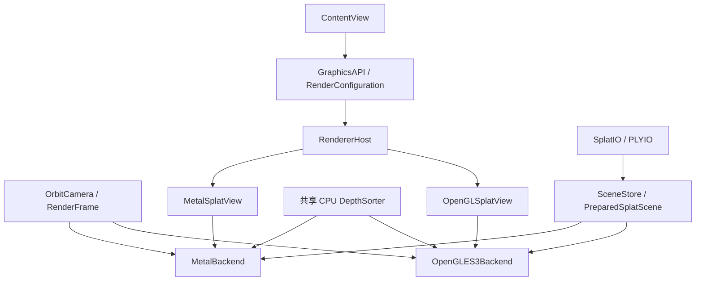

<!-- generated-by: gsd-doc-writer -->
# OpenGL ES 3.0 与 Metal 双后端适配备忘

本文记录 GaussianSplatMobile 未来同时支持 Metal 与 OpenGL ES 3.0 的技术讨论、已核实的当前代码事实、建议目标架构和风险边界。它是设计备忘，不是已完成能力说明。

> **代码核对（2026-08-27）与当前决策（2026-08-25）**：暂不实施 OpenGL ES 适配，不增加图形 API 切换，不重构为双后端。项目继续保持 **Metal-only**。下文所有 `GraphicsAPI`、`RendererHost`、`SceneStore`、OpenGL renderer、GLSL 和 OpenGL 资源布局均属于未来设计，仓库当前不存在这些实现。

## 1. 范围与术语

本项目目标平台是 iOS，因此讨论中的“OpenGL”具体指 **OpenGL ES 3.0**，不是 macOS/Windows/Linux 上的桌面 OpenGL。若未来实现，代码枚举也应命名为 `openGLES3`，避免制造“支持桌面 OpenGL”的错误预期。

Apple 已在 iOS 12 弃用 OpenGL ES，并建议高性能 GPU 工作使用 Metal。Apple 当前的 OpenGL ES 编程指南也已标记为 retired；`EAGLContext` 和 `GLKView` 均显示 deprecated。OpenGL ES 3.0 仍是这项兼容方案所讨论的 API，但不能把“系统仍提供 API”理解为“Apple 仍在积极演进它”。参见 Apple 的 [OpenGL ES Programming Guide](https://developer.apple.com/library/archive/documentation/3DDrawing/Conceptual/OpenGLES_ProgrammingGuide/)、[`EAGLContext`](https://developer.apple.com/documentation/opengles/eaglcontext?language=objc) 与 [`GLKView`](https://developer.apple.com/documentation/glkit/glkview)。

这带来三个产品风险：

- 新系统和新 GPU 的首要验证路径是 Metal，OpenGL ES 的长期可用性与工具支持不能按 Metal 的标准预期。
- 双后端会持续增加 shader、颜色空间、资源生命周期和截图基线的维护成本。
- Metal 应始终是默认后端；OpenGL ES 更适合作为明确有业务依据的兼容、对照或实验后端，而不是新主路径。

## 2. 当前事实：项目仍是 Metal-only

当前 App 是固定的 SwiftUI → `MTKView` → MetalSplatter 调用链：

```text
ContentView
  └─ MetalSplatView（UIViewRepresentable）
       └─ MTKView
            └─ GaussianSplatRenderer（MTKViewDelegate）
                 ├─ Task.detached → SceneChunkLoader
                 ├─ MTLDevice / MTLCommandQueue
                 ├─ SplatRenderer
                 ├─ SplatChunk / MetalBuffer
                 ├─ SplatSorter
                 └─ Metal Shading Language shaders
```

仓库内没有 `GraphicsAPI`、`RendererHost`、`SceneStore`、`EAGLContext`、`GLKView`、OpenGL ES framework 引用或 GLSL 文件。Xcode target 的 Sources build phase 只列出现有 Swift 文件；Frameworks build phase 只引用本地 package 产品 `MetalSplatter` 和 `SplatIO`。任何双后端描述都不能写成当前能力。

### 2.1 当前 Metal 耦合点

| 当前模块 | 已核实职责 | 与 Metal 的耦合 |
| --- | --- | --- |
| [`ContentView.swift`](../GaussianSplatMobile/UI/ContentView.swift) | 创建共享的 `OrbitCamera`、`RenderStatus`；优先加载 bundle 中的 `drjohnson_full_sh3.ply`，缺失时回退到 `sample_scene.ply`；提供拖动、捏合、双击手势、六个相机按钮和状态面板 | 直接构造 `MetalSplatView`；界面文案也明确写“Metal 实时查看器” |
| [`MetalSplatView.swift`](../GaussianSplatMobile/Renderer/MetalSplatView.swift) | SwiftUI 与 UIKit 渲染视图之间的生命周期桥接 | `UIViewRepresentable` 的实际 view 是 `MTKView`，Coordinator 直接持有 `GaussianSplatRenderer` |
| [`GaussianSplatRenderer.swift`](../GaussianSplatMobile/Renderer/GaussianSplatRenderer.swift) | 在 detached task 中编排场景加载，接收已构造的 GPU chunks，设置候选预算、相机取景和逐帧提交 | 同时实现 `MTKViewDelegate`，直接创建 `MTLDevice`、`MTLCommandQueue`、`MTLViewport`、command buffer 和 `SplatRenderer` |
| [`SceneChunkLoader.swift`](../GaussianSplatMobile/Renderer/SceneChunkLoader.swift) | 消费 reader 批次，以 65,536 点工作集做 Welford 统计、Metal 编码和 chunk 内 Morton 重排 | 直接接收 `MTLDevice` 并产出 `[SplatChunk]`，所以当前仍不是后端无关场景层 |
| [`MatrixMath.swift`](../GaussianSplatMobile/Math/MatrixMath.swift) | 构造当前右手透视矩阵 | 当前矩阵使用 Metal 的 NDC 深度区间 $[0,1]$ |
| [`SplatChunk.swift`](../Vendor/MetalSplatter/MetalSplatter/Sources/SplatChunk.swift) | 把 `SplatPoint` 编码为基础 splat 与可选高阶 SH 数据 | 公开字段直接是 `MetalBuffer<EncodedSplatPoint>` 和 `MetalBuffer<Float16>` |
| [`SplatSorter.swift`](../Vendor/MetalSplatter/MetalSplatter/Sources/SplatSorter.swift) | 从所有已注册 chunk 的扁平序列选出确定性均匀候选集合，在 CPU 上远到近排序并发布最近有效结果 | 输入和三份输出索引均为 `MetalBuffer`，排序结果类型是 `ChunkedSplatIndex` |
| [`SplatRenderer.swift`](../Vendor/MetalSplatter/MetalSplatter/Sources/SplatRenderer.swift) | chunk 管理、in-flight 同步、pipeline 创建和 draw 编码 | chunk 表写入 `MTLBuffer`，并把 splat/SH buffer 的 `gpuAddress` 传给 Metal shader |
| [`ShaderCommon.h`](../Vendor/MetalSplatter/MetalSplatter/Resources/ShaderCommon.h) 与 `.metal` 文件 | 定义 GPU 结构、投影、SH 求色、片元权重和合成路径 | `ChunkInfo` 直接包含 `device Splat*` 和 `device half*`；shader 是 Metal Shading Language |

### 2.2 当前激活的渲染能力

应用创建 `SplatRenderer` 时使用：

- `colorFormat: .bgra8Unorm_srgb`；
- `depthFormat: .invalid`；
- `sampleCount: 1`；
- `maxViewCount: 1`；
- `maxSimultaneousRenders: 3`；
- `highQualityDepth: false`。

因此当前产品路径是单 viewport、无深度纹理、无 MSAA、单阶段预乘 Alpha 合成。MetalSplatter 库内存在 multi-stage、高质量深度和最多两个 view 的结构，不代表 App 已启用这些能力。

### 2.3 当前场景与排序数据流

`GaussianSplatRenderer.load(url:)` 在 `Task.detached(priority: .userInitiated)` 中调用 `SceneChunkLoader.load(url:device:)`。loader 通过 `AutodetectSceneReader.read()` 消费 reader 分批结果，把跨 reader batch 的 `pendingPoints` 工作集限制为 65,536 点，并在同一次遍历中用 Welford 在线更新场景中心和均方根半径。每当工作集满载，就立即用 `SplatChunk(device:from:)` 编码为最终 Metal buffers，再调用 `chunk.sortByLocality()` 完成 chunk 内 Morton 重排；尾批也按相同步骤编码。返回主 actor 的是多个 `[SplatChunk]` 及统计信息，不是完整场景 `[SplatPoint]` 副本。

加载完成后，`GaussianSplatRenderer` 只调用一次 `addChunks(loadedScene.chunks, sortByLocality: false)`：局部性重排已经在 loader 中逐批完成，因此注册阶段不会再次 Morton 排序。该路径移除了显式整场 `readAll()` 聚合，并限制 loader 自己的 `pendingPoints`；但 reader 的 `AsyncThrowingStream` 没有有界 buffering/backpressure，不能据此承诺端到端解码峰值恒定。所有基础属性与高阶 SH 的最终 Metal buffers 仍随所有 chunks 全量常驻，不是 streaming residency。

`SplatSorter` 保持三份索引 buffer。它先把所有已注册 chunk 视为一个长度为 $N$ 的扁平序列，再从中选取最多 $K$ 个确定性均匀候选。第 $j$ 个候选的全局索引为：

$$
g_j=\left\lfloor\frac{jN}{K}\right\rfloor,\qquad 0\le j<K
$$

读作“用候选编号 $j$ 乘全场点数 $N$，除以候选数 $K$ 后向下取整”。分子 $jN$ 表示当前候选在全场范围内的相对位置，分母 $K$ 把整个扁平序列均匀分段；随后代码把 $g_j$ 映射回对应的 chunk index 与 chunk 内点索引。这里的候选集合可重复生成且覆盖全部已注册 chunks，但它不是按视觉重要性选择的 LOD。

当前候选预算初始为 $\min(N,1{,}000{,}000)$。场景超过 250,000 点时，renderer 最多每 3 秒依据**已完成 command buffer** 统计出的 FPS 和平均 GPU 时间调整一次：completed FPS 低于 55 时把预算乘以 0.8；completed FPS 至少 59、平均 GPU 时间大于 0 且小于 12 ms 时，把预算乘以 1.1。预算最终限制在 250,000 到 $\min(N,1{,}250{,}000)$ 之间。

候选确定后，当前常量 `sortByDistance = true`，第 $i$ 个候选高斯的 CPU 排序键为：

$$
d_i = \left\|\mathbf p_i-\mathbf c\right\|^2
$$

读作“第 $i$ 个候选高斯位置 $\mathbf p_i$ 减去相机位置 $\mathbf c$，再求这个三维向量的长度平方”。向量可以理解为按方向排列的三个数 $(x,y,z)$；长度平方不需要开根号，比较顺序与真实距离一致。代码按 $d_i$ 从大到小排序，也就是从远到近。当前路径不是对超过预算的全量点排序，也没有 GPU compaction、LOD 选择或按需驻留。

每项 `ChunkedSplatIndex` 占 8 字节：`UInt16` chunk index、2 字节 padding 和 `UInt32` chunk 内点索引。GPU frame 可复用最近一份有效排序，因此排序允许比当前相机落后一帧或多帧。

状态面板中的 FPS 是完成帧在至少 0.75 秒窗口内计算的 **completed FPS**，`GPU` 是同一窗口中 `gpuEndTime - gpuStartTime` 的平均毫秒数，`排序` 是最近一次成功 CPU 候选排序的耗时，`绘制` 是当前 candidate 预算。加载摘要另列出 SH degree、chunk 数、文件大小、全量属性大小和总加载秒数；candidate 只是每帧排序与提交的上限，不能当成已通过视锥测试的最终可见点数。

## 3. 未来目标架构

以下结构是未来建议，不是当前实现：



核心原则是共享“场景语义、相机、帧参数和 CPU 排序结果”，而不是试图把每条 Metal 与 OpenGL 命令包装成一一对应的通用 GPU API。Metal 与 OpenGL ES 的资源模型差异很大；过细的统一接口最终会泄漏后端细节，反而更难维护。

### 3.1 未来 API 选择与 View 路由

未来可采用代码级枚举。下面只是设计草案：

```swift
// 未来设计，当前仓库未实现。
enum GraphicsAPI: String, Sendable {
    case metal
    case openGLES3
}

// 未来设计，默认值应继续是 Metal。
enum AppRenderConfiguration {
    static let graphicsAPI: GraphicsAPI = .metal
}
```

`RendererHost` 只负责根据 API 创建正确的 surface，不承担渲染算法：

```swift
// 未来设计，当前仓库未实现。
struct RendererHost: View {
    let api: GraphicsAPI
    let sceneStore: SceneStore
    let camera: OrbitCamera
    let status: RenderStatus

    @ViewBuilder
    var body: some View {
        switch api {
        case .metal:
            MetalSplatView(sceneStore: sceneStore, camera: camera, status: status)
        case .openGLES3:
            OpenGLSplatView(sceneStore: sceneStore, camera: camera, status: status)
        }
    }
}
```

若需要运行期间切换，可用 `.id(api)` 让 SwiftUI 销毁旧 view 再创建新 view，但它只是触发器，不替代后端自己的资源清理。切换必须按“停止帧循环 → 等待/取消在途工作 → 删除后端资源 → 清除 delegate/context → 创建新 surface”的顺序执行。

不建议用互斥的 `#if METAL`/`#if OPENGL` 决定唯一编译路径，因为那无法在同一个安装包中通过代码切换。条件编译仍可用于隔离平台或消除弃用 warning，但不应代替运行时 API 选择。

### 3.2 未来共享场景层

当前 `GaussianSplatRenderer` 编排加载，而 `SceneChunkLoader` 把解析、场景统计、Morton 重排和 Metal buffer 构造绑在同一条 detached 路径中。未来若真正启动双后端，才应新增后端无关的语义层；例如让尚不存在的 `SceneStore` 输出不可变且可跨并发域传递的 `PreparedSplatScene`：

```swift
// 未来设计，字段以实现阶段验证为准。
struct PreparedSplatScene: Sendable {
    let points: [PreparedSplat]
    let center: SIMD3<Float>
    let radius: Float
    let shDegree: SHDegree
}

@MainActor
final class SceneStore: ObservableObject {
    // 负责加载状态、取消、CPU 场景缓存；不拥有 MTLBuffer 或 GLuint。
}
```

共享层可负责：

- PLY/.splat 解析；
- 场景中心和半径计算；
- 基础属性与三维协方差的 CPU 预计算；
- SH 数据规范化和 degree 验证；
- 加载取消、缓存与错误状态。

未来两个后端只根据同一份 `PreparedSplatScene` 创建 `MTLBuffer` 或 OpenGL texture/buffer。切换 API 时应复用当前已加载场景的 CPU 语义数据，不应因默认 SH3 场景或 SH0 回退场景的大小不同而重新读取和解析文件。这里描述的是目标架构；当前仓库既没有 `SceneStore`/`RendererHost`，也没有保留一份可直接供另一后端复用的完整 CPU 语义场景。

### 3.3 未来共享 CPU 排序

排序算法本身不依赖 Metal，当前依赖来自输入输出容器。未来可让排序器发布普通、不可变的索引快照：

```swift
// 未来设计，当前仓库未实现。
struct SortedSplatReference: Sendable {
    let chunkIndex: UInt16
    let splatIndex: UInt32
}

protocol SplatDepthSorting: Sendable {
    func updateCamera(position: SIMD3<Float>, forward: SIMD3<Float>)
    func latestSnapshot() async -> [SortedSplatReference]?
}
```

两个后端分别上传同一快照：Metal 继续轮换 `MTLBuffer`，OpenGL ES 使用三份 index buffer/texture 或 buffer orphaning。不要让 OpenGL renderer 直接读取 `MetalBuffer`，也不要让共享排序器直接调用 `gl*`。

普通 `[SortedSplatReference]` 会增加一次 CPU 到后端 staging 的复制。实现时应以 profiling 决定是保留值数组、使用后端提供的可写 storage，还是发布带生命周期 token 的共享内存；无论采用哪种方式，都必须保持“GPU 使用完之前不能覆盖索引”的现有安全性质。

## 4. OpenGL ES surface 与 context 生命周期

以下内容仅在未来开始 OpenGL 适配时适用。

### 4.1 Surface 选择

有两种主要路线：

| 路线 | 优点 | 代价与风险 |
| --- | --- | --- |
| `GLKView + EAGLContext(api: .openGLES3)` | `GLKView` 代管 framebuffer 的创建、resize 和 drawable；MVP 工作量较小 | `GLKView` 与 OpenGL ES 一样已弃用；控制面较少 |
| `UIView + CAEAGLLayer + CADisplayLink` | 完整控制 color renderbuffer、framebuffer、present 和帧循环 | 必须自己实现 framebuffer 完整性、resize、前后台和 present 生命周期 |

若业务只需要兼容后端，优先用 `GLKView` 完成原型更合理。若之后证明确实需要严格帧调度、特殊 drawable 或自定义资源复用，再评估 `CAEAGLLayer` 路线。

### 4.2 Context 规则

`EAGLContext` 保存 OpenGL ES 状态、命令与资源关系。执行任何 `gl*` 命令前，对应 context 必须是当前 context。未来实现至少需要遵守：

1. 在 renderer 的串行执行域中创建 `EAGLContext(api: .openGLES3)`，失败时返回明确的“不支持 OpenGL ES 3.0”错误。
2. shader 编译、program link、VAO/VBO/texture/FBO 的创建、上传、绘制和删除，都在同一受控执行域内进行，并先调用 `EAGLContext.setCurrent(context)`。
3. drawable size 改变时重新验证 framebuffer 尺寸与完整性；不能继续使用旧 viewport。
4. App 进入后台前停止 `CADisplayLink` 或 GLKView 绘制，并避免继续提交 OpenGL ES 命令；恢复后重新绑定 context 与 framebuffer。
5. API 切换或 view 拆除时先停止帧源，删除 GL 对象，解绑 framebuffer/program/VAO，再在确认没有后续 GL 工作后释放 context。
6. 不依赖析构顺序“自然正确”；Coordinator/view teardown 应显式触发 renderer shutdown。

Apple 的 OpenGL ES 指南明确提醒后台处理错误可能导致 App 被系统终止；这不是普通内存泄漏级别的问题。相关说明见 [Multitasking-Aware OpenGL ES Application](https://developer.apple.com/library/archive/documentation/3DDrawing/Conceptual/OpenGLES_ProgrammingGuide/ImplementingaMultitasking-awareOpenGLESApplication/ImplementingaMultitasking-awareOpenGLESApplication.html)。

### 4.3 帧循环与动态切换

Metal 当前由 `MTKViewDelegate.draw(in:)` 驱动。OpenGL 可由 `GLKView` 绘制周期或 `CADisplayLink` 驱动。两个后端都应消费统一的 `RenderFrame` 快照，而不是各自直接读取一组可能在帧中间改变的 SwiftUI 属性。

未来运行时切换的建议状态机是：

```text
ready(Metal)
  → switching
  → stop Metal submissions
  → release Metal view/backend resources
  → create OpenGL surface/context/resources
  → ready(OpenGL ES 3.0)
```

反向切换完全对称。创建新后端失败时应回退到 Metal 或显示错误，但不能同时让两个 surface 对同一个状态对象持续提交帧。

## 5. GPU 数据与索引布局差异

### 5.1 Metal chunk 指针表为什么不能直接复用

当前 `SplatRenderer.buildChunksBuffer` 为每个 chunk 写入：

- `splatsPointer = entry.chunk.splats.buffer.gpuAddress`；
- `shCoefficientsPointer = ...gpuAddress`；
- splat 数量、SH degree 和 enabled 标志。

Metal shader 中对应的 `ChunkInfo` 直接保存 `device Splat*` 与 `device half*`，顶点 shader 可以先用排序项找到 chunk，再解引用该 chunk 的 GPU 指针。OpenGL ES 3.0 没有可以照搬的、由应用写入任意 GPU 地址并在 GLSL 中解引用的指针表模型。因此不能只把 `MTLBuffer` 换成 `GLuint`，也不能原样翻译 `ChunkInfo`。

### 5.2 未来 OpenGL 的推荐扁平方案

当前 Metal App 会把大场景编码成多个最多 65,536 点的 chunks；这不妨碍未来 OpenGL MVP 在上传时把同一个逻辑场景扁平化为全局点索引。静态属性可放入只读纹理或 buffer，排序结果只保存 `UInt32` 全局索引：

```text
globalSplatIndex
  ├─ position / base color / opacity
  ├─ covariance A / covariance B
  └─ higher-order SH coefficients

sortedRank → UInt32 globalSplatIndex
```

建议优先评估以下纹理布局：

| 逻辑数据 | 候选格式 | 说明 |
| --- | --- | --- |
| 位置 | `RGBA32F` 2D texture | XYZ 存位置，W 可保留或放辅助值 |
| SH0 + Alpha | `RGBA16F` | RGB 为原始 SH0，A 为线性透明度 |
| 协方差 | 两张 `RGBA16F` | 当前基础结构只有 6 个独立 half 分量，需定义明确的通道映射 |
| 高阶 SH | `RGBA16F` 2D array 或等价 atlas | 每层存一个 RGB 系数，A 为 padding；SH3 最多 15 个额外 RGB 系数 |
| 排序索引 | integer texture 或逐实例 integer attribute | 每项只传一个全局 `UInt32` 点索引 |

GLSL ES 3.0 vertex shader 用 `gl_InstanceID` 找到排序项，再用 `texelFetch` 读取该高斯属性。绘制可从直观的一点一 instance 开始：

```c
// 未来设计示意，当前仓库未实现。
glDrawArraysInstanced(GL_TRIANGLES, 0, 6, splatCount);
```

当前 Metal 路径使用“最多 1024 个 quad 模板 + grouped instancing”，不要求 OpenGL 第一版逐命令复刻。先验证一点一 instance 的正确性，再用真机数据决定是否复制 Metal 的 grouped 方案。

上传前必须查询并记录 `GL_MAX_TEXTURE_SIZE`、`GL_MAX_ARRAY_TEXTURE_LAYERS` 和 `GL_MAX_VERTEX_TEXTURE_IMAGE_UNITS`。若场景无法放入选定布局，应在加载阶段明确失败或采用经过设计的分片方案，不能静默截断。

### 5.3 动态 chunk 为什么不是 MVP

一旦未来要求运行时增删 chunk，扁平布局还必须解决：

- chunk 的全局起始偏移、空间分配和空洞回收；
- atlas 扩容、重建和旧资源延迟释放；
- 排序项从 `(chunkIndex, localIndex)` 到全局索引的重新映射；
- 跨 chunk 全局透明排序；
- Morton 重排后基础属性与所有 SH 层同步移动；
- CPU 正在排序、GPU 正在读资源时的代际与引用生命周期。

因此建议 OpenGL MVP 保持单个扁平场景。动态 chunk、超大场景 streaming 和 atlas allocator 属于后续独立项目，不应和“能切换两种 API”绑在第一期。

## 6. Shader、颜色空间与透明合成

### 6.1 Shader 移植范围

未来 GLSL ES 3.0 需要等价实现当前 Metal shader 的：

- 世界/视图/裁剪空间变换；
- 三维协方差投影到二维；
- 二维协方差特征分解和椭圆轴计算；
- 屏幕 quad 扩展与裁剪；
- SH0–SH3 视角相关颜色；
- sRGB 与线性颜色空间约定；
- 高斯片元 Alpha；
- 预乘 Alpha 混合。

移植时应以 [`SplatProcessing.metal`](../Vendor/MetalSplatter/MetalSplatter/Resources/SplatProcessing.metal) 和 [`SingleStageRenderPath.metal`](../Vendor/MetalSplatter/MetalSplatter/Resources/SingleStageRenderPath.metal) 为行为基线，不要只依据通用 3DGS 伪代码重新实现，因为当前代码包含具体的裁剪阈值、$3\sigma$ 边界和 gamma 近似。

### 6.2 高斯片元权重

当前 shader 的片元 Alpha 为：

$$
\alpha = \alpha_0\exp\!\left(-\frac{1}{2}\left\|\mathbf r\right\|^2\right)
$$

读作“基础透明度 $\alpha_0$ 乘以二维高斯衰减”。$\mathbf r$ 是片元相对高斯中心的二维向量；向量长度越大，指数项越小。分数中的分子是 $1$，分母是 $2$，表示平方距离乘以 $-0.5$。当前 shader 会把半径超过 $3\sigma$ 的圆形边界外贡献设为 $0$，并未调用片元 `discard`。

片元 shader 返回预乘后的颜色：

$$
\mathbf C_{src}=\alpha\mathbf c
$$

读作“源颜色等于未乘透明度的颜色 $\mathbf c$ 乘当前 Alpha”。这里 $\mathbf C_{src}$ 是已经预乘 Alpha 的 RGB 向量。

### 6.3 预乘 Alpha 混合

当前 Metal pipeline 使用 source factor `.one`，destination factor `.oneMinusSourceAlpha`。颜色方程是：

$$
\mathbf C_{out}=\mathbf C_{src}+(1-\alpha_{src})\mathbf C_{dst}
$$

读作“输出颜色等于当前高斯已经预乘的颜色，加上剩余透明度乘之前 framebuffer 中的颜色”。$\mathbf C_{dst}$ 是已累积背景；计算方向必须从远到近，否则前后层关系会错误。

OpenGL ES 对应状态应为：

```c
// 未来 OpenGL ES 设计。
glEnable(GL_BLEND);
glBlendEquation(GL_FUNC_ADD);
glBlendFuncSeparate(
    GL_ONE,
    GL_ONE_MINUS_SRC_ALPHA,
    GL_ONE,
    GL_ONE_MINUS_SRC_ALPHA
);
glDisable(GL_DEPTH_TEST);
glDepthMask(GL_FALSE);
```

不要把 source RGB factor 改成 `GL_SRC_ALPHA`，否则已经预乘过的颜色会再乘一次 Alpha，边缘会错误变暗。

### 6.4 sRGB 契约

当前 Metal target 是 `.bgra8Unorm_srgb`。Metal shader 认为 SH 求值得到 sRGB 颜色，用近似幂函数转换到线性空间：

$$
\mathbf c_{linear}=\mathbf c_{sRGB}^{2.2}
$$

读作“对红、绿、蓝三个 sRGB 分量分别取 $2.2$ 次幂，得到近似线性颜色”。指数 $2.2$ 是当前代码采用的近似，不是完整的分段 sRGB 传递函数。shader 输出线性颜色，sRGB render target 在写入时完成编码。

OpenGL 后端必须先明确 drawable/FBO 是否提供等价的 sRGB 写入转换。如果使用线性 RGBA8 target，就要在 shader 或最终 pass 中显式编码；如果使用可验证的 sRGB target，则保持 shader 输出线性。两条路径不能同时做转换，也不能都不做。最终判定必须来自真机 capability 查询与 Metal/OpenGL 固定相机截图对比，而不是仅凭颜色格式名称推断。

颜色和 Alpha 的计算顺序也必须保持：先完成 SH sRGB 求色，再转换到线性 RGB，最后在 fragment 阶段乘 Alpha。Alpha 本身不做 sRGB gamma 变换。

## 7. Metal 与 OpenGL 的投影差异

当前 [`perspectiveRightHanded`](../GaussianSplatMobile/Math/MatrixMath.swift) 构造右手、相机面向负 Z 的 Metal 投影。令垂直缩放为 $s_y$、水平缩放为 $s_x$、near 为 $n$、far 为 $f$，当前矩阵按常见行展示为：

$$
P_{Metal}=
\begin{bmatrix}
s_x & 0 & 0 & 0 \\
0 & s_y & 0 & 0 \\
0 & 0 & \frac{f}{n-f} & \frac{fn}{n-f} \\
0 & 0 & -1 & 0
\end{bmatrix}
$$

读作“先按视场角和宽高比缩放 X/Y，再把相机空间负 Z 映射到 Metal 裁剪深度”。第三行两个分式的分母都是 $n-f$；因为 near 小于 far，分母为负。这个矩阵把 near 映射到 NDC 深度 $0$，far 映射到 $1$，与当前 `MTLViewport(znear: 0, zfar: 1)` 一致。

OpenGL ES 的标准 NDC 深度区间是 $[-1,1]$。对应右手投影应改为：

$$
P_{GL}=
\begin{bmatrix}
s_x & 0 & 0 & 0 \\
0 & s_y & 0 & 0 \\
0 & 0 & \frac{f+n}{n-f} & \frac{2fn}{n-f} \\
0 & 0 & -1 & 0
\end{bmatrix}
$$

读作“X/Y 缩放保持不变，但 Z 的缩放分子从 $f$ 变成 $f+n$，Z 的平移分子变成 $2fn$”。分子决定深度缩放和平移，分母仍是 $n-f$。这个矩阵把 near 映射到 $-1$，far 映射到 $1$。

未来可以提供带 API 参数的函数，也可以明确维护两个命名函数：

```swift
// 未来设计，当前仓库未实现。
func perspectiveRightHanded(
    api: GraphicsAPI,
    verticalFieldOfView: Float,
    aspectRatio: Float,
    nearZ: Float,
    farZ: Float
) -> simd_float4x4
```

实现和测试时还要核对：

- Swift `simd_float4x4(columns:)` 是按列构造，文档矩阵按行展示，两者不能逐行照抄；
- GLSL uniform 上传时的列主序与是否转置；
- Metal shader 当前用 `projectedCenter.z < 0` 做裁剪，GLSL 版必须改成适配 $-w \le z \le w$ 的规则；
- viewport 原点、纹理坐标和截图读回可能产生 Y 翻转；
- 协方差投影使用 `projectionMatrix[0][0]`、`projectionMatrix[1][1]` 计算焦距，这部分虽不依赖深度区间，也必须验证矩阵索引语义一致。

## 8. SH0–SH3：当前事实与未来 OpenGL 工作

### 8.1 当前 Metal 已有的能力

`SHDegree`、`SplatPoint.Color`、`SplatChunk` 和 Metal shader 已覆盖 SH0、SH1、SH2、SH3。阶数为 $L$ 时，每个颜色通道的总系数数为：

$$
N_{channel}=(L+1)^2
$$

读作“SH 阶数加一后平方”。$L$ 是阶数，$N_{channel}$ 是红、绿或蓝单个通道的系数总数。SH0 已放在基础 splat 的 color 字段中，因此额外 Float16 标量数为：

$$
N_{extra}=3\left((L+1)^2-1\right)
$$

读作“每通道总数减去一个 SH0，再乘 RGB 三个通道”。括号里的 $-1$ 去掉基础系数，外面的 $3$ 表示红、绿、蓝。

| Degree | 每通道总系数 | 额外 RGB 三元组 | 每点额外 `Float16` 标量 |
| --- | ---: | ---: | ---: |
| SH0 | 1 | 0 | 0 |
| SH1 | 4 | 3 | 9 |
| SH2 | 9 | 8 | 24 |
| SH3 | 16 | 15 | 45 |

当前 Metal shader 用从相机到高斯的归一化世界方向求色：

$$
\mathbf c(\mathbf d)=
\sum_{l=0}^{L}\sum_{m=-l}^{l}
\mathbf h_{lm}Y_{lm}(\mathbf d)
$$

读作“对每一阶 $l$ 和该阶的每个基函数编号 $m$ 求和，把 RGB 系数向量 $\mathbf h_{lm}$ 乘方向基函数 $Y_{lm}$”。$\mathbf d$ 是相机指向高斯的单位方向向量；矩阵没有参与这个求和，但相机世界位置由 view matrix 的逆矩阵得到。实际 shader 使用展开后的 SH0–SH3 多项式常数，而不是运行时双重循环。

### 8.2 当前 PLY reader 的 SH0～SH3 支持

[`SplatPLYSceneReader.swift`](../Vendor/MetalSplatter/SplatIO/Sources/SplatPLYSceneReader.swift) 会枚举、按数字后缀排序并校验连续的 `f_rest_*` 属性。当前支持关系是：

| PLY 中连续 `f_rest_*` 数量 | 识别结果 |
| ---: | --- |
| 0 | SH0 |
| 9 | SH1 |
| 24 | SH2 |
| 45 | SH3 |

数量不是 0/9/24/45、后缀不从 0 连续递增或属性不是 `float32` 时，reader 会明确拒绝文件。对于合法输入，它按每通道系数数把 PLY 的 channel-major 顺序“全部 R、全部 G、全部 B”重排为逐系数 RGB；同一映射同时覆盖 SH1、SH2 和 SH3。

### 8.3 未来 OpenGL 的 SH 数据布局

OpenGL 第一版可以先完成 SH0；只补 OpenGL 的 SH1–SH3 时，不必同时实现动态 chunk、深度或立体渲染。候选布局是 `GL_TEXTURE_2D_ARRAY`：每个额外 RGB 系数占一层 `RGBA16F`，每层每个 texel 对应一个 splat，A 通道留作 padding。

一维点索引 $i$ 映射到宽度为 $W$ 的二维纹理：

$$
x=i\bmod W,\qquad y=\left\lfloor\frac{i}{W}\right\rfloor
$$

读作“索引 $i$ 除以纹理宽度 $W$，余数是横坐标 $x$，商向下取整得到纵坐标 $y$”。分子是点的全局编号，分母是纹理宽度。

以 175,745 点的轻量回退样例规模做容量举例，若同样点数携带 SH3，紧凑高阶数据的理论大小为：

$$
175745\times45\times2=15{,}817{,}050\ \text{bytes}\approx15.1\ \text{MiB}
$$

读作“点数乘每点 45 个额外系数，再乘每个 `Float16` 的 2 字节”。三个乘数分别是点数、每点标量数和单标量字节数。若使用 `RGBA16F` 按 RGB 三元组存储，每组还会多一个 half padding，实际纹理占用高于这个紧凑值。

OpenGL 的 SH 移植必须逐项对齐 Metal：

- `viewDir = normalize(worldPosition - cameraPosition)` 的方向；
- SH 基函数常数、符号和系数顺序；
- 求和后加 $0.5$ 并限制为非负；
- SH0 快速路径不访问高阶纹理；
- sRGB→linear 和预乘 Alpha 的顺序；
- SH texture 宽高、层数与 splat 索引换算。

## 9. 能力声明与明确降级

MetalSplatter 中的 imageblock/tile memory、raster order group、vertex amplification、多 viewport 和 multi-stage 深度路径，在 OpenGL ES 3.0 中没有完全对等的一条命令翻译。若未来接口暴露这些功能，应让后端显式声明能力：

```swift
// 未来设计，当前仓库未实现。
struct RendererCapabilities: Sendable {
    let supportsHigherOrderSH: Bool
    let supportsHighQualityDepth: Bool
    let supportsStereo: Bool
    let supportsDynamicChunks: Bool
}
```

OpenGL MVP 建议能力边界为：

- 单 viewport；
- 单个扁平场景；
- CPU 远到近排序；
- 无 depth texture；
- 无 high-quality depth；
- 无 stereo；
- 预乘 Alpha；
- 先 SH0，后续可独立补 SH1–SH3。

不支持的能力应在初始化或配置阶段明确拒绝，不能静默切换到视觉语义不同的算法。

## 10. 分阶段改造建议

当前决定是不启动这些阶段。未来若重新立项，建议按以下顺序推进：

### 阶段 0：保持当前基线

- 固定 Metal-only 行为与截图基线。
- 记录样例相机 pose、输出尺寸、completed FPS、平均 GPU ms、排序耗时、candidate 预算和加载摘要。
- 不引入 OpenGL 类型或空壳协议。

### 阶段 1：只重构共享边界，Metal 画面不变

- 增加 `GraphicsAPI`、`RendererHost`、`SceneStore` 和 `PreparedSplatScene`。
- 把当前仍与 Metal 编码耦合的场景解析与统计从 `SceneChunkLoader` 拆到共享语义层。
- 让现有 Metal 后端适配共享场景；此时仍只选择 `.metal`。
- 用现有样例验证像素结果、加载状态和相机交互无回归。

### 阶段 2：抽离 CPU 排序结果

- 把排序算法与 `MetalBuffer` 解耦。
- 两端保留三缓冲或等价的不可覆盖生命周期。
- 先让 Metal 使用新排序接口并通过现有测试，再开始 OpenGL。

### 阶段 3：OpenGL ES 3.0 SH0 MVP

- 完成 `GLKView`/`EAGLContext` surface、GLSL 编译与资源上传。
- 实现单扁平场景、协方差投影、实例化 quad、SH0 和预乘 Alpha。
- 对齐投影深度与 sRGB 契约。

### 阶段 4：代码切换与资源销毁

- 接通 `RendererHost` 的 `.metal` / `.openGLES3`。
- 支持连续切换、前后台、resize 和加载取消。
- 确保 API 切换只重建 GPU 资源，不重复解析 CPU 场景。

### 阶段 5：SH1–SH3

- 保持当前 PLY reader 对 0/9/24/45 个 `f_rest_*` 的 SH0/SH1/SH2/SH3 映射，并用 fixtures 锁定通道重排。
- 上传高阶 SH texture/atlas。
- 移植 Metal 中的展开式 SH 求值并做旋转相机截图对比。

### 阶段 6：按业务需要选择高级能力

- 动态 chunk 与 atlas allocator；
- high-quality depth 的多 pass 替代方案；
- stereo/multi-view；
- 超大场景 streaming。

阶段 6 不是双 API 基础支持的验收条件。它会显著扩大资源管理和测试组合，必须有独立需求与性能预算。

## 11. 测试与验收

### 11.1 数学与数据单元测试

- Metal 投影：near 映射到 $0$、far 映射到 $1$。
- OpenGL 投影：near 映射到 $-1$、far 映射到 $1$。
- 同一相机和场景下，两后端获得完全相同的远到近排序索引。
- 全局索引与纹理 $(x,y)$ 映射在纹理行边界前后正确。
- SH0/SH1/SH2/SH3 的系数数量、channel-major → RGB-interleaved 重排正确。
- malformed PLY：缺少中间 `f_rest_*`、数量不是 0/9/24/45、类型错误时明确失败。

### 11.2 图像一致性测试

至少为以下情况保存 Metal/OpenGL 固定输出尺寸截图：

- SH0 正面、侧面和近距离；
- SH1、SH2、SH3 各至少两个明显不同的相机方向；
- 高透明重叠区域；
- 视锥边缘与近裁剪面附近；
- 纯色或灰阶校准场景，用于发现重复/缺失 gamma 转换。

比较应同时提供逐像素误差、结构相似度或明确的人工验收阈值。不能只比较“能看到模型”，因为投影、SH 符号、混合和颜色空间错误都可能在整体可见时存在。

### 11.3 生命周期与资源测试

- 连续 Metal ↔ OpenGL 切换，检查 CPU 场景不重复解析、旧 display link/delegate 不再回调。
- 前台 → 后台 → 前台，以及锁屏恢复。
- 横竖屏和 drawable size 快速变化。
- 加载中切换 API、切换中取消、后端初始化失败。
- 使用 Xcode/Instruments 与后端日志检查 `MTLBuffer`、GL texture/buffer/program/FBO 没有持续增长。
- OpenGL debug 构建在关键边界检查 shader compile/link log、framebuffer completeness 与 `glGetError`，release 不在每个 draw 后无条件同步查询。

### 11.4 真机性能测试

OpenGL ES 是已弃用 API，模拟器只能承担编译和基础 UI 验证，性能结论必须来自目标 iPhone 真机。至少记录：

- CPU 解码、GPU 资源构造、首次排序、首次呈现的分段耗时；
- completed FPS、CPU 候选排序毫秒、平均 GPU ms、candidate 预算与加载摘要；
- API 切换峰值内存；
- SH0 与 SH3 的显存/统一内存差值；
- 连续相机旋转下的索引上传带宽和帧抖动；
- 长时间运行后的温度与降频趋势。

## 12. 主要风险与缓解方式

| 风险 | 可能表现 | 建议缓解 |
| --- | --- | --- |
| OpenGL ES 已弃用 | 新系统 warning、工具能力下降、未来兼容不确定 | Metal 默认；OpenGL 有明确业务开关与可撤销边界 |
| Context/current-thread 错误 | 黑屏、随机 GL error、资源删除错误 | 所有 GL 操作进入单一串行执行域，每次入口验证 current context |
| 索引 buffer 被提前覆盖 | 高斯跳变、越界或 GPU 读取竞态 | 保留三缓冲/引用 token；GPU 完成后才复用 |
| sRGB 重复转换或漏转换 | 整体过暗、过亮、边缘色偏 | 明确 shader/FBO 契约，使用灰阶校准图和截图基线 |
| 深度区间照搬 Metal | 全部被裁掉或 near/far 行为异常 | 两套矩阵分别测试端点，GLSL 裁剪条件按 $[-w,w]$ |
| chunk 指针模型照搬 | GLSL 无法表达或被迫大量 draw call | OpenGL 先用扁平全局索引与纹理读取 |
| 每次排序重传全部点 | 带宽和 CPU 开销随点数快速上升 | 静态点属性只上传一次；相机变化只上传排序索引 |
| 同时修改基础与 SH 数据 | Morton 重排后颜色错位 | 以同一 permutation 原子更新所有属性，版本化发布 |
| 功能矩阵失控 | 两后端行为含糊、测试组合爆炸 | 能力声明与明确非目标；高级能力独立立项 |

Apple 对 OpenGL ES 3.0 的历史性能建议还指出，应避免在 GPU 仍使用对象时修改该对象，并建议把资源修改安排在帧的开始或结束。未来索引上传和 atlas 更新应按这一原则设计，而不是依赖 `glFinish` 强制全局同步。参见 [OpenGL ES 3.0 for Apple A7 GPUs and Later](https://developer.apple.com/library/archive/documentation/3DDrawing/Conceptual/OpenGLES_ProgrammingGuide/BestPracticesforAppleA7GPUsandLater/BestPracticesforAppleA7GPUsandLater.html)。

## 13. 非目标

本备忘不授权或暗示实现以下事项：

- 当前开始适配 OpenGL ES；
- 把项目迁移到桌面 OpenGL；
- 用 OpenGL ES 替换 Metal 默认后端；
- 逐指令复刻 MetalSplatter 的所有高级路径；
- 在第一版支持 dynamic chunk、streaming、high-quality depth 或 stereo；
- 改变现有单场景资源入口；
- 训练、编辑或转换 3DGS 模型；
- 保证 Apple 未来系统继续提供 OpenGL ES；
- 在没有真机测量的情况下承诺 Metal/OpenGL 性能等价。

## 14. 决策记录

| 日期 | 决策 | 原因与后续触发条件 |
| --- | --- | --- |
| 2026-08-25 | 暂不实施 OpenGL ES，项目继续 Metal-only | 当前需求先不做 OpenGL 适配；避免在没有明确兼容目标、设备范围和验收标准时引入双后端成本 |
| 2026-08-25 | 若未来重启，“OpenGL”统一定义为 OpenGL ES 3.0 | 项目目标是 iOS，桌面 OpenGL 不在范围内 |
| 2026-08-25 | Metal 保持默认和行为基线 | Apple 已弃用 OpenGL ES；当前实现、shader、资源同步和测试资料均以 Metal 为核心 |
| 2026-08-25 | OpenGL MVP 不包含高级能力 | 单 viewport、单扁平场景、SH0、CPU 排序和预乘 Alpha 足以先验证双 API 主链路 |
| 2026-08-25 | SH1–SH3 可作为 OpenGL 后续独立增强 | 高阶 SH 主要增加纹理布局、GLSL 求值、输入样例和颜色一致性验证，不要求同时实现动态 chunk |

未来只有在以下信息明确后才建议重新启动适配：目标 iOS/iPhone 范围、为什么必须支持 OpenGL ES、运行时还是构建时切换、最低功能集合、截图误差阈值、性能和内存预算、长期维护负责人。

## 15. 相关源码与延伸阅读

当前实现的关键源码：

- App/UI 与加载编排：[`ContentView.swift`](../GaussianSplatMobile/UI/ContentView.swift)、[`MetalSplatView.swift`](../GaussianSplatMobile/Renderer/MetalSplatView.swift)、[`GaussianSplatRenderer.swift`](../GaussianSplatMobile/Renderer/GaussianSplatRenderer.swift)、[`SceneChunkLoader.swift`](../GaussianSplatMobile/Renderer/SceneChunkLoader.swift)；
- 相机与投影：[`OrbitCamera.swift`](../GaussianSplatMobile/Renderer/OrbitCamera.swift)、[`MatrixMath.swift`](../GaussianSplatMobile/Math/MatrixMath.swift)；
- Metal 数据与同步：[`SplatChunk.swift`](../Vendor/MetalSplatter/MetalSplatter/Sources/SplatChunk.swift)、[`SplatSorter.swift`](../Vendor/MetalSplatter/MetalSplatter/Sources/SplatSorter.swift)、[`SplatRenderer.swift`](../Vendor/MetalSplatter/MetalSplatter/Sources/SplatRenderer.swift)；
- Shader：[`ShaderCommon.h`](../Vendor/MetalSplatter/MetalSplatter/Resources/ShaderCommon.h)、[`SplatProcessing.metal`](../Vendor/MetalSplatter/MetalSplatter/Resources/SplatProcessing.metal)、[`SingleStageRenderPath.metal`](../Vendor/MetalSplatter/MetalSplatter/Resources/SingleStageRenderPath.metal)；
- 输入与 SH：[`SplatPoint.swift`](../Vendor/MetalSplatter/SplatIO/Sources/SplatPoint.swift)、[`SplatPLYSceneReader.swift`](../Vendor/MetalSplatter/SplatIO/Sources/SplatPLYSceneReader.swift)；
- 工程配置：[`Package.swift`](../Vendor/MetalSplatter/Package.swift)、[`project.pbxproj`](../GaussianSplatMobile.xcodeproj/project.pbxproj)。

仓库内配套文档：

- [系统架构](ARCHITECTURE.md)
- [SplatRenderer 深入导读](./SPLAT-RENDERER.md)
- [3D Gaussian Splatting 文件格式指南](3DGS-FORMATS.md)
- [测试指南](TESTING.md)
