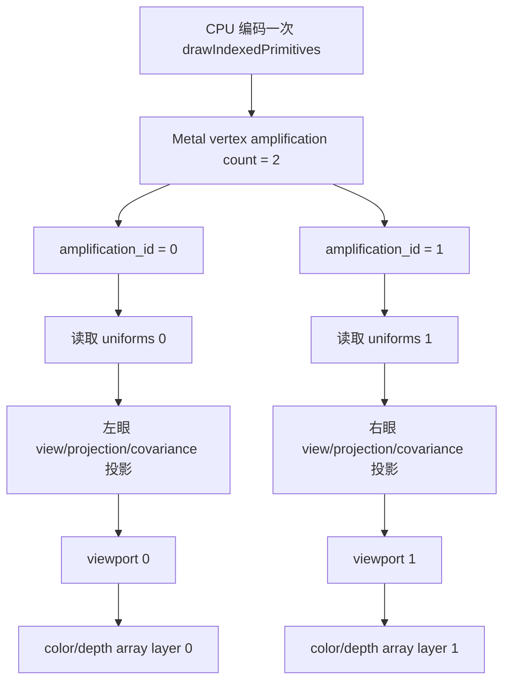

<!-- generated-by: gsd-doc-writer -->
# 3DGS 双眼与立体渲染

本文面向第一次接触立体渲染的开发者，解释 GaussianSplatMobile 与仓库内 vendored MetalSplatter 已经具备的双 view 数据通路、当前 iPhone App 为什么仍是单视图，以及未来接入 visionOS 时还必须补齐什么。

文中严格区分三类陈述：

- **当前事实**：可由本仓库源码直接验证。
- **平台要求**：来自 Apple Metal 或 Compositor Services 的接口约束。
- **建议演进**：为未来 visionOS 版本提出，当前 App 尚未实现。

## 结论先行

**双眼不是基础 3D Gaussian Splatting（3DGS）资产格式或算法的默认要求。** 原始 3DGS 的目标是从多张照片或视频优化出场景表示，再从新相机位置做 novel-view synthesis；一个普通手机或桌面 viewer 通常每帧只需要渲染一个相机。只有当输出设备要同时向左右眼提供不同图像时，运行时 stereo rendering 才成为 VR、AR、MR 头显正确呈现空间深度的必要显示路径。

当前代码的结论也要分两层看：

- vendored MetalSplatter 把静态上限写成两个 view，并实现了 Metal vertex amplification、双 uniform 槽、viewport 映射和 render-target array layer 映射。
- GaussianSplatMobile 的 iPhone App 明确以 `maxViewCount: 1` 创建 renderer，每帧只传一个 `ViewportDescriptor`，并传 `renderTargetArrayLength: 0`。因此当前产品路径**没有启用双眼，也没有启用 vertex amplification**。
- 即便未来传入两个 view，当前 sorter 也只会从跨 chunk 展平序列确定性抽样出候选 $C$，再为这些候选生成一条共享的跨 chunk 全局顺序；全量 splat 属性仍常驻，高阶 SH 也使用共享平均眼位。几何投影是逐眼的，但颜色视线和候选透明排序不是逐眼独立的。

[原始 3DGS 项目](https://repo-sam.inria.fr/fungraph/3d-gaussian-splatting/)把方法描述为多图像输入下的 novel-view synthesis，而 [VRSplat](https://arxiv.org/abs/2505.10144) 与 [VR-Splatting](https://arxiv.org/abs/2410.17932) 则专门处理头显中的大视场、高分辨率、持续头动、帧率和注视点渲染压力。这种研究主题的分离本身就说明：“能合成新视角”和“能舒适地实时输出双眼”不是同一个完成条件。

## 先区分三个经常混用的概念

| 概念 | 发生阶段 | 相机数量的含义 | 是否要求同一显示帧输出两张图 |
| --- | --- | --- | --- |
| 多视图训练数据 | 训练/重建输入 | 多张已标定照片或视频帧来自不同拍摄位置 | 否 |
| Novel-view synthesis | 推理/显示 | 从训练相机之外的任意目标相机生成新图像 | 否；可以一次只生成一个新视角 |
| Runtime stereo rendering | 头显每个显示帧 | 左眼和右眼各有 pose、投影、viewport 与目标 layer | 是 |

多视图训练解决的是“怎样从多个观察恢复场景”；novel-view synthesis 解决的是“怎样从一个新相机看这个场景”；双眼渲染解决的是“怎样在同一显示时刻，从两个略有间距的眼位产生相互一致的图像”。训练集有很多相机，并不意味着运行时必须同时画很多 view；反过来，一个已经训练好的普通 3DGS 文件也可以被双眼 renderer 使用，不需要在基础点格式里新增“左眼 splat”和“右眼 splat”。

## 初学者需要的几何词汇

- **向量**：按顺序放在一起的一组数。三维位置向量可写成 $(x,y,z)$；它同时表达方向和长度，或表达空间中的坐标。
- **矩阵**：把输入向量变换成输出向量的一张数字表。view matrix 把世界坐标变到相机坐标，projection matrix 再把相机坐标变到裁剪空间。
- **视差**：同一个三维点在左眼和右眼图像中的水平位置差。近物通常视差较大，远物通常视差较小；大脑利用这种差异感知深度。
- **Viewport**：渲染目标中接收一个 view 的矩形区域及深度范围。
- **Texture array layer**：同一 array texture 中的一层。立体路径通常把左、右眼写入不同 layer，而不是让两眼互相覆盖。

对第 $e$ 个眼睛，一个世界空间点 $\mathbf{p}$ 的中心投影可抽象为：

$$
\mathbf{p}_{clip,e}=P_eV_e
\begin{bmatrix}
\mathbf{p} \\
1
\end{bmatrix}
$$

读作“世界空间点先乘第 $e$ 眼的视图矩阵 $V_e$，再乘该眼投影矩阵 $P_e$，得到该眼的裁剪空间坐标”。矩阵乘法从公式最右侧开始；$e=0$、$e=1$ 可以分别代表左眼和右眼。当前代码对应每个 `ViewportDescriptor` 中的 `viewMatrix` 与 `projectionMatrix`。

在简化的平行双目模型中，视差近似为：

$$
d\approx\frac{fB}{Z}
$$

读作“视差 $d$ 约等于像素焦距 $f$ 乘左右眼基线距离 $B$，再除以点的相机深度 $Z$”。分子 $fB$ 越大，左右图像分离越明显；分母 $Z$ 越大，物体越远，视差越小。真实头显应直接采用平台给出的逐眼 pose 和非对称投影，不能用这条简式自行伪造显示矩阵。

## 当前 iPhone App：单视图事实

[`GaussianSplatRenderer.swift`](../GaussianSplatMobile/Renderer/GaussianSplatRenderer.swift) 把当前运行路径固定为：

| 项目 | 当前值 | 直接后果 |
| --- | --- | --- |
| `SplatRenderer.maxViewCount` | `1` | pipeline 只声明最多一个 amplified view |
| `viewports` | `[descriptor]`，数组长度为 1 | `setViewports` 只设置一个 viewport |
| `renderTargetArrayLength` | `0` | 使用普通非 layered render target 路径 |
| color texture | `MTKView.currentDrawable.texture` | 一张 iPhone drawable，而不是左右眼 array texture |
| depth texture | `nil` | 当前无深度 attachment |
| `highQualityDepth` | `false` | 当前走 single-stage 管线 |
| 相机 | 一个 `OrbitCamera` | 只生成一份 view matrix 和一份透视投影 |

底层 `renderEncoder` 只有在 `viewports.count > 1` 时才调用 `setVertexAmplificationCount`。当前 count 为 1，所以：

1. shader 的合法 `amplification_id` 只有单视图的 0 号语义；
2. `UniformsArray.uniforms0` 会被更新；
3. `UniformsArray.uniforms1` 只是固定 CPU/Metal ABI 预留空间，不表示存在第二台相机，也不会让 GPU 自动画第二眼；
4. 一次 indexed-instanced draw 只输出到当前 iPhone drawable。

因此，看到 `Constants.maxViewCount = 2` 或 `UniformsArray` 有两个元素，不能据此声称当前 App 是 stereo viewer。它们只证明 vendored renderer 的静态数据布局和编码路径预留了双 view 能力。

## `maxViewCount` 不等于什么

`maxViewCount` 是“一个 render 调用通过 vertex amplification 最多编码多少个 view”的 renderer/pipeline 容量。它与下列数量不是同一个概念：

| 名称 | 当前 App 值 | 控制什么 | 为什么不同 |
| --- | ---: | --- | --- |
| `maxViewCount` | 1 | 一个 draw 可放大的 view 上限 | 是 pipeline 与 uniform 选择容量 |
| `maxSimultaneousRenders` | 3 | 已提交但 GPU 尚未完成的 frame 上限 | 是 frame-in-flight 与 uniform ring 槽数，不是眼睛数 |
| `MTKView` 数量 | 1 | UIKit/Metal 显示 surface 数量 | 一个 surface 不等于一个 amplified view |
| `OrbitCamera` 数量 | 1 | App 的交互相机状态 | stereo 可由一个头部 pose 推导两个眼位，但仍需两套逐眼矩阵 |
| `SplatChunk` 数量 | 文件相关；默认 Dr Johnson 为 49 | 场景属性分块数量 | 当前加载器按每块最多 65,536 点生成多个 chunk；数量由文件点数决定，与相机或眼睛数无关 |
| `viewports.count` | 1 | 本次 render 实际请求的 view 数 | 它是运行时数量，必须不超过配置容量 |

尤其不要把 `maxSimultaneousRenders = 3` 解释成“三目渲染”。它只让最多三帧 GPU 工作在途，并为每帧轮换一整个 `UniformsArray` 槽。

## 两个 view 的 CPU→GPU 完整数据流

### 1. 静态上限与 ABI

[`SplatRenderer.swift`](../Vendor/MetalSplatter/MetalSplatter/Sources/SplatRenderer.swift) 的 `Constants.maxViewCount` 为 2；[`ShaderCommon.h`](../Vendor/MetalSplatter/MetalSplatter/Resources/ShaderCommon.h) 的 `kMaxViewCount` 也为 2。两侧必须保持一致。

Swift 侧 `UniformsArray` 不是动态数组，而是两个内联字段 `uniforms0`、`uniforms1`。Metal 侧则声明 `Uniforms uniforms[kMaxViewCount]`。固定两项的好处是 ABI 简单、每帧不需按 view 数重新分配；代价是单视图时第二项仍占空间，而且所有边界检查必须严格遵守 `[0,1]`。

实例构造时执行：

```swift
self.maxViewCount = min(maxViewCount, Constants.maxViewCount)
```

这会把请求上界夹到 2，但当前代码没有在这里验证下界或设备能力；相关审计见后文。

### 2. Pipeline 声明最大放大数

renderer 在构建下列 render pipeline 时设置：

```swift
pipelineDescriptor.maxVertexAmplificationCount = maxViewCount
```

- single-stage splat pipeline；
- multi-stage 的 draw-splat pipeline；
- multi-stage 的 postprocess pipeline。

这个值是 pipeline 的能力声明，不会主动开启放大。Apple 的 [vertex amplification 官方文档](https://developer.apple.com/documentation/metal/improving-rendering-performance-with-vertex-amplification)要求 encoder 的 amplification count 不超过当前 pipeline 的 `maxVertexAmplificationCount`。

### 3. 每帧写逐 view uniforms

`updateUniforms(forViewports:)` 为每个 descriptor 计算并写入：

- `projectionMatrix`；
- `viewMatrix`；
- `screenSize`；
- `focalX`、`focalY`；
- `tanHalfFovX`、`tanHalfFovY`；
- 共享的 chunk/splat 计数。

二维协方差的逐眼投影可抽象为：

$$
\Sigma_{2D,e}=T_e\Sigma_{3D}T_e^T
$$

读作“同一份三维协方差 $\Sigma_{3D}$，分别用每眼由 view、projection 焦距导出的变换 $T_e$ 搬到屏幕，得到不同的二维协方差 $\Sigma_{2D,e}$”。上标 $T$ 表示矩阵转置。当前 shader 对应 `calcCovariance2D`，所以左右眼可得到不同的椭圆中心、方向与大小。

这里有一个关键例外：`cameraPosition` **不是逐眼写入**。代码先求所有 viewport 世界相机位置的平均值，再把同一个平均值写进每个 `Uniforms`。它只供高阶 SH 的 view direction 使用，后文单独分析。

### 4. Render pass 配置 layered 输出

`renderEncoder` 把调用者传入的 color/depth texture 绑定到 render pass，并原样设置：

```swift
renderPassDescriptor.renderTargetArrayLength = renderTargetArrayLength
renderEncoder.setViewports(viewports.map(\.viewport))
```

未来双眼 layered 路径需要由调用者提供兼容的 color/depth array texture，并让 `renderTargetArrayLength` 与实际可写 layer 布局匹配。仅仅传两个 viewport、但仍绑定普通单层 drawable，不足以构成立体输出。

### 5. View mapping 开启 amplification

当 `viewports.count > 1` 时，代码为第 $i$ 个 view 建立：

```swift
MTLVertexAmplificationViewMapping(
    viewportArrayIndexOffset: UInt32(i),
    renderTargetArrayIndexOffset: UInt32(i)
)
```

随后调用：

```swift
renderEncoder.setVertexAmplificationCount(
    viewports.count,
    viewMappings: &viewMappings
)
```

offset 0 把第一路输出映射到 viewport 0 / render-target array layer 0；offset 1 把第二路映射到 viewport 1 / layer 1。`MTLVertexAmplificationViewMapping` 的职责就是给 viewport array index 和 render-target array index 加偏移。

### 6. 一个 draw 被逻辑扩增成两路



single-stage 与 multi-stage splat vertex shader 都声明：

```metal
ushort amplificationID [[amplification_id]]
```

它们用该 ID 选择 `uniformsArray.uniforms[...]`。因此同一份 `vertexID`、`instanceID`、排序索引和 splat 属性会经过两个 uniform 集合，产生左右眼各自的投影。固定功能阶段再依据 view mapping 把结果送到不同 viewport 和 texture array layer。

multi-stage 的全屏 postprocess draw 也使用声明了 amplification 能力的 pipeline，并在同一个已配置 encoder 中执行；它没有读取逐眼 uniforms，但其全屏三角形仍需要按 view mapping 覆盖对应输出层。当前 iPhone App 没有启用 multi-stage，这只是 vendored 能力边界。

## 哪些共享，哪些逐眼独立

| 数据/工作 | 当前双-view 代码语义 | 说明 |
| --- | --- | --- |
| 基础 splat 属性 | 共享 | position、SH0、Alpha、三维协方差只保存一份 |
| 高阶 SH coefficient buffer | 共享 | 两眼读取同一组系数 |
| chunk table | 共享 | 两眼使用同一份 GPU 地址、点数、degree、enabled 表 |
| `ChunkedSplatIndex` | 共享 | sorter 从全部 resident chunks 确定性抽样候选 $C$，只发布候选的一条跨 chunk 全局远到近序列 |
| indexed-instanced draw | 共享提交 | CPU 只编码一次 draw；Metal 扩增顶点流 |
| `viewMatrix` | 逐眼 | 决定每眼相机空间位置与方向 |
| `projectionMatrix` | 逐眼 | 可表达头显提供的非对称投影 |
| viewport | 逐眼 | 由 `setViewports` 与 mapping 选择 |
| `screenSize` / focal / FOV 参数 | 逐眼 | 决定协方差投影与像素尺度 |
| 几何中心与二维椭圆 | 逐眼 | 由各眼 view/projection/covariance 计算 |
| 输出 array layer | 逐眼 | mapping offset 0/1 路由到不同层 |
| SH `cameraPosition` | **共享平均眼位** | 不是逐眼 eye position |
| sorter camera pose | **共享平均位置与平均 forward** | 不做每眼独立排序 |

可以把当前设计概括为：**场景属性、索引和 draw 共享；几何投影与输出逐眼；SH 视线和透明顺序共享中心姿态。**

## 平均眼位：SH 与 sorter 的两个共享点

### 高阶 SH 使用共享平均眼位

若一帧有 $V$ 个 viewport，各自世界相机位置为 $\mathbf{c}_e$，`updateUniforms` 先计算：

$$
\bar{\mathbf{c}}=\frac{1}{V}\sum_{e=1}^{V}\mathbf{c}_e
$$

读作“把所有 view 的三维相机位置向量相加，再除以 view 数，得到平均相机位置”。分子是位置向量总和，分母 $V$ 是 view 数；双眼时它通常接近两眼中点。代码把同一个 $\bar{\mathbf{c}}$ 写入每一个 uniform 槽。

高阶 SH 的方向随后为：

$$
\mathbf{v}_{SH}=\frac{\mathbf{p}-\bar{\mathbf{c}}}
{\lVert\mathbf{p}-\bar{\mathbf{c}}\rVert}
$$

读作“splat 世界位置 $\mathbf{p}$ 减平均眼位，再除以这个差向量的长度，得到单位方向”。分式的分子是从平均眼位指向 splat 的向量，分母把它归一化为长度 1。shader 对应 `normalize(worldPosition - uniforms.cameraPosition)`。

所以高阶 SH 颜色在两眼间共享同一个观察方向；逐眼独立的只是几何投影。对 SH0 场景，这个差别不生效，因为 SH0 颜色不依赖观察方向；对 SH1–SH3，它减少了左右眼颜色差异和重复语义，但也放弃了严格的逐眼 view-dependent color。

### Sorter 使用共享平均姿态

`cameraWorldPose(forViewports:)` 另行计算平均位置与平均 forward：

$$
\bar{\mathbf{f}}=
\frac{\frac{1}{V}\sum_{e=1}^{V}\mathbf{f}_e}
{\left\lVert\frac{1}{V}\sum_{e=1}^{V}\mathbf{f}_e\right\rVert}
$$

读作“先把所有 view 的世界 forward 向量求平均，再把结果归一化”。分子是平均 forward，分母是它的长度；当前代码把平均位置与平均 forward 一起传给 sorter。

当前 `Constants.sortByDistance = true`，所以实际排序键使用平均位置：

$$
k_i=\lVert\mathbf{p}_i-\bar{\mathbf{c}}\rVert^2
$$

读作“第 $i$ 个候选 splat 的位置减平均眼位，再求三个分量平方和”。平方距离不需要开平方，也不会改变非负距离的大小关系；sorter 先把全部 chunks 展平为逻辑序列并确定性抽样至 $C$，再按该键从大到小排列，得到一份共享的、仅覆盖候选的跨 chunk 全局远到近顺序。平均 forward 已传入 sorter，但在当前 distance 分支中不决定排序键；若切到源码保留的 forward 分支，它才参与计算。

### 共享顺序的收益与代价

**收益：**

- CPU 只对确定性抽样后的候选 $C$ 做一次共享的 $O(C\log C)$ 比较排序，不为左右眼各排一遍；全量 resident splat 属性仍常驻，只是没有全部进入这次排序。
- 每次 draw 的左右眼绑定同一个最新候选排序 buffer，未来双 view 仍共享同一份候选索引，不额外维护左眼、右眼两份排序副本；`SplatSorter` 内部仍用三个物理 `ChunkedSplatIndex` buffer 支持后台排序、结果发布和在途 GPU 引用。
- 左右眼使用相同的 splat 顺序与同一个 SH 观察方向，能避免由“两眼采用不同近似规则”额外引入的颜色或顺序跳变。
- 两路 vertex 工作读取相同的 index、splat、SH 和 chunk table，更有机会受益于 GPU cache；源码没有承诺具体命中率。

**代价：**

- 平均眼位排序并不严格等于左眼排序，也不严格等于右眼排序。
- 近景物体的眼间视差更大；两个透明高斯的相对遮挡关系可能在左右眼不同，一份中心顺序无法同时正确描述两眼。
- 当前本来就是“候选的一条跨 chunk 全局中心距离顺序”，而不是全部 resident splats 的顺序，也不是逐像素或逐 tile 真深度；进入模型、相交椭球、薄透明层和大 footprint 会放大误差。
- 同序可改善双眼一致性，却可能让两眼以相同方式“稳定地错”；逐眼排序可能更接近各眼几何，但又可能引入两眼不一致、视觉竞争和双倍排序成本。
- 共享 SH 平均眼位让颜色更一致，但对强 view-dependent 高阶 SH 材质会丢失细微的眼间方向差异。

因此这是一项明确的性能/舒适性/几何正确性 trade-off，不能写成“当前每眼独立排序”。当前事实恰好相反：**每次 draw 共享一份候选的跨 chunk 全局排序结果，共享一个 SH 中心眼位，但使用两份独立几何投影。** 这里的“一份候选逻辑结果”不等于 sorter 只有一个物理 buffer；其三缓冲生命周期详见 [DATA-STRUCTURES.md](DATA-STRUCTURES.md)。

## 单视图与双视图逐项对照

| 阶段 | 当前 iPhone 单视图 | 未来合法双视图路径 |
| --- | --- | --- |
| renderer 构造 | `maxViewCount: 1` | 建议在能力验证后请求 2 |
| pipeline 上限 | `maxVertexAmplificationCount = 1` | `= 2` |
| descriptor 数 | 1 | 2，来自平台本帧左右 view |
| uniform 写入 | 只写槽 0 | 写槽 0、1；其中 SH camera position 相同 |
| `setViewports` | 一个 viewport | 两个 viewport |
| amplification call | 不调用 | `setVertexAmplificationCount(2, ...)` |
| `amplification_id` | 单视图语义为 0 | 合法值 0、1 |
| color/depth target | 普通 iPhone drawable；无 depth | 平台提供的 layered color/depth texture |
| `renderTargetArrayLength` | 0 | 与 drawable 的 layered 配置一致；常见双层布局为 2 |
| single-stage splat draw | 一个普通 `drawIndexedPrimitives` | 一个 amplified `drawIndexedPrimitives`，而不是左右眼各编码一次 |
| multi-stage 命令 | 当前不启用 | tile initialization + 一个 amplified splat draw + 一个 amplified 全屏 postprocess draw |
| vertex/fragment 输出 | 一路 | 逻辑上两路，GPU 工作并不免费 |
| sort | 一份候选的跨 chunk 全局顺序 | 仍共享同一份平均姿态候选索引 |

只把构造参数从 1 改成 2 不会自动得到双眼：还必须同时提供两个 descriptor、可写的 layered attachments、正确的 render-target array length、逐眼矩阵和平台时序。

## 性能：一个 amplified draw 不等于一只眼的成本

Vertex amplification 的核心收益是让**每个需要立体输出的 draw**不必由 CPU 为左右眼分别编码，并让两路共享同一份输入数据和 draw 状态。它不表示 GPU 免费复制最终图像，也不表示整个 multi-stage frame 只有一个命令：multi-stage 仍包含 tile initialization、splat draw 和 postprocess draw。

双眼总像素预算至少要考虑：

$$
P_{stereo}=W_LH_L+W_RH_R
$$

读作“左眼宽乘高，加右眼宽乘高，得到两眼目标的总像素数”。$W_L,H_L$ 是左眼分辨率，$W_R,H_R$ 是右眼分辨率。即使两眼尺寸相同，总目标像素也是单眼的约两倍；实际 fragment 工作还取决于每个 Gaussian quad 覆盖和 overdraw。

当一次 draw 被扩增为两个 view 时：

- `vertexID` / `instanceID` 所指向的 splat 属性、SH 和排序索引可以复用同一资源绑定，也可能受益于缓存；
- vertex shader 的逐眼 view transform、投影、2D covariance、裁剪和顶点输出在逻辑上仍要为两个 view 产生结果；
- rasterization、fragment Gaussian、颜色混合以及 color/depth 写入要覆盖两套 viewport/layer；
- 两眼视锥略有不同，同一 splat 可能一眼可见、另一眼被退化，仍需分别判断；
- 高分辨率与大视场会增加像素覆盖，透明 splat 的 overdraw 不会因一次 draw submission 自动消失。

目标刷新率为 $F$ 时，单帧显示预算是：

$$
B_{frame}=\frac{1000}{F}\ \text{ms}
$$

读作“1000 毫秒除以每秒目标帧数”。分子是一秒的毫秒数，分母是刷新率；例如更高的 $F$ 会让每帧可用时间更短。头显还要求低 motion-to-photon 延迟：头部 pose 采样、CPU 编码、GPU 执行、合成和显示必须沿平台时序尽量靠近预测显示时刻，不能只看平均 FPS。

VR/AR/MR 的主要压力包括：

- 两眼高分辨率与高刷新率共同压缩 vertex、fragment 和带宽预算；
- 持续头动会持续触发当前 CPU sorter，stale sort 与 popping 在头显中更明显；
- 大视场增加可见 Gaussian 数和大 footprint overdraw；
- 低延迟要求限制 in-flight 深度与 frame pacing，`maxSimultaneousRenders` 不能只为吞吐量盲目调大；
- foveation 可降低周边分辨率或工作量，但需要 rasterization rate map、逐区 LOD 或专用 rasterizer，并通过注视移动、边界过渡和画质测试；当前 App 没有启用这套头显策略。

[VRSplat](https://arxiv.org/abs/2505.10144)讨论了 popping、双眼不一致 floater、头显大视场与高分辨率问题，并提出 foveated rasterizer；[VR-Splatting](https://arxiv.org/abs/2410.17932)也把注视点与周边不同表示作为 VR 性能/质量取舍。它们适合作为设计参考，但并不证明本仓库已经实现对应算法。

## 未来 visionOS 接入清单

本节全部是**建议演进，当前 GaussianSplatMobile 未实现 visionOS 接入**。

1. **建立 visionOS 显示入口。** 使用 [Compositor Services fully immersive Metal 官方流程](https://developer.apple.com/documentation/compositorservices/drawing-fully-immersive-content-using-metal)创建 `CompositorLayer` / `LayerRenderer` 渲染循环，而不是把当前 iPhone `MTKView` 直接等同于头显 drawable。
2. **先验证设备能力。** 这是未来 visionOS 接入建议，不是当前仓库已实现的函数调用：在请求双路 pipeline 前，通过 Apple Metal 外部平台 API [`MTLDevice.supportsVertexAmplificationCount(_:)`](https://developer.apple.com/documentation/metal/mtldevice/supportsvertexamplificationcount%28_%3A%29) 查询 count 2。只有返回 true 才把 renderer 的 `maxViewCount` 配为 2；不要仅依赖源码常量。当前 GaussianSplatMobile 源码没有调用该 Apple API。
3. **接受平台的 drawable 布局。** 使用 Compositor Services 给出的 color/depth texture、view 数、texture layout 与能力信息，不硬编码设备内部规格。
4. **配置 layered attachments。** 为左右 view 绑定兼容的 color texture array 和 depth texture array，把 `renderTargetArrayLength` 设为 drawable 布局要求的层数，并验证 color/depth layer 一一对应。
5. **生成两个 `ViewportDescriptor`。** 每个 descriptor 使用平台本帧对应 view 的 viewport、screen size、projection 和 pose-derived view matrix；不得简单复制 iPhone 的单个 `OrbitCamera.viewMatrix`。
6. **保持逐眼投影，明确中心共享近似。** 先沿用现有逐眼 view/projection 与共享平均 SH/sort，建立参考图；再用近景、透明层和高阶 SH 场景决定是否值得实验逐眼颜色或排序。
7. **接入 Compositor Services 时序。** 按 `LayerRenderer` 的 frame/drawable 时间信息安排 pose 更新、编码和提交，记录预测显示时刻、CPU/GPU completion 与实际 frame pacing。不要用当前 `MTKViewDelegate.draw` 的节奏推断头显时序。
8. **评估 depth 与重投影。** 当前 App 无 depth。visionOS 路径要根据平台 drawable 要求选择有效 depth format/texture，并验证 multi-stage Alpha 加权深度是否真的满足组合与重投影需求；不能因为 vendored 代码有 `highQualityDepth` 就跳过设备测试。
9. **评估 foveation。** 若平台提供 rasterization rate map 或等效机制，把它传入现有参数只是起点；还要测量 Gaussian footprint、透明边界和左右眼一致性。必要时再考虑逐区 LOD 或专用 foveated rasterizer。
10. **在目标设备测量。** 至少采集 CPU sort、command encode、GPU vertex/fragment、attachment 带宽、present pacing、热状态、掉帧和 motion-to-photon 代理指标；模拟器不能替代 Vision Pro 真机结论。
11. **提供确定性降级。** 设备不支持 amplification 2、layered allocation 失败或性能超预算时，保留诊断用单视图模式；产品若必须保持沉浸式立体，则还应评估“两次逐眼 draw”作为不依赖 amplification 的兼容路径。任何降级都要显式提示，不能悄悄把左眼图复制给右眼并称为 stereo。

Apple 的 [vertex amplification 文档](https://developer.apple.com/documentation/metal/improving-rendering-performance-with-vertex-amplification)说明了 pipeline 上限、encoder amplification count 与 view mappings 的关系；Compositor Services 文档则提供 fully immersive Metal 的 drawable、视图和显示时序边界。两者分别解决“如何扩增一次 draw”和“何时、向哪些头显目标提交”，缺一不可。

## 当前实现边界：源码审计结论

以下是对当前源码的审计结论，本文**不修改代码**。

### 1. `render(viewports:)` 没有验证数量

公开 `render` 入口没有 `guard !viewports.isEmpty`，也没有 `guard viewports.count <= maxViewCount`。空数组会让平均 pose 回退到默认值、uniform 不更新，并继续进入后续 render 编码；超限数组会继续传给 `setViewports`，当 count 大于 1 时还会作为 amplification count。调用者目前必须自行保证非空且不超限。

建议契约是先明确拒绝：

```swift
guard !viewports.isEmpty, viewports.count <= maxViewCount else {
    // 返回可诊断错误
}
```

这只是建议写法，不是当前源码。

### 2. `updateUniforms` 的循环上界是 `<=`

当前条件是：

```swift
for (i, viewport) in viewports.enumerated() where i <= maxViewCount
```

合法下标应满足 `i < maxViewCount`。当实例上限为 1 时，`i == 1` 仍会写固定 ABI 的第二槽；当实例上限为 2 时，`i == 2` 会进入循环，但 `setUniforms` 的 default 分支静默忽略。无论是否恰好被固定两槽布局掩盖，边界表达都与容量语义不一致，也不能替代入口处的 count 检查。

### 3. 构造器只夹上界

构造器只执行 `min(requested, 2)`：

- 没有验证 `requested >= 1`；
- 没有验证设备支持请求的 amplification count；
- 没有让 `maxViewCount` 与调用时 `viewports.count` 建立运行时不变量。

未来 visionOS 接入应在构造 pipeline 前使用 Apple Metal 外部平台 API [`MTLDevice.supportsVertexAmplificationCount(_:)`](https://developer.apple.com/documentation/metal/mtldevice/supportsvertexamplificationcount%28_%3A%29) 查询 count 2，并为无效下界返回清楚错误；当前仓库未执行这项查询。

### 4. Shader clamp 的上界写成数组长度

single-stage 与 multi-stage vertex shader 都写成：

```metal
uniformsArray.uniforms[min(int(amplificationID), kMaxViewCount)]
```

数组长度为 `kMaxViewCount = 2`，合法最大下标却是 1。当前合法 amplification ID 只有 0、1，所以正常双 view 不会出错；若异常值到达 2，`min(2, 2)` 仍是越界下标 2。更健壮的夹取上界应是 `kMaxViewCount - 1`，同时 CPU 入口仍应拒绝非法 count，而不是依靠 shader 掩盖错误。

## 测试矩阵

以下测试用于未来实现与回归；当前仓库不应被描述为已经通过这些 visionOS 测试。

| 类别 | 输入/场景 | 必查结果 |
| --- | --- | --- |
| 单眼回归 | 当前 iPhone 样例、一个 descriptor | amplification 不启用；图像、FPS 统计和加载行为不回退 |
| 双眼 layer 映射 | 两个 viewport、已知 array layer 0/1 | 左眼只写 layer 0，右眼只写 layer 1；color/depth 不串层 |
| 矩阵映射 | 左右眼故意使用可辨识的 view/projection | `amplification_id 0→uniform 0`，`1→uniform 1`；viewport offset 对应正确 |
| 左右眼视差 | 已知基线、前中远三个标记点 | 近点视差大于远点；方向正确；无垂直错位与眼位交换 |
| 非对称投影 | 平台提供的左右非对称 frustum | 不能用复制矩阵替代；边缘几何连续且不被错误裁剪 |
| SH0 / SH3 | 常量颜色与强 view-dependent 模型 | SH0 两眼只因几何变化；SH3 明确验证共享平均眼位的颜色近似 |
| 共享排序边界 | 近景、相交、半透明薄层、进入模型 | 记录两眼伪影与视觉竞争；确认只有一份共享索引，不误报逐眼排序 |
| 超限输入 | 0、3 个 descriptor；count 大于实例上限 | 未来修复应返回确定错误，不产生 Metal validation 或越界访问 |
| 非法构造 | `maxViewCount <= 0` 或请求大于 2 | 明确拒绝或按文档降级；不创建无效 pipeline |
| 设备不支持 | 未来接入的 Apple Metal 外部能力查询对 count 2 返回 false | 不调用 amplification count 2；进入明确的单视图或双 draw fallback |
| Layer 配置错误 | texture 非 array、层数不匹配、depth 缺层 | 在提交前失败并给出诊断，不串写或静默黑屏 |
| 多阶段路径 | 有效 depth + `highQualityDepth` | 两层 color/depth、全屏 postprocess 和 viewport mapping 都正确 |
| 性能 | 代表性点数、SH degree、分辨率与 overdraw | 对比单眼/双眼 CPU encode、GPU vertex、fragment、带宽与内存 |
| 帧率/延迟 | 目标刷新率下静止、持续头动、快速转头 | p95/p99 frame time、掉帧、队列深度、pose-to-submit 与热稳定性 |
| Foveation | 注视点移动、边界跨越、高频细节 | 中央清晰度、周边稳定、过渡无闪烁、左右眼 rate map 一致 |
| 视觉舒适性 | 长时观看、近物、透明层、快速头动 | 无眼位交换、垂直视差、双眼竞争、popping 或明显 motion lag |

自动化图像测试应分别保存 layer 0 与 layer 1，而不是只检查合成后的预览。性能测试则必须在目标设备上运行；模拟器适合验证控制流，不适合给出 vertex amplification、带宽、热状态或舒适性的结论。

## 设计取舍总结

| 决策 | 当前选择 | 收益 | 代价/何时重审 |
| --- | --- | --- | --- |
| 静态最多两个 view | CPU/Metal ABI 固定 2 | 足够表达常见双眼，结构简单 | 边界检查必须正确；不是设备能力证明 |
| Vertex amplification | vendored 路径已编码，App 未启用 | 每个 amplified draw 只编码一次并共享绑定与输入 | multi-stage 仍有多个 pass/draw；GPU 仍输出两眼；需 layered target 与能力检查 |
| 逐眼几何 | 独立 view/projection/focal/screen | 产生正确视差与 footprint | 两眼 vertex/raster/fragment 工作增加 |
| 共享 SH 眼位 | 所有 uniform 写平均位置 | 颜色一致、少一个语义分支 | 高阶 SH 不严格逐眼 |
| 共享平均姿态排序 | 候选的一条跨 chunk 全局距离顺序 | 对候选 $C$ 做一次 $O(C\log C)$ CPU sort、共享索引 | 全量属性仍常驻；近景透明顺序不能同时适合两眼 |
| 当前 iPhone 单视图 | `maxViewCount=1`、一个 viewport | 产品路径短，适合手机 viewer | 不是 visionOS immersive renderer |

最重要的设计思想不是“把 1 改成 2”，而是同时维护四个一致性边界：逐眼矩阵正确、layer 路由正确、共享近似被明确记录、显示时序满足头显要求。任何一个边界缺失，都可能得到“左右各有图”但几何、透明关系或舒适性仍然错误的系统。

## 关键源码索引

- [App 的单视图构造与逐帧调用](../GaussianSplatMobile/Renderer/GaussianSplatRenderer.swift)
- [SplatRenderer：view 上限、uniform、pipeline、mapping、排序姿态与 draw](../Vendor/MetalSplatter/MetalSplatter/Sources/SplatRenderer.swift)
- [CPU/Metal 共用 `UniformsArray` 与 `kMaxViewCount`](../Vendor/MetalSplatter/MetalSplatter/Resources/ShaderCommon.h)
- [Single-stage：`amplification_id` 与 uniform 选择](../Vendor/MetalSplatter/MetalSplatter/Resources/SingleStageRenderPath.metal)
- [Multi-stage：amplified splat 与 layered postprocess](../Vendor/MetalSplatter/MetalSplatter/Resources/MultiStageRenderPath.metal)
- [逐眼 view/projection、协方差与共享 SH camera position](../Vendor/MetalSplatter/MetalSplatter/Resources/SplatProcessing.metal)

## 关联文档

- [系统架构与当前每帧数据流](ARCHITECTURE.md)
- [Uniform、chunk、索引与内存布局](DATA-STRUCTURES.md)
- [Mobile graphics 与 CUDA 3DGS 前向路径对照](FORWARD-RENDERING-COMPARISON.md)
- [大场景、LOD、逐 tile pipeline 与性能预算](LARGE-SCENE-RENDERING.md)

## 一手资料

- [3D Gaussian Splatting 原始项目与论文](https://repo-sam.inria.fr/fungraph/3d-gaussian-splatting/)
- [Apple：Improving rendering performance with vertex amplification](https://developer.apple.com/documentation/metal/improving-rendering-performance-with-vertex-amplification)
- [Apple：Drawing fully immersive content using Metal](https://developer.apple.com/documentation/compositorservices/drawing-fully-immersive-content-using-metal)
- [VRSplat: Fast and Robust Gaussian Splatting for Virtual Reality](https://arxiv.org/abs/2505.10144)
- [VR-Splatting: Foveated Radiance Field Rendering via 3D Gaussian Splatting and Neural Points](https://arxiv.org/abs/2410.17932)
